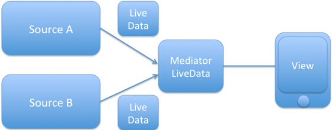

LiveData

LiveData [lɪv] [ˈdeɪ.t̬ə]
resume [rɪˈzuːm/]

# 1.LiveData好处
* 1.数据存储器类，数据始终处于最新
* 2.LiveData 具有生命周期感知能力,只有生命周期处于活跃状态时时，也就是STARTED 或 RESUMED 状态,才会通知将更新通知给观察者，避免了内存泄露
* 观察者会绑定到Lifecycle对象，如果lifecycle遭到销毁后进行自我清理
* 屏幕翻转时，会通知相应的观察者更新数据

# 2.LiveData介绍

```java
public abstract class LiveData<T> {

    /** 外部经常使用的方法 **/

    //返回当前值
    public T getValue()
    //添加观察者，并放入所有者生命周期内的观察者列表中
    public void observe(LifecycleOwner owner,Observer<? super T> observer)
    //添加观察者，一直观察，除非自己移除观察者
    public void observeForever(Observer<? super T> observer)  

    //移除指定的观察者
    public void removeObserver(Observer<? super T> observer)  
    //删除所有与给定绑定的观察者LifecycleOwner
    public void removeObservers(LifecycleOwner owner)

    //主线程中设置
    void setValue(T value)
    //将任务发布到主线程以设置给定值。
    void postValue(T value)

   //如果此LiveData具有观察者，则返回true
    public boolean hasObservers()
    //如果此LiveData具有活动的观察者，则返回true。
    public boolean hasActiveObservers()

    /** 自定义liveData使用的方法 **/

    //当活动观察者的数量从0变为1时调用。变为活跃状态
    protect void onActive()
    //非活跃状态， 当活动观察者的数量从1变为0时调用。
    protect void onInactive()
}
```

# 3.实现类/工具类
 ## 1.实现类
 * 1.MutableLiveData
 * 2.MediatorLiveData



1.继承MutableLiveData
2.作用将多个LiveData收集起来
举例
```java
public static <X, Y> LiveData<Y> map(LiveData<X> source，final Function<X, Y> mapFunction) {
    final MediatorLiveData<Y> result = new MediatorLiveData<>();
    result.addSource(source, new Observer<X>() {
        @Override
        public void onChanged(X x) {
            result.setValue(mapFunction.apply(x));
        }
    });
    return result;
}
```


 # 2.2 工具类Transformations  
   处理LiveData类
   
```java
//1.map，数据转换/处理
Transformations.map(getLiveDataA()) { "A:$it" }

// 2.urLiveDataSwitch 判断条件
//getLiveDataB()/getLiveDataA()选择的LiveData
//使用场景是：如用户登录 session的不同数据源，来处理不同的业务逻辑。
Transformations.switchMap(curLiveDataSwitch, {
                switchToB ->
                if (switchToB) {
                     getLiveDataB()
                } else {
                     getLiveDataA()
                }
        })

//3.第一次，立即更新，之后只有内容发生变化时，才会通知更新，第一次更改
Transformations.distinctUntilChanged(liveData)
```


# 补充
1.新加入的不收到liveData通知，思路

//用来记录加入ObservableNumber数量
val ObservableNumber = 0
val realLiveData: MutableLiveData 
(1)setValue()设置valueVersion = ObservableNumber
(2)
```kt
singleObservabler:observable{
    val obserbableValue = 0
    init{ 
        obserbableValue = ObservableNumber
        ObservableNumber++
    }
    fun isCanChange():Boolea{
        if(obserbableValue < valueVersion ) return true
        return faluse
    }
}
```


