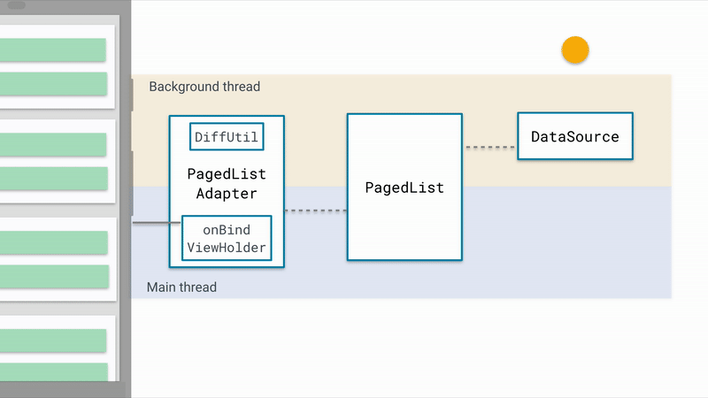

Paging

<!-- TOC -->

- [1.介绍](#1介绍)
- [2.重要Api](#2重要api)
  - [2.1 DataSource](#21-datasource)
    - [2.1.1 PageKeyedDataSource](#211-pagekeyeddatasource)
    - [2.1.2 ItemKeyedDataSource](#212-itemkeyeddatasource)
    - [2.1.3 PositionalDataSource](#213-positionaldatasource)
  - [2.2.DataSource.Factory](#22datasourcefactory)
  - [2.3 PageList](#23-pagelist)
  - [2.3 PagedListAdapter](#23-pagedlistadapter)
- [3.使用](#3使用)
  - [1.DataSource](#1datasource)
  - [2.PageList](#2pagelist)
  - [3.Adapter](#3adapter)
  - [4.关联](#4关联)

<!-- /TOC -->

# 1.介绍


# 2.重要Api
## 2.1 DataSource
DataSource<Key, Value>抽象类，含义是数据源，用于加载数据，达到一定条件加载数据，例如：初始化，下一页，上一页  
其中key对应加载数据的条件信息，Value对应加载数据的实体类。

### 2.1.1 PageKeyedDataSource
PageKeyedDataSource<Key, Value>：适用于目标数据根据页信息请求数据的场景  
即Key 字段是页相关的信息，一般是第几页。比如请求的数据的参数中包含类似next/previous页数的信息。
```java
class NewsDataSource() : PageKeyedDataSource<Int, ArticleModel>() {
    // 初始化第一页数据
    override fun loadInitial(params: LoadInitialParams<Int>, callback: LoadInitialCallback<Int, ArticleModel>) {
        //1.数据 2.数据的位置 3.数据总数
        callback.onResult(dataList, 1, 2)
    }
    // 加载下一页数据
    override fun loadAfter(...) {
        callback.onResult(dataList, params.key + 1)
    }
    // 加载前一页数据
    override fun loadBefore(...) {}
}
```
### 2.1.2 ItemKeyedDataSource
ItemKeyedDataSource<Key, Value>：适用于目标数据的加载依赖特定item的信息。  
即Key字段包含的是Item中的信息，比如需要根据第N项的信息加载第N+1项的数据，传参中需要传入第N项的ID时，该场景多出现于论坛类应用评论信息的请求。

### 2.1.3 PositionalDataSource
PositionalDataSource<T> ：适用于目标数据总数固定，通过特定的位置加载数据，这里Key是Integer类型的位置信息，T即Value。   
比如从数据库中的1200条开始加在20条数据。

## 2.2.DataSource.Factory
持有PageKeyedDataSource
```java
class NewsDataSourceFactory() : DataSource.Factory<Int, ArticleModel>() {
    override fun create(): DataSource<Int, ArticleModel> {
        return NewsDataSource(newsApi, domains, executor)
    }
} 
``` 

## 2.3 PageList
PagedList作用   
1.从数据源中取出数据
2.通过Config的配置，可以设置一次加载的数量以及预加载的数量。
3.PagedList还可以向RecyclerView.Adapter发送更新的信号，驱动UI的刷新。
4.PageList是一个List的子类，支持所有List的操作
```java
public abstract class PagedList<T> extends AbstractList<T> {
    //用于将结果post到主线程。
    Executor mMainThreadExecutor 
    //后台线程的Excutor
    Executor mBackgroundThreadExecutor
    //加载Datasource中的数据加载到边界时的回调.
    BoundaryCallback<T> BoundaryCallback:
    //配置PagedList从Datasource加载数据的方式
    Config mConfig

    //用于存储加载到的数据，它是真正的蓄水池所在，它包含一个ArrayList 对象mPages，按页存储数据。
    PagedStorage<T> mStorage 
}

public static class Config {
    //设置每页加载的数量
    int pageSize
    //距底部还有几条数据时，加载下一页数据
    int mPrefetchDistance 
    //初始化数据时加载的数量，默认为pageSize*3
    int initialLoadSizeHint：
    //当item为null是否使用PlaceHolder展示
    boolean enablePlaceholders
}
```

## 2.3 PagedListAdapter
PagedListAdapte是RecyclerView.Adapter的实现类  
1.负责处理UI展示的逻辑（增加/删除/替换等）
2.Item数量的统计等功能。
* a.PagedListAdapterHelper:负责监听PagedList的更新
* b.ListAdapterConfig:负责主线程和后台线程的调度以及DiffCallback的管理


# 3.使用

## 1.DataSource

* a.网络请求/读取本地文件
  
  
* b.Room数据库
```java
@Dao
interface StudentDao {
    @Query("SELECT * FROM Student ORDER BY name COLLATE NOCASE ASC")
    fun getAllStudent(): DataSource.Factory<Int, Student>
}


```

## 2.PageList
```java
val livePagedListBuilder = LivePagedListBuilder(dataSource.getAllStudent(), PagedList.Config.Builder()
            .setPageSize(15)                         //配置分页加载的数量
            .setEnablePlaceholders(false)     //配置是否启动PlaceHolders
            .setInitialLoadSizeHint(30)              //初始化加载的数量
            .build()).build()
```


## 3.Adapter
```java
public class RecyclerViewAdapter extends PagedListAdapter<User, RecyclerViewAdapter.MyViewHolder> {
    
    ....

}
```

## 4.关联
```kt
DataSource userDataSource = dataBase.getUserDao();
livePagedListBuilder.observe(lifecycle, new Observer<PagedList<User>>() {
    @Override
    public void onChanged(PagedList<User> users) {
        adapter.submitList(users);
    }
});

//触发获取数据源
userDataSource.insertUser(users);

```
