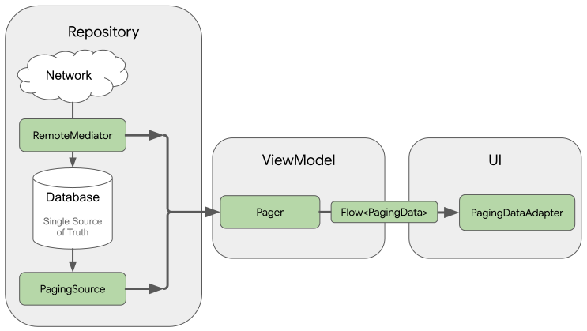
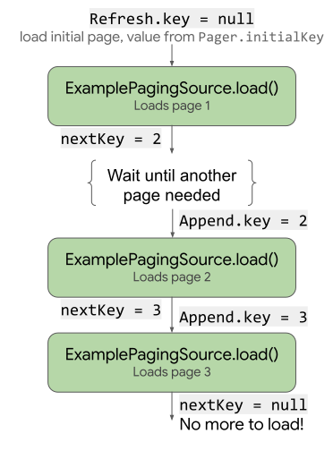

Paging3

<!-- TOC -->

- [1.简介](#1简介)
  - [1.1 优点](#11-优点)
  - [1.2 库架构](#12-库架构)
- [2.主要Api](#2主要api)
  - [2.1 PagingSource](#21-pagingsource)
  - [2.2 Pager](#22-pager)
  - [2.3.PagingDataAdapter](#23pagingdataadapter)
  - [source和mediator | 分别包含上面123的属性，source代表单一的数据源，mediator | 代表多数据源的场景，source 和 mediator 二选一。](#source和mediator--分别包含上面123的属性source代表单一的数据源mediator--代表多数据源的场景source-和-mediator-二选一)
  - [2.4.LoadStateAdapter](#24loadstateadapter)
  - [处理加载状态](#处理加载状态)
  - [withLoadStateHeaderAndFooter(header: LoadStateAdapter<*>, footer: LoadStateAdapter<*> ) | 头尾都添加状态适配器](#withloadstateheaderandfooterheader-loadstateadapter-footer-loadstateadapter---头尾都添加状态适配器)

<!-- /TOC -->

# 1.简介
## 1.1 优点
* 分页数据的内存中缓存。该功能可确保您的应用在处理分页数据时高效利用系统资源。
* 内置的请求重复信息删除功能，可确保您的应用高效利用网络带宽和系统资源。
* 可配置的 RecyclerView 适配器，会在用户滚动到已加载数据的末尾时自动请求数据。
* 对 Kotlin 协程和 Flow 以及 LiveData 和 RxJava 的一流支持。
* 内置对错误处理功能的支持，包括刷新和重试功能。

对比Paging区别
* 1.支持 Kotlin 中的 Flow。
* 2.简化数据源 PagingSource 的实现。
* 3.增加请求数据时状态的回调，支持设置 Header 和 Footer。
* 4.支持多种方式请求数据，比如网络请求和数据库请求。


## 1.2 库架构
代码库层  ViewModel 层  界面层


PagingSource：单一的数据源。  
RemoteMediator：其实 RemoteMediator 也是单一的数据源，它会在 PagingSource 没有数据的时候，再使用 RemoteMediator 提供的数据，如果既存在数据库请求，又存在网络请求，通常 PagingSource 用于进行数据库请求。         RemoteMediator 进行网络请求。   
PagingData：单次分页数据的容器。  
Pager：用来构建 Flow<PagingData> 的类，实现数据加载完成的回调。
PagingDataAdapter：分页加载数据的 RecyclerView 的适配器。


过程：
* 1.PagingSource 和 RemoteMediator 充当数据源的角色
* 2.ViewModel 使用 Pager 中提供的 Flow<PagingData> 监听数据刷新，每当 RecyclerView 即将滚动到底部的时候，就会有新的数据的到来
* 4.PagingAdapter 复杂展示数据。

网络请求+本地数据库加载



# 2.主要Api
## 2.1 PagingSource

<table><tr><td bgcolor=#FFFFFFFF>  </table>


PagingSource 类即可通过 Kotlin 协程进行异步加载。    
```kt
class ExamplePagingSource(
    val backend: ExampleBackendService,
    val query: String
) : PagingSource<Int, User>() {
  override suspend fun load(
    params: LoadParams<Int>
  ): LoadResult<Int, User> {
    try {
         //滑动到下一页，key= nextKey
         //滑动到上一页，key= prevKey
        val pos = params.key ?: SHOE_START_INDEX
        val startIndex = pos * params.loadSize + 1
        val endIndex = (pos + 1) * params.loadSize
        //正确的话，返回LoadResult.Page
      return LoadResult.Page(
        data = response.users,
        // prevKey != null 有上一页
        prevKey = if (!isHavePre) null else pos - 1,, 
        // nextKey!= null 有下一页
        nextKey = if (!isHaveNext) null else pos + 1
      )
    } catch (e: Exception) {
        //错误的话，LoadResult.Error
        LoadResult.Error(e)
    }
  }

/**
  override fun getRefreshKey(state: PagingState<Int, User>): Int? {
    //  * prevKey == null -> anchorPage is the first page.
    //  * nextKey == null -> anchorPage is the last page.
    //  * both prevKey and nextKey null -> anchorPage is the initial page, so just return null.
    return state.anchorPosition?.let { anchorPosition ->
      val anchorPage = state.closestPageToPosition(anchorPosition)
      anchorPage?.prevKey?.plus(1) ?: anchorPage?.nextKey?.minus(1)
    }
  }
  **/
}
```

LoadResult 对象包含加载操作的结果。LoadResult 是一个密封的类，根据 load() 调用是否成功，采用如下两种形式之一：
* 如果加载成功，则返回 LoadResult.Page 对象。
* 如果加载失败，则返回 LoadResult.Error 对象

Paging 库还提供了支持其他异步框架的类: 
* 如需使用 RxJava，请改为实现 RxPagingSource。
* 如需使用 Guava 中的 ListenableFuture，请改为实现 ListenableFuturePagingSource。
```kt
class RxPagingSourceImp(
    //网络请求接口类
    val myBackend: RxBackendService,
    //需要传入的值
    val searchTerm: String
) : RxPagingSource<String, Item>() {
    override fun loadSingle(params: LoadParams<String>)
    : Single<LoadResult<String, Item>> {
        return myBackend
            .searchUsers(searchTerm, params.key)
            .subscribeOn(Schedulers.io())
            .map<LoadResult<String, Item>> { result ->
                LoadResult.Page(
                    data = result.items,
                    prevKey = result.prev,
                    nextKey = result.next
                )
            }
            .onErrorReturn { e -> 
                LoadResult.Error(e)
            }
    }

    //初始化/刷新时，的key
    override fun getRefreshKey(state: PagingState<String, Item>): String? {
        return state.anchorPosition?.let { state.closestItemToPosition(it)?.id}
    }
}
```


## 2.2 Pager
a.常用配置
```java
class PagingConfig
    //设置每页加载的数量
    int pageSize
    //距底部还有几条数据时，加载下一页数据
    //0:滑动到底部才加载，若要让加载无感，可调节到3
    int prefetchDistance = pageSize
    //初始化数据时加载的数量，默认为pageSize*3
    int initialLoadSize
    //当item为null是否使用PlaceHolder展示
    int enablePlaceholders
    //最大加载数量
    val maxSize: Int
    //当item为null是否使用PlaceHolder展示
    // boolean jumpThreshold
}

```

* b.初始化  
pager负责 
可观察数据集使用的是 Flow
```kt
/**
 * @param config 分页的参数
 * @param pagingSourceFactory 单一数据源的工厂，在闭包中提供一个PageSource即可
 * @param remoteMediator 同时支持网络请求和数据库请求的数据源
 * @param initialKey 初始化使用的key
 */
var shoes = Pager(config = PagingConfig(
    pageSize = 20
    , enablePlaceholders = false
    , initialLoadSize = 20
), pagingSourceFactory = { CustomPageDataSource(shoeRepository) }).
//可客观的
flow
//这个是设置协程的，可以不用
//.cachedIn(viewModelScope)
```
pagingSourceFactory 使用 pagingSource 或者 remoteMediator，他们都是数据源

c.开启paging
```java

fun onCreate(){
    lifecycleScope.launch {
        pager.collectLatest { pagingData ->
            adapter.submitData(pagingData)
        }
    }
}
```

## 2.3.PagingDataAdapter
```java
class ArticleAdapter : PagingDataAdapter<Article, BindingViewHolder>(Article.DiffCallback) {
    
    override fun onCreateViewHolder(parent: ViewGroup, viewType: Int): BindingViewHolder {
        val binding = ItemArticleBinding.inflate(LayoutInflater.from(parent.context), parent, false)
        return BindingViewHolder(binding)
    }

    override fun onBindViewHolder(holder: BindingViewHolder, position: Int) {
        val binding = holder.binding as ItemArticleBinding
        binding.data = getItem(position)
    }
}
```
```java
class OrderRecordAdapter :
    BaseQuickAdapter<OrderListResponse.ListBean, BaseViewHolder>(R.layout.trans_item) {

    override fun onItemViewHolderCreated(viewHolder: BaseViewHolder, viewType: Int) {
        DataBindingUtil.bind<TransItemRecordBinding>(viewHolder.itemView)
    }

    override fun convert(holder: BaseViewHolder, item: listResponse.ListBean) {
        DataBindingUtil.getBinding<TransItemRecordBinding>(holder.itemView)?.apply {
            setVariable(BR.item, item)
            executePendingBindings()
        }
    }
}
```
//添加数据

* 协程
```java
flow.collectLatest{
    pagingAdapter.submitData(pagingData)
}
```

* Rxjava
```kt
Pager(config = pagingConfig,
      pagingSourceFactory = 
        {rxPagingSource(
            loginApi,
            recordId)}
)
.flowable //Flowable
.getloginService() //请求api方法
.autoDispose(lifecycle)
subscribe({},{})
```

```java
adapter.addLoadStateListener { loadState:CombinedLoadStates ->}
```

----
方法 | 说明
---- | ---
refresh:LoadState | 刷新时的状态，因为可以调用 PagingDataAdapter#refresh() | 方法进行数据刷新。
append:LoadState | 可以理解为 RecyclerView 向下滑时数据的请求状态。
prepend:LoadState |可以理解为RecyclerView 向上滑时数据的请求状态。
source和mediator | 分别包含上面123的属性，source代表单一的数据源，mediator | 代表多数据源的场景，source 和 mediator 二选一。
---


## 2.4.LoadStateAdapter
处理加载状态
----
方法 | 说明
---- | ---
withLoadStateHeader(header: LoadStateAdapter<*> ) | 头部添加状态适配器
withLoadStateFooter(footer: LoadStateAdapter<*> ) | 底部添加状态适配器
withLoadStateHeaderAndFooter(header: LoadStateAdapter<*>, footer: LoadStateAdapter<*> ) | 头尾都添加状态适配器
----

```java
class ArticleLoadStateAdapter(
    private val adapter: ArticleAdapter
) : LoadStateAdapter<BindingViewHolder>() {

    override fun onCreateViewHolder(parent: ViewGroup,loadState: LoadState): BindingViewHolder {
        val binding = ItemFooterBinding.inflate(LayoutInflater.from(parent.context), parent, false)
        return BindingViewHolder(binding)
    }

    override fun onBindViewHolder(holder: BindingViewHolder, loadState: LoadState) {
        val binding = holder.binding as ItemFooterBinding

        when (loadState) {
            is LoadState.Error -> {
                binding.loading.visibility = View.GONE
                binding.loadingMsg.visibility = View.VISIBLE
                binding.loadingMsg.text = "Load Failed, Tap Retry"
                binding.loadingMsg.setOnClickListener {
                    adapter.retry()
                }
            }
            is LoadState.Loading -> {
                binding.loading.visibility = View.VISIBLE
                binding.loadingMsg.visibility = View.VISIBLE
                binding.loadingMsg.text = "Loading"
            }
            is LoadState.NotLoading -> {
                binding.loading.visibility = View.GONE
                binding.loadingMsg.visibility = View.GONE
            }
        }
    }
}
```
添加到
```java
ryAdapter = loadStateAdapter.withLoadStateHeaderAndFooter(
    ArticleLoadStateAdapter(adapter),
    ArticleLoadStateAdapter(adapter)
)
```
* b.加载状态的监听
  LoadState  

方法 | 说明
---- | ---
LoadState.NotLoading | 如果没有正在执行的加载操作且没有错误
LoadState.Loading  | 如果有正在执行的加载操作
LoadState.Error | 如果出现错误


文章  
https://www.jianshu.com/p/e3be24b0a4e4

OAuth 2.0
http://www.ruanyifeng.com/blog/2014/05/oauth_2_0.html