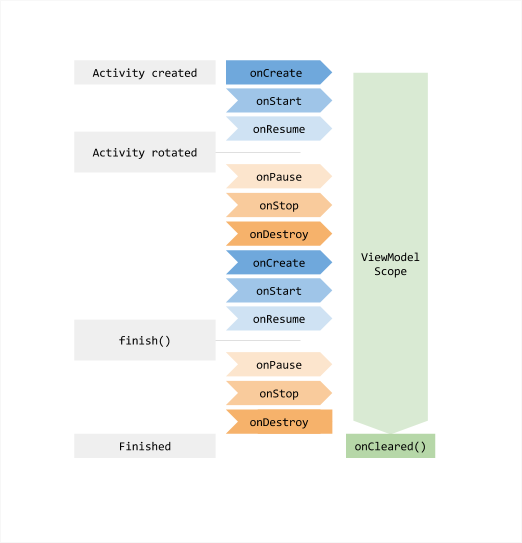

ViewMode  

jetpack [ˈjetˌpak]

# 1.ViewMode概述
* 1.为什么需要ViewModel
  * 让数据可在发生屏幕旋转等配置更改后继续留存。
  * 网络请求，异步操作等耗时的操作，以及数据处理放到viewMode中，activity只负责ui操作，从而减少activity代码

* 对比onSaveInstanceState()   
  从 onCreate() 中的捆绑包恢复其数据，但此方法仅适合可以序列化再反序列化的少量数据，而不适合数量可能较大的数据，如用户列表或位图。

# 2.实现 ViewModel
架构组件为界面控制器提供了 ViewModel 辅助程序类,该类负责为界面准备数据。在配置更改期间会自动保留 ViewModel 对象
```java
class MyViewModel : ViewModel() {}
```

1.获取无参viewMode
```java
  //获取无参构造的ViewModel
  val model: MyViewModel = new ViewModelProvider(this).get(MyViewModel.class);
```

2.获取有参的ViewModel
```java
  new vmFactory = new ProjectViewModelFactory(projectId)
  //获取有参构造的Viewmodel
  val model: MyViewModel = new ViewModelProvider(this, vmFactory).get(MyViewModel.class);
```

```java
class ProjectViewModelFactory(val projectId: Int): ViewModelProvider.Factory {
    override fun <T : ViewModel?> create(modelClass: Class<T>): T {
      //自己创建ViewModel
      return modelClass.getConstructor(Int::class).newInstance(userLiveData)
    }
}
 ```

# 3.ViewModel生命周期
 


# 注意
* 1.ViewModel 绝不能引用视图、Lifecycle 或可能存储对 Activity 上下文的引用的任何类。
* 2.ViewModel 对象绝不能观察对生命周期感知型可观察对象（如 LiveData 对象）的更改.  
* 3.new ViewModelProvider(requireActivity()).get(SharedViewModel.class)同一个activity获取的是同一个viewModel
* 4.ViewModel 与 Room 和 LiveData 一起使用可替换CursorLoader(28中废弃)加载器，ViewModel 确保数据在设备配置更改后仍然存在。Room 在数据库发生更改时通知 LiveData，LiveData 进而使用修订后的数据更新界面。  
* 5.使界面控制器（Activity 和 Fragment）尽可能保持精简。它们不应试图获取自己的数据，而应使用 ViewModel 执行此操作，并观察 LiveData 对象以将更改体现到视图中