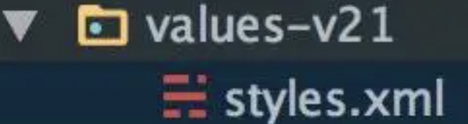

沉浸式

# 2.实现
* Android4.4 以下  
  我们可以对StatusBar和 NavigationBar进行显示和隐藏操作

* Android4.4（API 19） - Android 5.0（API 21）：
  FLAG_TRANSLUCENT_STATUS设置状态栏为透明并且为全屏模式，然后通过添加一个与StatusBar 一样大小的View，将View 的 background 设置为我们想要的颜色，从而来实现沉浸式。表现得还不是很好
```java
activity.getWindow().addFlags(WindowManager.LayoutParams.FLAG_TRANSLUCENT_STATUS);
```
也可以在theme 中设置属性windowTranslucentStatus
```java
android:windowTranslucentStatus
```

```java
 getStatusBarHeight(activity)
 ```

* Android 5.0（API 21）
 android:statusBarColor （对应方法为 setStatusBarColor），通过这个方法我们就可以轻松实现沉浸式。也就是说，从Android5.0开始，系统才真正的支持沉浸式。

 ```java
getWindow().addFlags(WindowManager.LayoutParams.FLAG_DRAWS_SYSTEM_BAR_BACKGROUNDS);
//注意要清除 FLAG_TRANSLUCENT_STATUS flag
getWindow().clearFlags(WindowManager.LayoutParams.FLAG_TRANSLUCENT_STATUS);
getWindow().setStatusBarColor(getResources().getColor(android.R.color.holo_red_light));
```

也可以直接在Theme中使用，在values-v21文件夹下添加如下主题

解释：设置了FLAG_DRAWS_SYSTEM_BAR_BACKGROUNDS,表明会Window负责系统bar的background 绘制，<font color="#dd0000">上浮</font>，绘制透明背景的系统bar（状态栏和导航栏），然后用getStatusBarColor()和getNavigationBarColor()的颜色填充相应的区域。这就是Android 5.0 以上实现沉浸式导航栏的原理。

  

 ```xml
<style name="MDTheme" parent="Theme.Design.Light.NoActionBar">
        <item name="android:windowTranslucentStatus">false</item>
        <item name="android:windowDrawsSystemBarBackgrounds">true</item>
        <item name="android:statusBarColor">@android:color/holo_red_light</item>
</style>
 ```

在Android 5.0 使图片延伸到状态栏，只需设置windowTranslucentStatus,将 statusBarColor 设置为透明即可：
<style name="ImageTranslucentTheme" parent="Theme.AppCompat.DayNight.NoActionBar">
        <item name="android:windowTranslucentNavigation">true</item>
        <item name="android:windowTranslucentStatus">true</item>
        <!-- 设置statusBarColor 为透明-->
        <item name="android:statusBarColor">@android:color/transparent</item>
    </style>

 * Android 6.0（API 23）
  实现状态栏字色和图标浅黑色（除了魅族手机，魅族自家有做源码更改，6.0以下就能实现）

```java
if (Build.VERSION.SDK_INT >= Build.VERSION_CODES.M) {
    getWindow().getDecorView().setSystemUiVisibility(
        View.SYSTEM_UI_FLAG_LAYOUT_FULLSCREEN
        |View.SYSTEM_UI_FLAG_LIGHT_STATUS_BAR);
}
```
为setSystemUiVisibility(int)方法添加的Flag,请求status bar 绘制模式，它可以兼容亮色背景的status bar 。要在设置了FLAG_DRAWS_SYSTEM_BAR_BACKGROUNDSflag ,同时清除了FLAG_TRANSLUCENT_STATUSflag 才会生效。


也可在主题中设置  
主题要放在values-v23文件夹下：
```java
<style name="MDTheme" parent="Theme.Design.Light.NoActionBar">
        <item name="android:windowTranslucentStatus">false</item>
        <item name="android:windowDrawsSystemBarBackgrounds">true</item>
        <item name="android:statusBarColor">@android:color/holo_red_light</item>
        <!-- Android 6.0以上 状态栏字色和图标为浅黑色-->
        <item name="android:windowLightStatusBar">true</item>
    </style>
```

WindowManager.LayoutParams.FLAG_TRANSLUCENT_STATUS这个属性低于6.0的都需要设置,我遇到了魅族,OPPO手机,setStatusBarColor()并没有沉浸,底部导航栏还有遮盖的情况,设置FLAG_TRANSLUCENT_STATUS就可以了


https://www.jianshu.com/p/752f4551e134