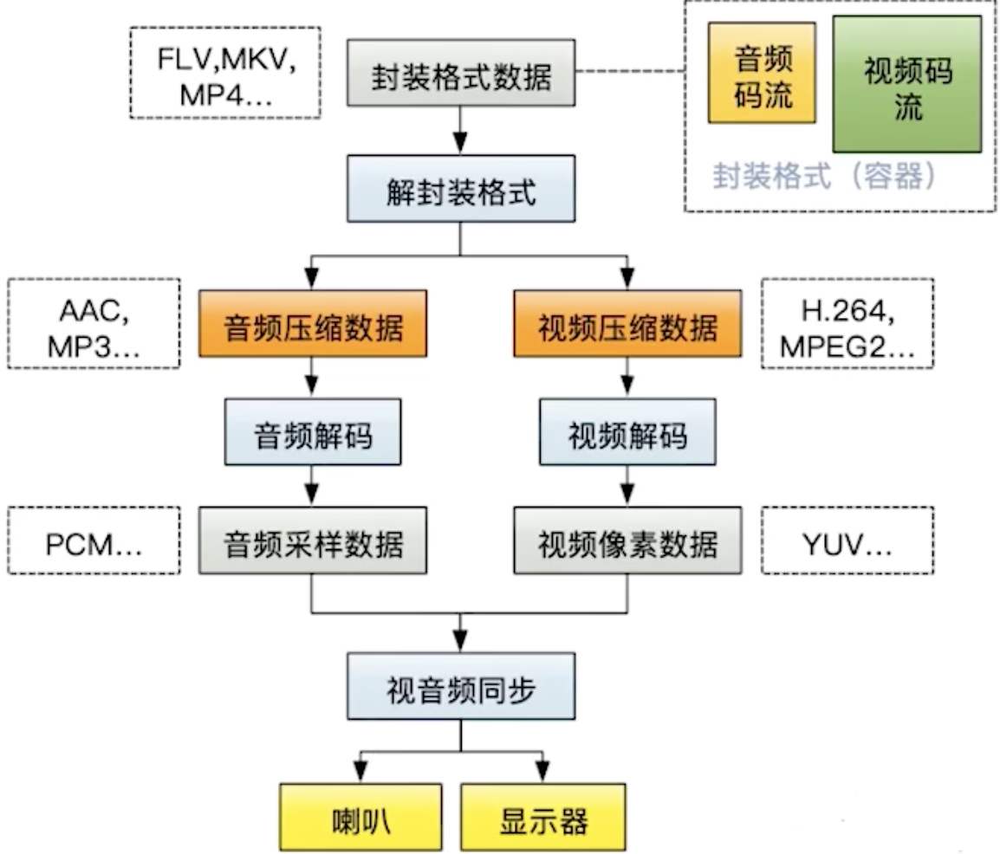
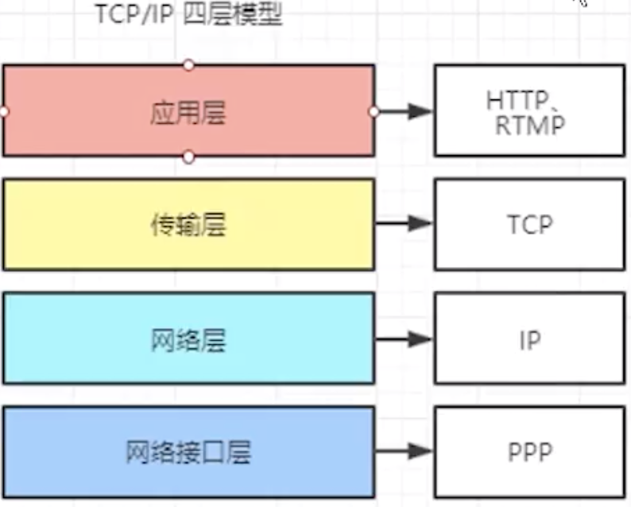
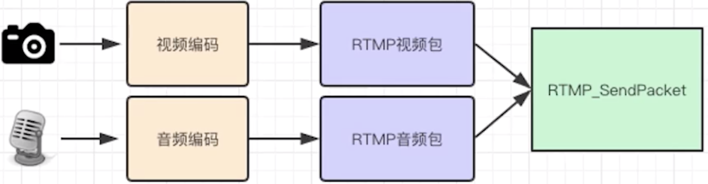

音视频

# 简介

# 视频处理步骤
视频播放器播放一个互联网上的视频文件，需要经过以下几个步骤：
解协议  
解封装  
解码视音频  
视音频同步  

如果播放本地文件则不需要解协议，为以下几个步骤：
解封装  
解码视音频  
视音频同步  

# 传输协议

解协议的过程中会去除掉信令数据(这些信令数据包括对播放的控制（播放，暂停，停止），或者对网络状态的描述等)而只保留视音频数据

HTTP将所有的数据作为文件做处理。http协议不是流媒体协议。
RTMP和RTSP协议是流媒体协议。

## Rtmp
rtmp:/localhost/myapp

协议基于TCP
Adobe 公司为 Flash 播放器和服务器之间音视频数据传输开发的私有协议。

RTMP协议就像一个用来装数据包的容器,这些数据既可以是AMF格式的数据，也可以是FLV中的视/音频数据。

* 优点：  
1.RTMP 是专为流媒体开发的协议，底层优化更好，延迟相对较低 

* 缺点
1.非公共端口，可能会被防火墙阻拦 
2.需要使用第三方解码器才能播放

## HTTP-FLV
HTTP-FLV 即将流媒体数据封装成 FLV 格式，然后通过 HTTP 协议传输给客户端。

依靠 MIME 的特性，根据协议中的 Content-Type 来选择相应的程序去处理相应的内容，使得流媒体可以通过 HTTP 传输。

* 优点
1.很好穿透防火墙

* 缺点 
(1)由于它的传输特性，会让流媒体资源缓存在本地客户端，在保密性方面不够好。
(2)因为网络流量较大，它也不适合做拉流协议。
(3)超文本传送协议(ftp即文件传输协议)

## HLS 
HTTP Live Streaming，苹果公司基于 HTTP 的流媒体传输协议。

HLS 它并不是一下请求完整的数据流。它会在服务器端将流媒体数据切割成连续的时长较短的 ts 小文件，并通过 M3U8 索引文件按序访问 ts 文件。客户端只要不停的按序播放从服务器获取到的文件，从而实现播放音视频。

* 优点 
(1)穿透防火墙。基于 HTTP/80 传输，有效避免防火墙拦截 
(2)性能高。通过 HTTP 传输， 支持网络分发，CDN 支持良好，且自带多码率自适应，Apple 在提出 HLS 时，就已经考虑了码流自适应的问题。

* 缺点： 
1.实时性差，延迟高。HLS 的延迟基本在 10s+ 以上 (服务器切割视频，客户端先下载再播放)
2.文件碎片。特性的双刃剑，ts 切片较小，会造成海量小文件，对存储和缓存都有一定的挑战

# 解封装
就是将输入的封装格式的数据，分离成为音频流压缩编码数据和视频流压缩编码数据

MP4，MKV，RMVB，TS，FLV，AVI等。 
例如：FLV格式的数据，经过解封装操作后，输出H.264编码的视频码流和AAC编码的音频码流

# 3.解码
就是将视频/音频压缩编码数据，解码成为非压缩的视频/音频原始数据。

音频的原始数据格式主要有如下几种：
PCM 格式
音频的编解码标准主要有如下几种：
MP3
AAC
AC-3

视频的原始数据格式主要有如下几种：
YUV 格式
RGB 格式
视频的编解码标准主要有如下几种：
H.264
H.265
MPEG2

# 开源播放器内核对比

## 1.MediaPlayer
基本上只支持本地和HTTP协议的视频播放，扩展性都很差，只适合最简单的视频播放需求。

# ijkPlayer
Bilibili公司开源的播放器实现

优点：
1.ijkplayer结构比较简单，基本以ffplay展开，开发难度较小；
2.ijkplayer包比VLC小一点，经过裁剪，约为4.2M左右；

缺点：
1.ijkplayer可扩展性较差，基本上没有提供modules供开发者二次开发；
2.ijkplayer 官方维护力度小，版本更新很慢；

## 4、VLC Media Player
SmartPlayer系大牛直播SDK(Github)出品的全自研内核的RTSP和RTMP直播播放器SDK，跨平台(Windows、Android、iOS)、功能齐全、高稳定、超低延迟，超低资源占用，适用于安防、教育、单兵指挥等对延迟和稳定性要求比较苛刻的场景。

在机器性能没有瓶颈的前提下，SmartPlayer的RTSP播放器和RTMP播放器延迟是业内为数不多毫米级的。

## 5 SmartPlayer
SmartPlayer系大牛直播SDK(Github)出品的全自研内核的RTSP和RTMP直播播放器SDK，跨平台(Windows、Android、iOS)、功能齐全、高稳定、超低延迟，超低资源占用，适用于安防、教育、单兵指挥等对延迟和稳定性要求比较苛刻的场景。

在机器性能没有瓶颈的前提下，SmartPlayer的RTSP播放器和RTMP播放器延迟是业内为数不多毫米级的。

# 解封装
将已经压缩编码的视频数据和音频数据按照一定的格式放到一起。

封装的格式：例如MP4，MKV，RMVB，TS，FLV，AVI等等

# 直播技术
## 直播场景
推流系统：主播端直播   (obstudio 直播)
拉流系统：客户端观看  
礼物系统：  
社交系统：  
聊天系统：  
直播系统：  

应用层协议：RTMP/HTTP
RTMP协议：C语言开源的库，封装Socket，建立tcp的协议。
RTMP:Real time messaging protocol实时消息传输协议。

音频采集
AudioRecord
OpenSl Es

# 补充

## 1. 软/硬解码
硬解码：要机器中的专门的解码芯片来完成，质量因厂家的技术能力而定，部分厂商技术实力强，兼容性和解码效果做的比较好，而有些厂商技术实力稍差，兼容性和解码效果做的就不尽如意。  

软解码：是用CPU来解码，需要CPU的性能与处理能力较强，但对流媒体格式兼容性比较好，因为软解库是自行开发的，质量能控制。  

## AndroidVideoCache

视频缓存