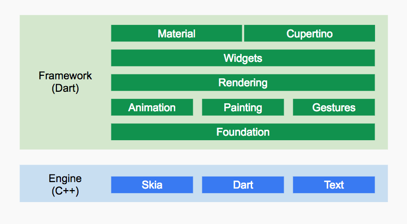
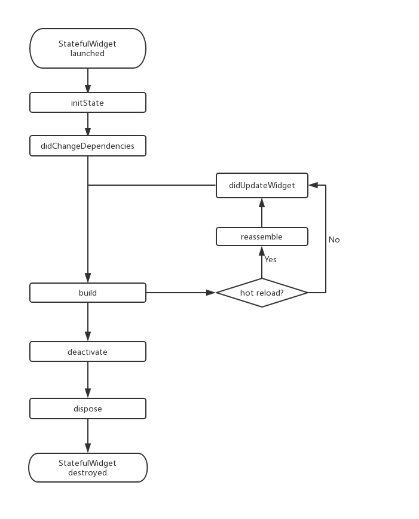

Flutter 介绍

# 1.跨平台解决方案

## 1.Hybrid技术简介
WebView (Android)或WKWebView（iOS）来加载h5.

缺点：WebView渲染，性能一般。权限有限，例如获取手机型号，访问文件系统、使用蓝牙。

## 2.JavaScript开发+原生渲染
JavaScript开发+原生渲染的方式主要优点如下：

采用Web开发技术栈，社区庞大、上手快、开发成本相对较低。
原生渲染，性能相比H5提高很多。
动态化较好，支持热更新。 

而RN中将虚拟DOM映射为原生控件的过程中分两步：  
布局消息传递； 将虚拟DOM布局信息传递给原生；  
原生根据布局信息通过对应的原生控件渲染控件树；

缺点：
渲染时需要JavaScript和原生之间通信，在有些场景如拖动可能会因为通信频繁导致卡顿。
JavaScript为脚本语言，执行时需要JIT(Just In Time)，执行效率和AOT(Ahead Of Time)代码仍有差距。
由于渲染依赖原生控件，不同平台的控件需要单独维护，并且当系统更新时，社区控件可能会滞后；除此之外，其控件系统也会受到原生UI系统限制，例如，在Android中，手势冲突消歧规则是固定的，这在使用不同人写的控件嵌套时，手势冲突问题将会变得非常棘手。


## 3.跨平台自绘引擎
自己的高性能渲染引擎来绘制widget。这样不仅可以保证在Android和iOS上UI的一致性，而且也可以避免对原生控件依赖而带来的限制及高昂的维护成本。

* 1.静态编译AOT  
  静态编译的程序在执行前全部被翻译为机器码，通常将这种类型称为AOT （Ahead of time）即 “提前编译”
* 2.即时编译
  而解释执行的则是一句一句边翻译边运行，通常将这种类型称为JIT（Just-in-time）即“即时编译”

  

## 总结

技术类型 | UI渲染方式 | 性能 | 开发效率 | 动态化 | 框架代表
---|---|---|---|---|---
H5+原生 | WebView渲染 | 一般,系统权限有限 | 高 | 支持 | Cordova、Ionic，微信小程序
JavaScript+原生渲染 | 原生控件渲染 | 好 | 中 | 支持 | RN、Weex，快应用
自绘UI+原生 | 调用系统API渲染 | 好 | Flutter高, QT低 | 默认不支持 | QT、Flutter

# 2.Flutter

## 2.1 优点

### a. 开发效率高
Dart运行时和编译器支持Flutter的两个关键特性的组合：

基于JIT的快速开发周期：Flutter在开发阶段采用，采用JIT模式，这样就避免了每次改动都要进行编译，极大的节省了开发时间；

基于AOT的发布包: Flutter在发布时可以通过AOT生成高效的ARM代码以保证应用性能。而JavaScript则不具有这个能力。

Flutter：

### b.高性能
  有高效的渲染引擎，Flutter中需要能够在每个动画帧中运行大量的代码。

### c.类型安全
由于Dart是类型安全的语言，支持静态类型检测，所以可以在编译前发现一些类型的错误，并排除潜在问题

## 2.2 框架结构


## Flutter Framework
### dart UI层
Foundation和Animation、Painting、Gestures。
它是Flutter引擎暴露的底层UI库，提供动画、手势及绘制能力。

在Google的一些视频中被合并为一个dart UI层，对应的是Flutter中的dart:ui包，它是Flutter引擎暴露的底层UI库，提供动画、手势及绘制能力。

### Rendering层
抽象的布局层，Rendering层会构建一个UI树，当UI树有变化时，会计算出有变化的部分，然后更新UI树，最终将UI树绘制到屏幕上。

它除了确定每个UI元素的位置、大小之外还要进行坐标变换、绘制(调用底层dart:ui)。

### Widgets层
基础组件库，还提供了 Material 和Cupertino两种视觉风格的组件库。

### Flutter Engine
纯 C++实现的 SDK，其中包括了 Skia引擎、Dart运行时、文字排版引擎等。在代码调用 dart:ui库时，调用最终会走到Engine层，然后实现真正的绘制逻辑。


## 2.四种工程类型

Flutter Application | Flutter应用
Flutter Plugin | Flutter插件
Flutter Package | 纯Dart组件
Flutter Module | Flutter与原生混合开发

Plugin其实就是一个特殊的Package。Flutter Plugin提供Android或者iOS的底层封装，在Flutter层提供组件功能，使Flutter可以较方便的调取Native的模块。很多平台相关性或者对于Flutter实现起来比较复杂的部分，都可以封装成Plugin。


# 基础控件

## Widget
包含UI元素，手势检测的 GestureDetector widget、用于APP主题数据传递的Theme等等。  
原生开发控件通常只是指UI元素。  

* 总结
Widget树实际上是一个配置树，而真正的UI渲染树是由Element构成；不过，由于Element是通过Widget生成的，所以它们之间有对应关系，在大多数场景，我们可以宽泛地认为Widget树就是指UI控件树或UI渲染树。  
一个Widget对象可以对应多个Element对象。这很好理解，根据同一份配置（Widget），可以创建多个实例（Element）。

## Widget与Element
Widget只是UI元素的一个配置数据，Element是屏幕上显示元素的类，并且一个Widget可以对应多个Element。


## 源码分析

```dart
@immutable
abstract class Widget extends 
    //DiagnosticableTree即“诊断树”，主要作用是提供调试信息
    DiagnosticableTree {
  const Widget({ this.key });

      @protected
    Element createElement();

    //复写父类的方法，主要是设置诊断树的一些特性。
    @override
    void debugFillProperties(DiagnosticPropertiesBuilder properties) {
        super.debugFillProperties(properties);
        properties.defaultDiagnosticsTreeStyle = DiagnosticsTreeStyle.dense;
    }
  
  //是否用新的Widget对象去更新旧UI树上所对应的Element对象的配置
  //只要newWidget与oldWidget的runtimeType和key同时相等时就会用newWidget去更新Element对象的配置，否则就会创建新的Element。
    static bool canUpdate(Widget oldWidget, Widget newWidget) {
        return oldWidget.runtimeType == newWidget.runtimeType
        && oldWidget.key == newWidget.key;
    }
}

```

Widget的属性应尽可能的被声明为final，防止被意外改变。

### StatelessWidget
它继承自Widget类，重写了createElement()方法.  
Widget的属性应尽可能的被声明为final，防止被意外改变。


### StatefulWidget 
tatefulWidget也是继承自Widget类，并重写了createElement()方法，不同的是返回的Element 对象并不相同；  
另外StatefulWidget类中添加了一个新的接口createState()。

```dart
abstract class StatefulWidget extends Widget {
  const StatefulWidget({ Key key }) : super(key: key);
    
    //StatefulElement中可能会多次调用createState()来创建状态(State)对象。
  @override
  StatefulElement createElement() => new StatefulElement(this);
    
  @protected
  State createState();
}

```

```dart
class _CounterWidgetState extends State<CounterWidget> {  
  int _counter;

// 当Widget第一次插入到Widget树时会被调用  
  @override
  void initState() {}

//initState() / didUpdateWidget() / setState() /didChangeDependencies()
//State对象从树中一个位置移除后（会调用deactivate）又重新插入到树的其它位置之后。
  @override
  Widget build(BuildContext context) {}

//在widget重新构建时
  @override
  void didUpdateWidget(CounterWidget oldWidget) {}

//当State对象从树中被移除时，会调用此回调
  @override
  void deactivate() {}

//当State对象从树中被永久移除时调用；通常在此回调中释放资源
  @override
  void dispose() {}

//在热重载(hot reload)时会被调用，此回调在Release模式下永远不会被调用。
  @override
  void reassemble() {}

//当State对象的依赖发生变化时会被调用
//典型的场景是当系统语言Locale或应用主题改变时，Flutter framework会通知widget调用此回调。
  @override
  void didChangeDependencies() {}

}
```



### 为什么build方法放在State中

* 构建过程不仅可以直接访问状态，而且也无需公开私有状态，这会非常方便。  
* 继承StatefulWidget不便。
  

# Context
```dart
// 在Widget树中向上查找最近的父级`Scaffold` widget
Scaffold scaffold = context.findAncestorWidgetOfExactType<Scaffold>();
```

获取state
```dart
// 查找父级最近的Scaffold对应的ScaffoldState对象
ScaffoldState _state = context.findAncestorStateOfType<ScaffoldState>();

// 直接通过of静态方法来获取ScaffoldState 
ScaffoldState _state=Scaffold.of(context); 

<!-- GlobalKey存储并获取state，使用GlobalKey开销较大，应尽量避免使用它 -->
static GlobalKey<ScaffoldState> _globalKey= GlobalKey();
//设置key
Scaffold(key: _globalKey)
//获得widget对应的element对象
globalKey.currentState
//获取State对象
_globalKey.currentState.openDrawer()
//获得该widget对象
globalKey.currentWidget
//获得widget对应的element对象
globalKey.currentElement

```


# Cupertino组件
一套丰富的Cupertino风格的组件,可以根据实际运行平台来切换表现风格.


## 向下传递约束，向上传递尺寸
最后父widget决定把子widget放在哪里。
runApp下的是根组件，根widget充满全屏，无法更改。之后的widget必须满足上一级的约束，才会生效。
这决定了如果没有设置子布局的位置，子布局将和父布局一样大小

LayoutBuilder可以查看约束的大小。  
double.infinity:正无穷，因为父widget约束，只能充满父widget。
```dart
LayoutBuilder(builder:(BuildContext context, BoxConstraints constraints){
        print("container:$constraints");
        return FlutterLogo(size: 900);
      })
```

colum向下传递的约束无限，它布局固定的高度，之后在限制弹性布局高度。  
如果子widget向上传递无限高度，会导致移除。解决：使用弹性布局Expanded，这一块可以滑动。