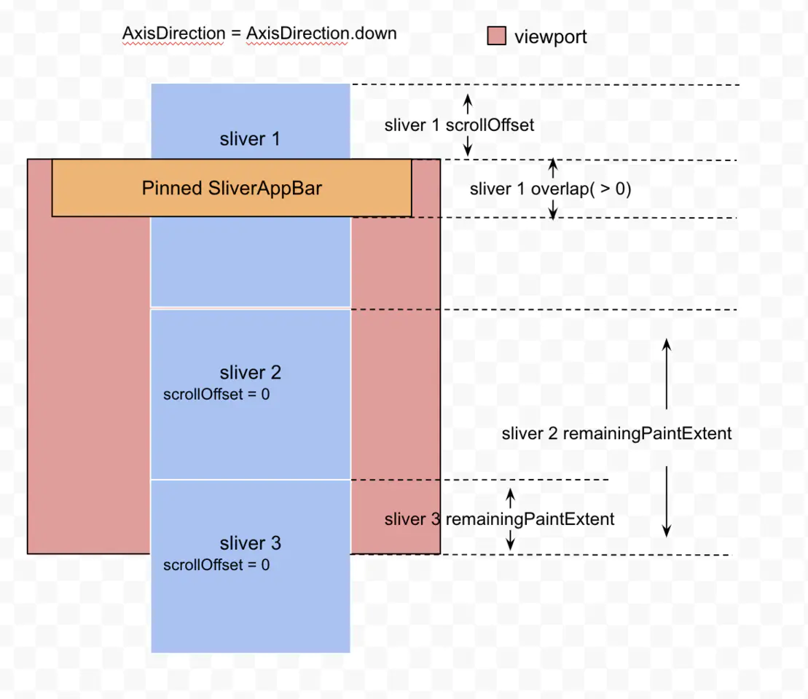
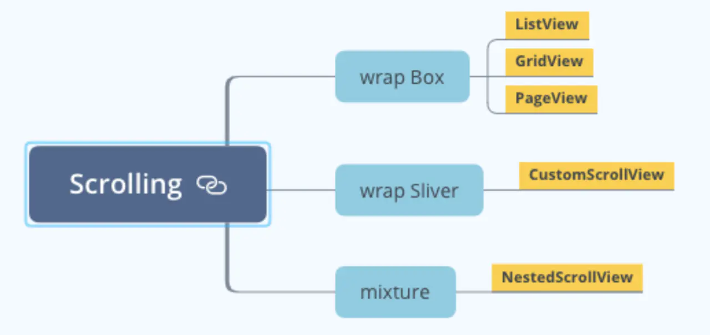

slipe

<!-- TOC -->

- [介绍](#介绍)
- [源码](#源码)
  - [Viewport](#viewport)
  - [ScrollPostion](#scrollpostion)
  - [Scrollable](#scrollable)
  - [SliverConstraints](#sliverconstraints)
  - [SliverGeometry](#slivergeometry)
- [Scrolling 常用 Widget](#scrolling-常用-widget)
  - [NestedScrollView](#nestedscrollview)
  - [CustomScrollView](#customscrollview)
  - [Slivers](#slivers)
    - [SliverAppBar](#sliverappbar)
  - [SliverList / SliverGrid](#sliverlist--slivergrid)
  - [SliverFixedExtentList](#sliverfixedextentlist)
  - [SliverPersistentHeader](#sliverpersistentheader)
  - [SliverToBoxAdapter](#slivertoboxadapter)
  - [SliverPadding](#sliverpadding)
  - [SliverSafeArea](#sliversafearea)
  - [SliverFillRemaining](#sliverfillremaining)

<!-- /TOC -->

# 介绍
Flutter 的布局可以分为两种：  
* Box ( RenderBox ): 2D 绘制布局
* Sliver ( RenderSliver )：滚动布局


ViewPort视口
* 指一个Widget的实际显示区域。
* ViewPort 的宽高是确定的，它内部 Slivers 的宽高之和是可以大于自身的宽高的；
* ViewPort 为了提高性能采用懒加载机制，它只会绘制可视区域内容 Widget。

Sliver
* 该滚动可以将子组件分成好多个“薄片”（Sliver），只有当Sliver出现在视口中时才会去构建它，这种模型也称为“基于Sliver的延迟构建模型”

# 源码
重要参数

## Viewport
```dart
class Viewport extends MultiChildRenderObjectWidget {
  /// 主轴方向
  final AxisDirection axisDirection;
  /// 纵轴方向
  final AxisDirection crossAxisDirection;
  /// center 决定 viewport 的 zero 基准线，也就是 viewport 从哪个地方开始绘制，默认是第一个 sliver
  /// center 必须是 viewport slivers 中的一员的 key
  final Key center;
  
/// 锚点，取值[0,1]，和 zero 的相对位置，比如 0.5 代表 zero 被放到了 Viewport.height / 2 处
  final double anchor;
  /// 滚动的累计值，确切的说是 viewport 从什么地方开始显示
  final ViewportOffset offset;
  /// 缓存区域，也就是相对有头尾需要预加载的高度
  final double cacheExtent;
  /// children widget
  List<Widget> slivers；
  }
```

## ScrollPostion
ScrollPosition 决定了 Viewport 哪些区域是可见的，它包含了Viewport 的滚动信息.
```dart
abstract class ScrollPosition extends ViewportOffset with ScrollMetrics {
  // 滚动偏移量
  double _pixels;
  // 设置滚动响应效果，比如滑动停止后的动画
  final ScrollPhysics physics;
  // 保存当前的滚动偏移量到 PageStore 中，当 Scrollable 重建后可以恢复到当前偏移量
  final bool keepScrollOffset;
  // 最小滚动值
  double _minScrollExtent;
  // 最大滚动值
  double _maxScrollExtent;
  ...
}
```

## Scrollable
Scrollable 是一个可滚动的 Widget，它主要负责：
* 监听用户的手势，计算滚动状态发出 Notification
* 计算 offset 通知 listeners
* 通过构造注入的 viewportBuilder 来创建一个 Viewport 来显示内容，当滚动状态变化的时候，Scrollable 就会不断的更新 Viewport 的 offset ,不断的更新显示内容。

```dart
<!-- ScrollableScope 继承自 InheritedWidget,方便的获取 scrollable 和 position； -->
_ScrollableScope(
      scrollable: this,
      position: position,
      child: Listener(
        onPointerSignal: _receivedPointerSignal,
        //负责手势监听，手势变化时会回调 _gestureRecognizers；
        child: RawGestureDetector(
          gestures: _gestureRecognizers,
          ...,
          child: Semantics(
            ...
            child: IgnorePointer(
			...
                //viewportBuilder 会生成 viewport；
              child: widget.viewportBuilder(context, position),
            ),
          ),
        ),
      ),
    );
```

## SliverConstraints

```dart
class SliverConstraints extends Constraints {
  // 主轴方向
  final AxisDirection axisDirection;
  // 窗口增长方向
  final GrowthDirection growthDirection;
  // 如果 Direction 是 AxisDirection.down,scrollOffset 代表 sliver 的 top 滑过 viewport 的 top 的值，没滑过 viewport 的 top 时 scrollOffset 为 0。
  final double scrollOffset;
  // 上一个 sliver 覆盖下一个 sliver 的大小（只有上一个 sliver 是 pinned/floating 才有效）
  final double overlap;
  // 轮到当前 sliver 开始绘制了，需要 viewport 告诉 sliver 当前还剩下多少区域可以绘制，受 viewport 的 size 影响
  final double remainingPaintExtent;
  // viewport 主轴上的大小
  final double viewportMainAxisExtent;
  // 缓存区起点（相对于 scrolloffset），如果 cacheExtent 设置为 0，那么 cacheOrigin 一直为 0
  final double cacheOrigin;
  // 剩余的缓存区大小
  final double remainingCacheExtent;

  ...
}

```



## SliverGeometry

iewport 通过 SliverConstraints 告知它内部的 sliver 自己的约束信息，比如还有多少空间可用、offset 等，那么Sliver 则通过 SliverGeometry 反馈给 Viewport 需要占用多少空间量。

```dart
class SliverGeometry extends Diagnosticable {
  // sliver 可以滚动的范围，可以认为是 sliver 的高度（如果是 AxisDierction.Down） 
  final double scrollExtent;
  // 绘制起点（默认是 0.0），是相对于 sliver 开始 layout 的起点而言的，不会影响下一个 sliver 的 layoutExtent，会影响下一个 sliver 的paintExtent
  final double paintOrigin;
  // 绘制范围
  final double paintExtent;
  // 布局范围，当前 sliver 的 top 到下一个 sliver 的 top 的距离，范围是[0,paintExtent],默认是 paintExtent，会影响下一个 sliver 的 layout 位置
  final double layoutExtent;
  // 最大绘制大小，必须 >= paintExtent
  final double maxPaintExtent;
  // 如果 sliver 被 pinned 在边界的时候，这个大小为 Sliver 的自身的高度,其他情况为0,比如 pinned app bar
  final double maxScrollObstructionExtent;
  // 点击有效区域的大小，默认为paintExtent
  final double hitTestExtent;
  // 是否可见，visible = (paintExtent > 0)
  final bool visible;
  // 是否需要做clip，免得chidren溢出
  final bool hasVisualOverflow;
  // 当前 sliver 占用了 SliverConstraints.remainingCacheExtent 多少像素值
  final double cacheExtent;
  ...
}
```


```dart
class CustomRefreshWidget extends SingleChildRenderObjectWidget {
  const CustomRefreshWidget({Key key, Widget child})
      : super(key: key, child: child);

  @override
  RenderObject createRenderObject(BuildContext context) {
    return SimpleRefreshSliver();
  }
}

/// 一个简单的下拉刷新 Widget
class SimpleRefreshSliver extends RenderSliverSingleBoxAdapter {
  @override
  void performLayout() {
    ...
    final bool active = constraints.overlap < 0.0;
    /// 头部滑动的距离
    final double overscrolledExtent =
        //constraints.overlap：List 第一个 Sliver 的 top 距离屏幕 top 的距离
        constraints.overlap < 0.0 ? constraints.overlap.abs() : 0.0;
    //计算child的高度
    double layoutExtent = child.size.height;
    print("overscrolledExtent:${overscrolledExtent - layoutExtent}");
    child.layout(
      constraints.asBoxConstraints(
        maxExtent: layoutExtent + overscrolledExtent,
      ),
      parentUsesSize: true,
    );
    if (active) {
      geometry = SliverGeometry(
        scrollExtent: layoutExtent,
        // 绘制起始位置, 也就是第一个weidget原点位置
        //  paintOrigin = min(overscrolledExtent - RefreshWidget.height, 0)
        paintOrigin: min(overscrolledExtent - layoutExtent, 0),
        //绘制范围，
        paintExtent: max(max(child.size.height, layoutExtent) ,0.0,),
        maxPaintExtent: max(max(child.size.height, layoutExtent) ,0.0,),
        /// 布局占位  RefreshWidget 的高度
        layoutExtent: min(overscrolledExtent, layoutExtent),
      );
    } else {
      /// 如果不想显示可以直接设置为 zero
      geometry = SliverGeometry.zero;
    }
    setChildParentData(child, constraints, geometry);
  }
}

```
# Scrolling 常用 Widget



## NestedScrollView
NestedScrollView 其实里面是一个CustomScrollView，它的 headers 是 Sliver 的数组，body是被包裹在 SliverFillRemaining 中的，body 可以接受 Box。

* headerSliverBuilder()
headerSliverBuilder 中使用携带 TabBar 的 SliverAppBar（就是使用 SliverAppBar 的 bottom 属性添加 tab 切换也），其 body 属性使用 TabBarView 来展示 Tab 页的内容，这样通过切换 Tab 页就能展示该页下的展示内容。

构建 NestScrollView 的头部部件，innerBoxIsScrolled 主要用来控制 SliverAppBar 的 forceElevated 属性，当内部内容滚动时，显示 SliverAppbar 的阴影，主要用来提醒内部的内容低于 SliverAppBar （相当于给人一种物理层次感，否则很容易被认为，头部和内容是连接在一起的）


* SliverOverlapAbsorber  
一个 sliver 部件，用于把部件重叠的高度反馈给 SliverOverlapAbsorberHandle，而且指明了 handle 不能空，可以通过 NestedScrollView 的 sliverOverlapAbsorberHandleFor 方法来赋值，并且 child 必须是个 sliver 部件，也就是说我们的 SliverAppBar 需要放到 SliverOverlapAbsorber 里面。

* SliverOverlapInjector  
创建一个和指定的 handle 一样高度的 sliver 部件，这个 handle 同 SliverOverlapAbsorber 的 handle 保持一致即可。


## CustomScrollView
直接使用 ListView 嵌套 ListView 会报错，性能会比较差，因为内部的列表每次都要计算出所有 content 的高度，这个时候使用 CustomScrollView 更为合适。

CustomScrollView 可以让它内部的 Slivers 进行联动，比如做一个可伸缩的 TitleBar 、中间区域可以固定的 header、下拉刷新组件等等。


## Slivers
### SliverAppBar
类似于 android 中 CollapsingToolbarLayout，可以根据滑动做伸缩布局，并提供了 actions，bottom 等提高效率的属性。

```dart
CustomScrollView(slivers: <Widget>[
      SliverAppBar(
        title: Text('Sliver Demo'),
        centerTitle: true,
        // 展开的高度
        expandedHeight: 300.0,
        // 强制显示阴影
        forceElevated: true,
        // 设置该属性，当有下滑手势的时候，就会显示 AppBar
//        floating: true,
        // 该属性只有在 floating 为 true 的情况下使用，不然会报错
        // 当上滑到一定的比例，会自动把 AppBar 收缩（不知道是不是 bug，当 AppBar 下面的部件没有被 AppBar 覆盖的时候，不会自动收缩）
        // 当下滑到一定比例，会自动把 AppBar 展开
//        snap: true,
        // 设置该属性使 Appbar 折叠后不消失
//        pinned: true,
        // 通过这个属性设置 AppBar 的背景
        flexibleSpace: FlexibleSpaceBar(
//          title: Text('Expanded Title'),
          // 背景折叠动画
          collapseMode: CollapseMode.parallax,
          background: Image.asset('images/timg.jpg', fit: BoxFit.cover),
        ),
      ),

      // 这个部件一般用于最后填充用的，会占有一个屏幕的高度，
      // 可以在 child 属性加入需要展示的部件
      SliverFillRemaining(
        child: Center(child: Text('FillRemaining', style: TextStyle(fontSize: 30.0))),
      ),
])

```

## SliverList / SliverGrid
用法和 ListView / GridView 基本一致。 

ListView = SliverList + Scrollable，也就是说 SliverList 不具备处理滑动事件的能力，所以它必须配合 CustomScrollView 来使用。

## SliverFixedExtentList

它比 SliverList 多了修饰词 FixedExtent，意思是它的 item 在主轴方向上具有固定的高度/宽度。  
设计它的原因是在 item 高度/宽度全都一样的场景下使用，它的效率比 SliverList 高，因为它不用通过 item 的 layout 过程就可以知道每个 item 的范围。


## SliverPersistentHeader

SliverPersistentHeader 是一个可以固定/悬浮的 header，它可以设置在列表的任意位置，显示的内容需要设置 。

或者头部伸缩
* SliverPersistentHeaderDelegate。


```
const SliverPersistentHeader({
    Key key,
    @required this.delegate, // SliverPersistentHeaderDelegate，用来创建展示内容
    this.pinned = false, // 同 SliverAppBar 属性
    this.floating = false,
  }) 
```

## SliverToBoxAdapter
将 BoxWidget 转变为 Sliver：由于 CustomScrollView 只能接受 Sliver 类型的 child，所以很多常用的 Widget 无法直接添加到 CustomScrollView 中，此时只需要将 Widget 用 SliverToBoxAdapter 包裹一下就可以了。    
最常见的使用就是 SliverList 不支持横向模式，但是又无法直接将 ListView 直接添加到 CustomScrollView 中，此时用 SliverToBoxAdapter 包裹一下：


## SliverPadding

可以用在 CustomScrollView 中的 Padding。   
需要注意的是不要用它来包裹 SliverPersistentHeader ，因为它会使 SliverPersistentHeader 的 pinned 失效，如果 SliverPersistentHeader 非要使用 Padding 效果，可以在 delegate 内部使用 Padding。

## SliverSafeArea

用法和 SafeArea 一致。

## SliverFillRemaining
可以填充屏幕剩余控件的 Sliver。

SliverFillViewport：每个 item 需要占满一个屏幕或者更大，可以使用该部件生成列表。
SliverFillRemaning：


参考文档
Sliver：  
https://juejin.cn/post/6844904155195129864

https://juejin.cn/post/6844903821328515079

张风捷
https://juejin.cn/post/6887396184015208461

使用
https://juejin.cn/post/6911498454757801997

Painting ，Gestures，Animation
https://juejin.cn/post/6982706070653239327

拖拽
https://juejin.cn/post/6983832427294621733

绘制
https://zhuanlan.zhihu.com/p/146033612