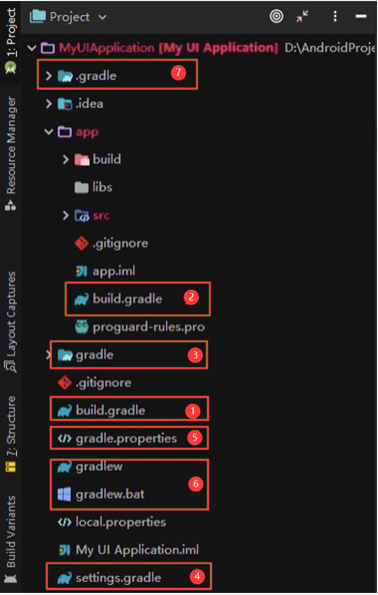
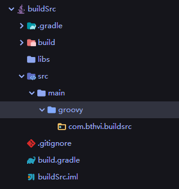
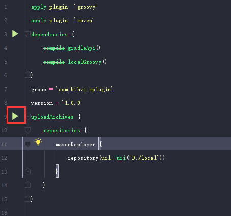

Gradle

Gradle [ɡreɪdl]
Groovy [ˈgruvi] 常规的

<!-- TOC -->

- [1.简介](#1简介)
  - [1.1 对比其他的构建工具](#11-对比其他的构建工具)
  - [1.2 特点](#12-特点)
- [2.Android中的Gradle](#2android中的gradle)
  - [2.1 项目结构](#21-项目结构)
  - [a.根目录下的 build.gradle 文件](#a根目录下的-buildgradle-文件)
  - [b.app目录下的 build.gradle 文件](#bapp目录下的-buildgradle-文件)
  - [c.setting.gradle](#csettinggradle)
  - [d.gradle.projects 文件](#dgradleprojects-文件)
  - [e.gradlew 和 gradlew.bat](#egradlew-和-gradlewbat)
  - [f.Gradle Wrapper](#fgradle-wrapper)
- [3.编写 Gradle 任务Task](#3编写-gradle-任务task)
  - [3.Gradle任务](#3gradle任务)
  - [3.2 Gradle命令](#32-gradle命令)
  - [3.3 exlude 排除依赖包中的部分类](#33-exlude-排除依赖包中的部分类)
  - [4.Gradle 插件](#4gradle-插件)
    - [a.脚本插件](#a脚本插件)
    - [b.对象插件](#b对象插件)
  - [4.Gradle 运用在组件化中](#4gradle-运用在组件化中)
  - [1. 组件化与集成化](#1-组件化与集成化)
  - [2. config.gradle](#2-configgradle)
  - [3.多渠道打包](#3多渠道打包)

<!-- /TOC -->

# 1.简介
Gradle：自动化的项目构建工具，帮助我们自动构建项目。使用 Groovy 或 Kotlin DSL 
DSL：Domain Specific Language，特定领域的语言

帮助完成
通过javac先将 Java 文件编译为 class 文件，然后再用jar命令将 class 文件打包为 jar 包
如果没有gradle，得执行多少命令才能最终打出一个 apk 包

## 1.1 对比其他的构建工具
* Apache Ant
* Apache Maven

## 1.2 特点
* 高度可定制
  它的高度可定制化体现在，它以最基本的方式可定制和可扩展的方式建模；
* 快速 
  Gradle 通过重新使用以前执行的输出，仅处理已更改的输入以及并行执行任务来快速完成任务。通俗点就是说，第二次构建，只构建我们修改代码相关的类，不会耗费时间来构建整个项目；
* 强大 
  Gradle 是 Android 的官方构建工具，并支持许多流行的语言和技术。


# 2.Android中的Gradle

## 2.1 项目结构
  

* 1.根目录下的 build.gradle： 顶级构建文件，配置 Gradle 版本和 Maven 依赖；
* 2.app 目录下的 build.gralde文件： app 打包和签名配置，及模块的依赖；
* 3.gradle 文件夹： 配置 gradel-wrapper；
* 4.setting.gradle 文件： 添加编译的所有模块；
* 5.gradle.projects 文件： 项目范围的梯度设置，编译内存，Gradle 并发性等设置。；
* 6.gradlew 和 gradlew.bat 文件： Gradle 启动脚本文件；
* 7..gradle 文件夹： 编译时的缓存文件夹。


```gradle
task hello {
    doLast {
        println 'Hello world!'
    }
}
```

在 Gradle 中task和action是其非常重要的两个元素。在上面的代码中，hello是一个task，也就是一个原子任务。doLast是一个action。就是task执行完成后就会回调这个action

## a.根目录下的 build.gradle 文件
顶级构建文件，可以在其中添加所有子项目/模块共有的配置选项。
以下是内容，以及闭包的说明
```Gradle
//顶级构建文件，您可以在其中添加所有 子项目/modules 共有的配置选项

//配置 Gradle 脚本执行所需要的的依赖
buildscript {
    //配置远程的 Maven 仓库地址
    repositories {
        maven { url "http://maven.aliyun.com/nexus/content/groups/public/" }
        google()
        //配置了很多仓库，例如Android 中的 V7，V4 包
        jcenter()
    }
    //配置构建工具 Gradle 的版本
    //classpath 就是声明一个插件 Gradle来构建项目
    dependencies {
         //注意：不要将您的应用程序依赖项放在这里； 它们属于单独的模块 build.gradle 文件
        classpath 'com.android.tools.build:gradle:3.5.1'
       
    }
}

//项目运行所需要的的依赖，往往和上面的repositories是相对应的。
allprojects {
    repositories {
        //国外 Maven 访问太慢，以加入国内阿里云的 Maven 库。
        maven { url "http://maven.aliyun.com/nexus/content/groups/public/" }
        google()
        jcenter()
    }
}

//Gradle 是基于任务的，clean就是一个 Gradle 任务，它继承自Delete。
//点击clean Project或是执行gradle clean命令的时候就是在执行这个任务，它的任务内容是删除build文件夹下的内容。
task clean(type: Delete) {
    delete rootProject.buildDir
}
```


## b.app目录下的 build.gradle 文件
闭包的说明
* apply plugin 语句：应用一个插件
* android 闭包
* dependencies 闭包
```Gradle
//代表这个模块是一个Android应用程序模块，可以独立运行，生成apk文件。
apply plugin: 'com.android.application'
//代表这个模块是一个Android model，不能够独立运行，必须依附于application才能运行，项目构建后生成的是一个aar文件
//com.android.library：如果是这个值，
//注释2
android {
    //设置编译时的 Android 版本。
    compileSdkVersion 28
    //设置编译时构建工具的版本。
    buildToolsVersion "29.0.2"
    //设置包的一些基本信息
    defaultConfig {
        //设置打包后的 APK 的包名
        applicationId "com.bthvi.myuiapplication"
        //设置 apk 最低运行的安卓版本
        minSdkVersion 19
        //设置项目的目标版本，高于这个版本的特性将不会被开启
        targetSdkVersion 28
        // 设置 APK 包的版本号，一般情况每次打包都要 +1，否则会无法覆盖安装
        versionCode 1
        //表示版本名称，展示在 APP 的关于里面或是应用市场上。
        versionName "1.0"
        //设置单元测试
        testInstrumentationRunner "androidx.test.runner.AndroidJUnitRunner"
    }
    //这个闭包主要是配置我们打包的，一般包含两个闭包release和debug，用于打包
    buildTypes {
        release {// 生产包配置
            minifyEnabled true//是否混淆
            shrinkResources true//是否启用未使用资源的收缩
            proguardFiles getDefaultProguardFile('proguard-android.txt'), 'proguard-rules.pro'//指定混淆的规则文件
            signingConfig signingConfigs.release//设置签名信息
            zipAlignEnabled true//是否对APK包执行ZIP对齐优化，减小zip体积
            renderscriptOptimLevel 5 //指定RenderScript的编译优化等级，一般设置为3
        }
        debug {// 开发配置
            minifyEnabled false//是否混淆
            shrinkResources false//是否启用未使用资源的收缩
            signingConfig signingConfigs.release//设置签名信息
            proguardFiles getDefaultProguardFile('proguard-android.txt'), 'proguard-rules.pro'//指定混淆的规则文件
            zipAlignEnabled true//是否对APK包执行ZIP对齐优化，减小zip体积
            renderscriptOptimLevel 5
        }
    }

    //签名信息
    //signingConfig闭包是在最外层的，和buildTypes闭包是在同一层级的
    signingConfigs {
        //你自己的keystore信息
        releaseConfig {
            storeFile file(rootProject.ext.store_file)
            storePassword rootProject.ext.store_password
            keyAlias rootProject.ext.key_alias
            keyPassword rootProject.ext.key_password
            v1SigningEnabled true
            v2SigningEnabled true
        }
    }
}
//项目运行所需要的依赖。包含第三方的 jar 包或是 aar 包，maven 库里面的第三方的开源库
dependencies {
    implementation fileTree(dir: 'libs', include: ['*.jar'])
}
```

## c.setting.gradle
```Gradle
include ':app'
//如果，我们的项目中有person，common,home等模块时，可以这样引入
include ':app',':person',':common',':home'
```

## d.gradle.projects 文件
这个文档主要是项目范围的梯度设置，通过 AndroidStudio 配置的渐变设置将覆盖此文件中指定的任何设置。
```projects
org.gradle.jvmargs=-Xmx2048m -XX:MaxPermSize=512m -XX:+HeapDumpOnOutOfMemoryError -Dfile.encoding=UTF-8
# 提高AndroidStudio的并发性，使Gradle独立运行。
org.gradle.parallel=true
org.gradle.daemon=true
```

## e.gradlew 和 gradlew.bat
gradlew文件是 Linux 系统或是 Unix 系统的脚本文件  
gradlew.bat是 Windows 系统的脚本文件。

## f.Gradle Wrapper
Gradle 就提供了 Gradle Wrapper，可以让我们的电脑中不安装 Gradle 环境也可以运行 Gradle 项目。这就是上面官方介绍中所说的 Gradle 是一个脚本，调用事先声明的 Gradle 版本，编译前去下载它，这样我们的电脑中就不用再去手动安装 Gradle 环境了，从而间接的提高了我们的开发效率。

当我们刚创建的时候，如果指定的版本没有被下载，就先会去 Gradle 的服务器中下载对应版本的压缩包，下载完成后需要先进行解压缩并且执行批处理文件，后续项目每次构建都会重用这个解压过的 Gradle 版本。

 

* gradle-wrapper.jar
  既然是 jar 包，那么它肯定是包含了 Gradle 运行时的逻辑代码;
* gradle-wrapper.properties
  这个文件主要负责配置 Gradle wrapper 运行时的属性文件，声明具

```Gradle
//Gradle 解包后存储的父目录
distributionBase=GRADLE_USER_HOME
//distributionBase指定目录的子目录。distributionBase+distributionPath就是 Gradle 解包后的存放的具体目录;
distributionPath=wrapper/dists
//Gradle 指定版本的压缩包下载地址
distributionUrl=https\://services.gradle.org/distributions/gradle-6.0.1-bin.zip
// Gradle 指定版本的压缩包下载地址
zipStoreBase=GRADLE_USER_HOME
//zipStoreBase指定目录的子目录
zipStorePath=wrapper/dists
```

# 3.编写 Gradle 任务Task

## 3.Gradle任务
```Gradle
//任务名
task first {
	doLast {
        println "+++++first+++++"
    }
}

task second {
	doLast {
        println "+++++second+++++"
    }
}

//指定多个task依赖
task print(dependsOn :[second,first]) {
	doLast {
      logger.quiet "指定多个task依赖"
    }
}

task third(dependsOn : print) {
	doLast {
      println '+++++third+++++'
    }
}

// //还可以采用这样的方式
// task third {
// 	doLast {
//         println "+++++third+++++"
//     }
// }
// third.dependsOn('print')


//创建一个 Action , 添加到 Action 列表的头部
doFirst(new Action<Task>() {
    @Override
    void execute(Task task) {
        println "action1++++++++++"
    }
})


//创建一个 Action , 添加到 Action 列表的头部
doFirst {
    println "action2++++++++++"
}

//创建一个 Action , 添加到 Action 列表的尾部
doLast(new Action<Task>() {
   @Override
   void execute(Task task) {
       println "action3++++++++++"
   }
})
  	//创建一个 Action , 添加到 Action 列表的尾部
doLast {
    println "action4++++++++++"
}
```

## 3.2 Gradle命令
```Gradle
//在控制台执行命令排除
$ gradle clean build -x mTest

//生成项目的配置文件报告，报告会以文件形式生成在 build/reports/ 目录下
//用来优化构建的性能问题，比如我们构建时间长，想要查看每个任务构建时间
gradle --profile build，浏览器打开

// 编译并打Debug包
$ gradle assembleDebug
// 编译app module 并打Debug包
$ gradlew install app:assembleDebug
// 编译并打Release的包
# gradle assembleRelease
// 编译并打Release包并安装
$ gradle installRelease
// 卸载Release包
$ gradle uninstallRelease

//解决Permission denied
chmod +x gradlew
//./gradlew showProjectName

```

## 3.3 exlude 排除依赖包中的部分类
 jar 包冲突的问题，有时候两个 jar 包不同，但是里面有两个类的包名路径是一摸一样的。
 ```gradle
compile('org.hibernate:hibernate:3.1') {
    //以artifact name来排除出
    exclude module: 'cglib'
    //通过group name来排除
    exclude group: 'org.jmock'
}
```

## 4.Gradle 插件
### a.脚本插件
```gradle
// 创建任务
task showProjectName{
    doLast {
        println("$project.name")
    }
}

//在对应的模块内应用插件
apply from: '../demo.gradle'
```

### b.对象插件
3种方式创建
1.在 gradle 文件中添加脚本 : 这种方式就是直接在我们的 build.gradle 文件中添加 Groovy 脚本   
2.在 buildSrc 目录下创建 : 这种方式是在根目录下添加 buildSrc 的一个子模块  
3.在独立项目中创建 : 这种方式是创建一个单独的项目，写一个 Gradle 插件，发布后别的项目都可以使用。

* 在 gradle 文件中添加脚本
```gradle
//app 模块下build.gradle
class PluginInGradleScript implements Plugin<Project> {
    @Override
    void apply(Project target) {
       target.task('showProjectName'){
            doLast {
                println("PluginInGradleScript:Module Name is $target.name")
            }
        }
    }
}

//应用插件
apply plugin: PluginInGradleScript
```

* 添加 buildSrc 子项目  
创建一个 Java Library 名字叫做 buildSrc，因为插件我们需要使用 Groovy 语言写，所以我们需要将 main 目录下的 java 目录修改为 groovy 目录。  
   

buildSrc 的 build.gradle 文件
```gradle
apply plugin: 'groovy'
dependencies {
    compile gradleApi()
    compile localGroovy()
}
```

CustomPluginInBuildSrc.groovy 文件

package com.bthvi.buildsrc
import org.gradle.api.Project
import org.gradle.api.Plugin
```gradle
class CustomPluginInBuildSrc implements Plugin<Project> {
    @Override
    void apply(Project project) {
        project.task('showCustomPluginInBuildSrc') {
            doLast {
                println("InBuildSrc: Module Name is $project.name")
            }
        }
    }
}
```

在 app/build.gradle 中引用
第一种： 我们直接按照类名和包名路径引用
```gradle
import com.bthvi.buildsrc.CustomPluginInBuildSrc
apply plugin: CustomPluginInBuildSrc
//或者直接引用全路径
apply plugin: com.bthvi.buildsrc.CustomPluginInBuildSrc
```

第二种： 我们按照如下目录创建 resources 目录及 xxx.properties 文件，这里的 xxx 就是我们要引用的插件。我们这里创建 myplugin.properties。并将id对应的 Plugin 实现类全路径配置如下：
```gradle
implementation-class=com.bthvi.buildsrc.CustomPluginInBuildSrc
```

* 3. 单独的项目中
单独创建一个工程(和buildSrc 中是一样的)，并将我们定义的 Gradle 插件发布到 Maven。

```gradle
apply plugin: 'groovy'
apply plugin: 'maven'
dependencies {
    compile gradleApi()
    compile localGroovy()
}
group = 'com.bthvi.mplugin'
version = '1.0.0'
uploadArchives {
    repositories {
        mavenDeployer {
            repository(url: uri('D:/local'))
        }
    }
}
```
 
点击左边三角形执行编译并上传任

其他项目的使用
最外层 build.gradle 中配置
```gradle
buildscript {
    repositories {
        maven {
            url uri('D:/local')
        }
        google()
        jcenter()
    }
    dependencies {
        classpath 'com.bthvi.mplugin:CustomPluginDemo:1.0.1'
        classpath 'com.android.tools.build:gradle:3.5.3'

        // NOTE: Do not place your application dependencies here; they belong
        // in the individual module build.gradle files
    }
}
allprojects {
    repositories {
        maven {
            url uri('D:/local')
        }
        google()
        jcenter()
    }
}
task clean(type: Delete) {
    delete rootProject.buildDir
}
```

 app 下引用自定义的插件myplugin

 ```gradle
 apply plugin: 'myplugin'
 ```
 但是如果想要多个项目共用一个插件，我们就需要单独定义一个 Gradle 项目，并且上传到 Maven，我们多个项目使用的时候直接添加 Maven 就好。本文中直接上传到本地磁盘了，有兴趣的同学可以下来尝试将自己的插件上传到 Maven 服务器。


 ## 4.Gradle 运用在组件化中

 ## 1. 组件化与集成化
* 集成化模式
    就是打包整个项目，编译出一个全业务功能的 apk 文件。各个子模块不能够独立运行，只能依赖于宿主 App。
* 组件化模式
  就是每个子模块都能够独立运行，不需要依赖宿主 APP 壳。而且每个模块都能够编译出 apk 文件。

## 2. config.gradle
我们各个模块都会有编译工具版本，SDK 的版本，support 库的版本号等。我们可以将这些抽离出来，单独建立一个 Gradle 文件来配置这些全局变量。

创建config.gradle文件
```gradle
ext {
    // 定义一个项目全局变量isRelease，用于动态切换：组件化模式 / 集成化模式
    // false: 组件化模式（子模块可以独立运行），true ：集成化模式（打包整个项目apk，子模块不可独立运行）
    isRelease = false

    // 建立Map存储，对象名、key可以自定义
    androidId = [
            compileSdkVersion: 28,
            buildToolsVersion: "29.0.0",
            minSdkVersion    : 19,
            targetSdkVersion : 28,
            versionCode      : 1,
            versionName      : "1.0"
    ]

    appId = ["app"     : "com.bthvi.modular",
             "order"   : "com.bthvi.modular.order",
             "personal": "com.bthvi.modular.personal"]

  
    supportLibrary = "28.0.0"
    dependencies = [
            // ${supportLibrary}表示引用一个变量
            "appcompat"      : "com.android.support:appcompat-v7:${supportLibrary}",
            "recyclerview": "com.android.support:recyclerview-v7:${supportLibrary}",
            "constraint"     : "com.android.support.constraint:constraint-layout:1.1.3",
            "okhttp3"        : "com.squareup.okhttp3:okhttp:3.10.0",
            "retrofit"       : "com.squareup.retrofit2:retrofit:2.5.0",
            "fastjson"       : "com.alibaba:fastjson:1.2.58",
    ]
}
```

2.2 在 build.gradle 中引用 config.gradle
```gradle
apply from: "config.gradle"
```

使用里面的参数
```gradle
// 如果是生产发布版本时，各个模块都不能独立运行
if (rootProject.ext.isRelease) { 
    apply plugin: 'com.android.library'
} else {
    apply plugin: 'com.android.application'
}

def rootAndroidId = rootProject.ext.androidId
def appId = rootProject.ext.appId
def support = rootProject.ext.dependencies

android {
    compileSdkVersion rootAndroidId.compileSdkVersion
    buildToolsVersion rootAndroidId.buildToolsVersion
    defaultConfig {
        if (!isRelease) { // 如果是集成化模式，不能有applicationId
            applicationId appId.order // 组件化模式能独立运行才能有applicationId
        }
        minSdkVersion rootAndroidId.minSdkVersion
        targetSdkVersion rootAndroidId.targetSdkVersion
        versionCode rootAndroidId.versionCode
        versionName rootAndroidId.versionName
        testInstrumentationRunner "android.support.test.runner.AndroidJUnitRunner"
        //当前项目的build.config文件里添加了一个boolean类型的变量 
        buildConfigField("boolean", "isRelease", String.valueOf(isRelease))
    }

    buildTypes {
        release {
            minifyEnabled false
            proguardFiles getDefaultProguardFile('proguard-android-optimize.txt'), 'proguard-rules.pro'
        }
    }
}

dependencies {
    implementation fileTree(dir: 'libs', include: ['*.jar'])
    // 循环引入第三方库
    support.each { k, v -> implementation v }
    implementation project(':common') // 公共基础库
}

```

2.5 配置资源路径
```gradle
// 配置资源路径
sourceSets {
    main {
        if (!isRelease) {
            // 如果是组件化模式，需要单独运行时
            manifest.srcFile 'src/main/debug/AndroidManifest.xml'
        } else {
            // 集成化模式，整个项目打包apk
            manifest.srcFile 'src/main/AndroidManifest.xml'
        }
    }
}
```

2.6 配置组件化测试
测试数据，或是资源文件等等。就是只有在组件化中能够用到，但是不需要出现在集成化打包后的生产包中的，我们可以单独创建一个文件夹
```gradle
// 配置资源路径
sourceSets {
    main {
        if (!isRelease) {
            // 如果是组件化模式，需要单独运行时
            manifest.srcFile 'src/main/debug/AndroidManifest.xml'
        } else {
            // 集成化模式，整个项目打包apk
            manifest.srcFile 'src/main/AndroidManifest.xml'
            java {
                // release 时 debug 目录下文件不需要合并到主工程
                exclude '**/debug/**'
            }
        }
    }
}
```

## 3.多渠道打包

```gradle

android {
    ...

    //配置资源文件路径，可动态指定不同版本资源文件
    sourceSets {
        main {
            manifest.srcFile 'src/main/AndroidManifest.xml'
            java.srcDirs = ['src/main/java']
            resources.srcDirs = ['src/main/resources']
            aidl.srcDirs = ['src/main/aidl']
            renderscript.srcDirs = ['src/maom']
            res.srcDirs = ['src/main/res']
            assets.srcDirs = ['src/main/assets']
            jniLibs.srcDir 'src/main/jniLibs'
        }
        //用各自对应的资源文件路径
        chanlA.res.srcDirs = ['src/main/res-a']
        chanlB.res.srcDirs = ['src/main/res-b']
        androidTest.setRoot('tests')
        debug.setRoot('build-types/debug')
        release.setRoot('build-types/release')
    }

    // 版本比较多时，自定义导出的APK文件的名称
    applicationVariants.all {
        //获取是release还是debug版本
        def buildType = it.buildType.name
        def fileName
        //下面的channel是获取渠道号，你获取渠道号不一定会和我的代码一样，因为有可能你的渠道名称的规则和我的不一样，我的规则是${渠道名}-${applicationId},所以我是这样取的。
        def channel = it.productFlavors[0].name.split("-")[0]
        //获取当前时间的"YYYY-MM-dd"格式。
        def createTime = new Date().format("YYYY-MM-dd", TimeZone.getTimeZone("GMT+08:00"))
        it.getPackageApplication().outputDirectory = new File(project.rootDir.absolutePath + "/apks/${it.productFlavors[0].applicationId}/${createTime}")
        it.outputs.each {
                //我此处的命名规则是：渠道名_版本名_创建时间_构建类型.apk[大家也可以根据自己的需求命名]
                fileName = "${channel}_v${defaultConfig.versionName}_${createTime}-${buildType}.apk"
                //打印出apk文件名称，以便及时查看是否满足要求
                logger.quiet("文件名：>>>>>>>>>>>>>>>>>>>>>>${fileName}")
                //重新对apk命名。
                //Gradle4.0以下版本
                //it.outputFile = new File(it.outputFile.parent, fileName)
                //Gradle4.0（含）以上版本
                it.outputFileName = fileName
        }
    }
    /*
    * 渠道Flavors，配置不同Chanl的app
    * 资源文件不能用test字段命令(会运行报错的，如res-test)
    * */
    productFlavors {
        chanlA{
            applicationId "com.bthvi.chanla"//可为不同版本动态指定包名

        }
        chanlB{
            applicationId "com.bthvi.chanlb"//可为不同版本动态指定包名
        }
    }
}
dependencies {
    implementation fileTree(dir: 'libs', include: ['*.jar'])
    implementation 'androidx.appcompat:appcompat:1.1.0'
    implementation 'androidx.constraintlayout:constraintlayout:1.1.3'
    testImplementation 'junit:junit:4.12'
    androidTestImplementation 'androidx.test.ext:junit:1.1.1'
    androidTestImplementation 'androidx.test.espresso:espresso-core:3.2.0'
}

```

文档  
http://www.imooc.com/wiki/gradlebase/Plugin.html