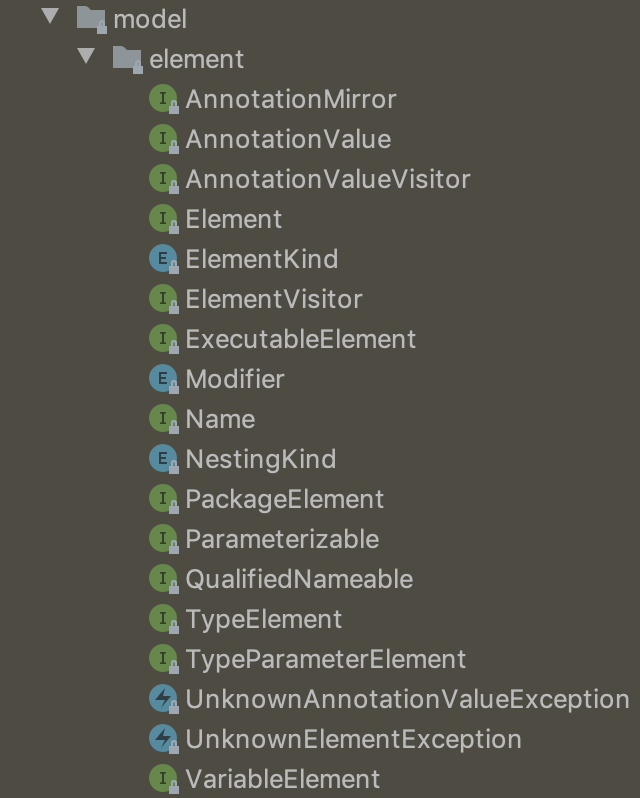
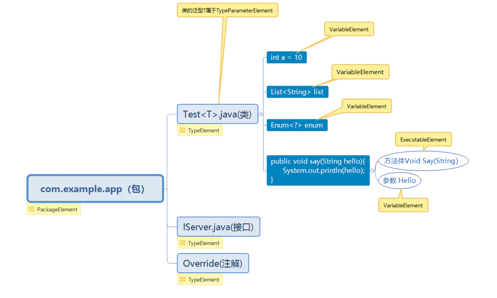

java-apt实现之Element

element [ˈɛləmənt] 元素

<!-- TOC -->

- [1.基本介绍](#1基本介绍)
  - [1.element 介绍](#1element-介绍)
  - [2.各种element所代表的元素类型](#2各种element所代表的元素类型)
- [2.element 接口方法](#2element-接口方法)
  - [2.1重要参数](#21重要参数)
  - [2.2不重要的参数](#22不重要的参数)
  - [2.3 补充：](#23-补充)
- [3.实例](#3实例)

<!-- /TOC -->

# 1.基本介绍
## 1.element 介绍 
element是代表程序的一个元素，这个元素可以是：包、类/接口、属性变量、方法/方法形参、泛型参数。element是java-apt(编译时注解处理器)技术的基础，因此如果要编写此类框架，熟悉element是必须的。

element指的是一系列与之相关的接口集合，它们位于javax.lang.model.element包下面
* 接口  

* Enume
```java
ElementKind
Modifier
NestingKind
```
* Exceptions
```java
UnknownAnnotionValueException
UnknownEntityException
```

## 2.各种element所代表的元素类型  


通过上图可以看到element元素及其子接口所指代的元素，有点类似[Type](https://www.jianshu.com/p/bd4e5c779063 "Type")类型，

* element接口族和Type接口族之间有什么区别呢？  
element所代表的元素只在编译期可见，用于保存元素在编译期的各种状态，而Type所代表的元素是运行期可见，用于保存元素在编译期的各种状态

* type和element用处
  * type ： 可以通过type的一系列方法获得元素信息，尤其是通过type我们可以在运行期间获取注解信息，再通过反射和动态代理实现AOP设计.  
  * element类既然在编译期可见，自然我们想到了在编译期获取元素的各类信息，结合apt技术实现动态的代码生成。


# 2.element 接口方法

## 2.1重要参数

* TypeMirror
```java 
TypeMirror asType()
```
返回一个TypeMirror是元素的类型信息，包括包名，类(或方法，或参数)名/类型，在生成动态代码的时候，我们往往需要知道变量/方法参数的类型，以便写入正确的类型声明

注意：TypeName/TypeMirror都可以作为类型引入$T

举例
```java
TypeName typeName = ClassName.get(element.asType());
TypeSpec typeSpec = TypeSpec.classBuilder("GenerateTest")
        .addField(typeName, "test")
       //添加泛型信息
       .addTypeVariable(TypeVariableName.get(((TypeElement) element).getTypeParameters().get(0)))
        .build();
```

```kotlin
val serviceClass:TypeElement = ClassName.get(element as TypeElement)
val interfaceClass:TypeMirror = element.interfaces[0]
val routerMethodBuilder = MethodSpec.methodBuilder("loadRouter")
        .addAnnotation(Override::class.java)
        .returns(Route::class.java)
        .addModifiers(Modifier.PUBLIC)
routerMethodBuilder.addStatement("return \$T.buildRouter(\$N, \$T.class, \$T.class, \$N)",
        RouterBuilder::class.java,
        "\"${routerAnnotation.module}\"",
        serviceClass,
        interfaceClass,
    routerAnnotation.init.toString())
```

 * Name getQualifiedName() :这个方法是element的子接口所带的方法，element本身并不指代具体的元素，因此没有改方法。获取全限定名，如果是类的话，包含完整的报名路径 

 * TypeMirror getReturnType():获取方法元素的返回值，返回TypeMirror表示
 * String getSimpleName(): 获取名字，不包含路径

 ## 2.2不重要的参数
 
 * VariableElement: Object getConstantValue()

* Element getEnclosingElement()  
 返回包含该element的父element，与上一个方法相反，VariableElement，方法ExecutableElement的父级是TypeElemnt，而TypeElemnt的父级是PackageElment


* ElementKind getKind()  
返回element的类型，判断是哪种element

* Set<Modifier> getModifiers()
 获取修饰关键字,入public static final等关键字

 * Name getSimpleName() 
 获取名字，不带包名  


## 2.3 补充：
* ClassName/TypeMirror/Class：都可以作为类型
* className/TypeMirror.toString(): 返回对象的全名
```java
val serviceClass = ClassName.get(element as TypeElement)
val interfaceClass = element.interfaces[0]
routerMethodBuilder.addStatement("return \$T.buildRouter(\$N, \$T.class, \$T.class, \$N)",

  //引入类
   RouterBuilder::class.java,
   
   //获取注解名字
   "\"${routerAnnotation.module}\"",

   //引入类
   className,

   引入类
   interfaceClass,
   routerAnnotation.init.toString())
```

```java
//获取报名
val packageName = name.substring(0, name.lastIndexOf("."))

//获取类名
val className = name.substring(name.lastIndexOf(".") + 1)
```

* 基本类型/方法调用：\$L或\$N

# 3.实例
```java

//写入java文件
private Filer mFiler;

//日志打印
private Messager mMessager;

//工具类，获取相关参数
private Elements mElementUtils;

@Override
public boolean process(Set<? extends TypeElement> set, RoundEnvironment roundEnvironment) {
    Set<? extends Element> bindViewElements = roundEnvironment.getElementsAnnotatedWith(BindView.class);
    for (Element element : bindViewElements) {

        //1.获取包名
        PackageElement packageElement=mElementUtils.getPackageOf(element);
        String pkName = packageElement.getQualifiedName().toString();
        note(String.format("package = %s", pkName));

        //2.获取属性的对象类类型
        TypeElement enclosingElement = (TypeElement) element.getEnclosingElement();
        String enclosingName = enclosingElement.getQualifiedName().toString();
        note(String.format("enclosindClass = %s", enclosingElement));

        //属性Element直接转化
        VariableElement bindViewElement = (VariableElement) element;

        //3.获取注解的成员变量名
        String bindViewFiledName = bindViewElement.getSimpleName().toString();

        //3.获取注解的成员变量类型
        String bindViewFiledClassType = bindViewElement.asType().toString();

        //4.获取注解元数据
        BindView bindView = element.getAnnotation(BindView.class);
        int id = bindView.value();
        note(String.format("%s %s = %d", bindViewFiledClassType, bindViewFiledName, id));

        return true;
    }
    return false;
}

private void note(String msg) {
  mMessager.printMessage(Diagnostic.Kind.NOTE, msg);
}


```

```java
//获取所有添加注解Router的信息
val routerElements = roundEnv.getElementsAnnotatedWith(Router::class.java)
for (element in routerElements) {

    //获取类上面的注解实例
    val routerAnnotation = element.getAnnotation(Router::class.java)

    //获得被注解的类
    val serviceClass = ClassName.get(element as TypeElement)

    //获得被注解的类  实现 的接口
    val interfaceClass = element.interfaces[0]

    val routerMethodBuilder = MethodSpec.methodBuilder("loadRouter")
            .addAnnotation(Override::class.java)
            .returns(Route::class.java)
            .addModifiers(Modifier.PUBLIC)
    routerMethodBuilder.addStatement("return \$T.buildRouter(\$N, \$T.class, \$T.class, \$N)",

            //引入类
            RouterBuilder::class.java,

            //获得注解类的属性值
            "\"${routerAnnotation.module}\"",

            serviceClass,

            //引入类
            interfaceClass,

            //基本类型true
            routerAnnotation.init.toString())

    //以接口的包名作为生成路径
    val name = interfaceClass.toString()

    //包名
    val packageName = name.substring(0, name.lastIndexOf("."))

    //类名
    val className = name.substring(name.lastIndexOf(".") + 1)

    
    JavaFile.builder(packageName,
            TypeSpec.classBuilder(ROUTE_SERVICE_CLASS_NAME + "_" + className)
                    .addSuperinterface(ClassName.get(RouterLoader::class.java))
                    .addModifiers(Modifier.PUBLIC)
                    .addMethod(routerMethodBuilder.build())
                    .build())
            .build()
            .writeTo(filer)
}

```


文字来源:https://www.jianshu.com/p/899063e8452e
详细说明 ：https://www.jianshu.com/p/d7567258ae85

写入文件：https://github.com/square/javapoet

项目实践：https://www.tqwba.com/x_d/jishu/218834.html


