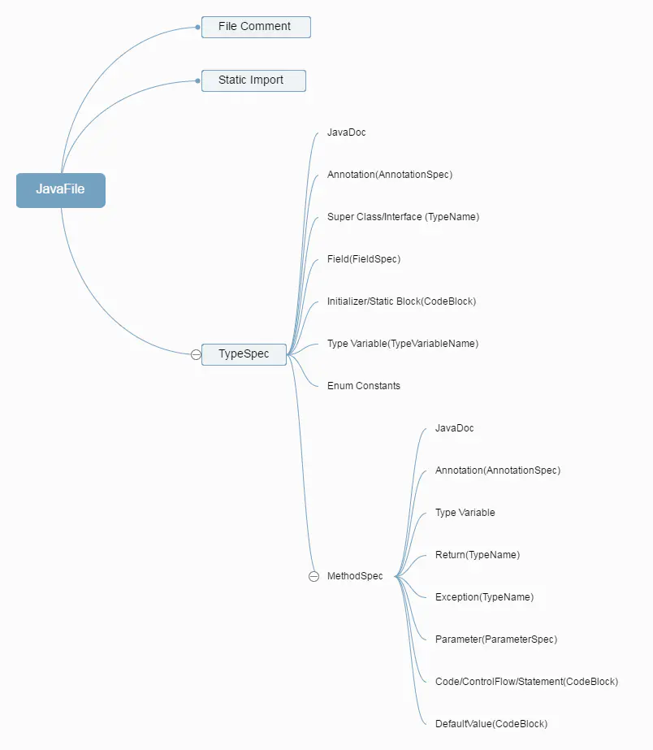

javapoet

javapoet(ˈdʒɑːvə  ˈpəʊɪt)/JakeWharton(dʒeɪk  ˈwɔːtən)

# 1.javapoet简介
  ## 1.1介绍
  
  JavaPoet是square推出的开源java代码生成框架，提供Java Api生成.java源文件 
  <font color="#dd0000">它根据注解、数据库模式、协议格式等,编译时生成java源文件。通过这种自动化生成代码的方式，可以让我们用更加简洁优雅的方式要替代繁琐冗杂的重复工作。</font>  

  ## 1.2大体结构图
  

  ## 2.2 关键类说明
| class  |	说明 |
| ----   | --- |
| JavaFile  |	A Java file containing a single top level class	用于构造输出包含一个顶级类的Java文件|
| TypeSpec  |	A generated class, interface, or enum declaration	生成类，接口，或者枚举|
| MethodSpec  |A generated constructor or method declaration	生成构造函数或方法|
| FieldSpec |	A generated field declaration	生成成员变量或字段|
| ParameterSpec |	A generated parameter declaration	用来创建参数|
| AnnotationSpec |	A generated annotation on a declaration	用来创建注解|

# 2.使用
## 2.1写入进文件
```java
JavaFile.builder(packageName, typeSpec)
    .build()
    .writeTo(filer)
```

## 2.2类
```java
TypeSpec helloWorld = TypeSpec.classBuilder("HelloWorld")

    //添加属性
    .addModifiers(Modifier.PUBLIC, Modifier.FINAL)

    //添加父类
    .addSuperinterface(ClassName.get(RouterLoader::class.java))
    //添加含有范性的
    .addSuperinterface(ParameterizedTypeName.get(Comparator.class, String.class))

    .addMethod(methodSpec)
    .build();
```

## 2.3方法
```java
MethodSpec methodSpec = MethodSpec
    //方法名
     .methodBuilder("main")

    //添加注解
    .addAnnotation(Override::class.java)

    //添加public/staitc
    .addModifiers(Modifier.PUBLIC)

    //返回的类型
    .returns(IRouter::class.java)

    //添加代码
    .addStatement("return new $T()", Date.class)
    .addStatement("return new $T()", className)
    .addStatement("return new $T()", TypeMirror)

    //添加属性
    .addParameter(String.class, "a")
    .addParameter(String.class, "b")

    //代码if{}else{}/trycatch(){}else{}
    .addStatement("long now = $T.currentTimeMillis()", System.class)
    .beginControlFlow("if ($T.currentTimeMillis() < now)", System.class)
    .addStatement("$T.out.println($S)", System.class, "Time travelling, woo hoo!")
    .nextControlFlow("else if ($T.currentTimeMillis() == now)", System.class)
    .addStatement("$T.out.println($S)", System.class, "Time stood still!")
    .nextControlFlow("else")
    .addStatement("$T.out.println($S)", System.class, "Ok, time still moving forward")
    .endControlFlow()


    .build();
```

github地址：https://github.com/square/javapoet

