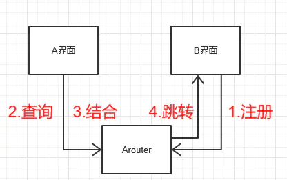
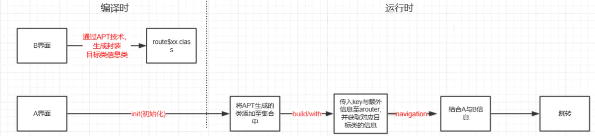

阿里ARouter [ˈraʊtə]

# 1.为什么有路由
说到路由便不得不提一下Android中的组件化开发思想，组件化是最近比较流行的架构设计方案，它能对代码进行高度的解耦、模块分离等，能极大地提高开发效率。  
路由和组件化本身没有什么联系，因为路由的责任是负责页面跳转，但是组件化中两个单向依赖的module之间需要互相启动对方的Activity，因为没有相互引用，startActivity()是实现不了的，必须需要一个协定的通信方式，此时类似ARouter和ActivityRouter等的路由框架就派上用场了。

# 2.关系分析
     

  * 1.B界面将类的信息，通过key-value的形式，注册到arouter中。
  * 2.A界面将类信息与额外信息（传输参数、跳转动画等），通过key传递至arouter中，并查询对应需要跳转类的信息。
  * 3.将A界面类信息、参数与B界面的类信息进行封装结合。
  * 4.将结合后的信息，使用startActivity实现跳转。

  

从上图流程中，我们可以发现Arouter中原理：
* 1.通过apt技术利用注解编译时生成类，封装目标界面类的类信息。
* 2.在初始化时，把编译生成的类通过key-value的方式存储在arouter中。
* 3.发送操作者通过key获取到目标界面类的信息。
* 4.把发送操作者的信息与目标界面类信息进行结合或者关联在一起。
* 5.实现跳转功能。

简单概括：将需要相互跳转的界面信息传递至arouter中存储关联 & 实现跳转。

