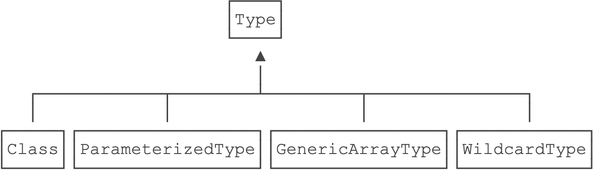

泛型
<!-- TOC -->

- [1.泛型是什么](#1泛型是什么)
  - [注意](#注意)
- [2.使用](#2使用)
  - [泛型继承](#泛型继承)
  - [总结](#总结)
- [3.extend通配](#3extend通配)
  - [1.只读](#1只读)
  - [2.extends限定T类型](#2extends限定t类型)
  - [总结](#总结-1)
- [4.super通配符](#4super通配符)
  - [PECS原则](#pecs原则)
  - [无限定通配符?](#无限定通配符)
  - [泛型和反射](#泛型和反射)
  - [注意](#注意-1)

<!-- /TOC -->

# 1.泛型是什么
泛型是一种“代码模板”，可以用一套代码套用各种类型。

编译器能自动推断出的类型，例如：List<String> list = new ArrayList<>();

## 注意
* 擦拭法：虚拟机对泛型其实一无所知，所有的工作都是编译器做的。
编译器内部永远把所有类型T视为Object处理，但是，在需要转型的时候，编译器会根据T的类型自动为我们实行安全地强制转型。
* 局限
    * <T>不能是基本类型，例如int，因为实际类型是Object，Object类型无法持有基本类型：
    * 无法取得带泛型的Class,编译后都是Object.class
    * 不能实例化T类型，实例化T类型，必须借助额外的Class<T>参数


```java
Pair<String> p1 = new Pair<>("Hello", "world");
Pair<Integer> p2 = new Pair<>(123, 456);
Class c1 = p1.getClass();
Class c2 = p2.getClass();
//编译后都是Pair<Object>
System.out.println(c1==c2); // true
System.out.println(c1==Pair.class); // true


/*******************实例化*********************/
first = new T();
last = new T();
//擦拭后实际上Object，编译器阻止这种类型不对的代码
//first = new Object();
//last = new Object();
Pair<String> pair = new Pair<>(String.class);
public class Pair<T> {
    private T first;
    private T last;
    public Pair(Class<T> clazz) {
        first = clazz.newInstance();
        last = clazz.newInstance();
    }
}
```


不恰当的覆写方法
```java
public class Pair<T> {
    //equals(T t)方法实际上会被擦拭成equals(Object t)，而这个方法是继承自Object的，编译器会阻止一个实际上会变成覆写的泛型方法定义
    // public boolean equals(T t) {
    //     return this == t;
    // }

    public boolean same(T t) {
        return this.t == t;
    }
}
```

# 2.使用

```java
public class Pair<T> {
    private T first;
    private T last;
    public Pair(T first, T last) {
        this.first = first;
        this.last = last;
    }
    public T getFirst() { ... }

    // 静态泛型方法应该使用其他类型区分
    //静态方法泛型K和普通方法泛型T，要区分开
    public static <K> Pair<K> create(K first, K last) {
        return new Pair<K>(first, last);
    }
}


//多泛型类型
public class Pair<T, K> {
    private T first;
    private K last;
}
```

## 泛型继承
在父类是泛型类型的情况下，编译器就必须把类型T（对IntPair来说，也就是Integer类型）保存到子类的class文件中，不然编译器就不知道IntPair只能存取Integer这种类型。
在继承了泛型类型的情况下，子类可以获取父类的泛型类型。

```java
public class IntPair extends Pair<Integer> {
}

//获取父类的泛型类型
Type t = clazz.getGenericSuperclass();
if (t instanceof ParameterizedType) {
    ParameterizedType pt = (ParameterizedType) t;
    Type[] types = pt.getActualTypeArguments(); // 可能有多个泛型类型
    Type firstType = types[0]; // 取第一个泛型类型
    Class<?> typeClass = (Class<?>) firstType;
    System.out.println(typeClass); // Integer
}

//retrofit获取类型
val rawType:Class<?> = Utils.getRawType(type);
//获取type内的泛型
Utils.getParameterUpperBound(index, type);
if (rawObservableType != BaseResponse::class.java) {
    throw IllegalArgumentException("type must be a resource")
}
```

Java的类型系统结构




## 总结
* 不能是基本类型，例如：int；
* 不能获取带泛型类型的Class，例如：Pair<String>.class；
* 不能判断带泛型类型的类型，例如：x instanceof Pair<String>；retrofit提供了Utils.getRawType(type);用来判断类型

```
getRawType(returnType) == LiveData::class.java

//获取type类的第index的泛型的Type
Utils.getParameterUpperBound(index, type)：Type;
//获取泛型的类
val rawObservableType = getRawType(observableType)
```
* 不能实例化T类型，例如：new T()。

# 3.extend通配

## 1.只读
```java
//只读的方法（恶意调用set(null)除外）
//int sumOfList(List<? extends Integer> list) {

//List<Integer>： 读写
int sumOfList(List<Integer> list) {
    int sum = 0;
    for (int i=0; i<list.size(); i++) {
        Integer n = list.get(i);
        sum = sum + n;
    }
    return sum;
}
```


## 2.extends限定T类型
```java
public class Pair<T extends Number> { ... }
```
非Number以及子类，无法通过编译


## 总结
* 使用<? extends Number>通配符表示可以读，不能写。
* 使用类似<T extends Number>定义泛型类时表示：
泛型类型限定为Number以及Number的子类。

# 4.super通配符
泛型的继承关系：Pair<Integer>不是Pair<Number>的子类。
```java
public static void main(String[] args) {
    Pair<Number> p1 = new Pair<>(12.3, 4.56);
    Pair<Integer> p2 = new Pair<>(123, 456);
    setSame(p1, 100);
    setSame(p2, 200);
    System.out.println(p1.getFirst() + ", " + p1.getLast());
    System.out.println(p2.getFirst() + ", " + p2.getLast());
}

//可以安全编译通过
static void setSame(Pair<? super Integer> p, Integer n) {
    p.setFirst(n);
    p.setLast(n);
    //无法通过编译
    //? super Integer getFirst();
}
```
1.<? extends T>允许调用读方法T get()获取T的引用，但不允许调用写方法set(T)传入T的引用（传入null除外)<br/>
2.<? super T>允许调用写方法set(T)传入T的引用，但不允许调用读方法T get()获取T的引用（获取Object除外）。


## PECS原则
Producer Extends Consumer Super。
如果需要返回T，它是生产者（Producer），要使用extends通配符；如果需要写入T，它是消费者（Consumer），要使用super通配符。
```java
public static <T> void copy(List<? super T> dest, List<? extends T> src) {
    for (int i=0; i<src.size(); i++) {
        T t = src.get(i); // src是producer
        dest.add(t); // dest是consumer
    }
}
```

## 无限定通配符?
因为<?>通配符既没有extends，也没有super，因此：
* 不允许调用set(T)方法并传入引用（null除外）；
* 不允许调用T get()方法并获取T引用（只能获取Object引用）
* 既不能读，也不能写，只能做一些null判断
```java
static boolean isNull(Pair<?> p) {
    return p.getFirst() == null || p.getLast() == null;
}
```

大多数情况下，可以引入泛型参数<T>消除<?>通配符  
<?>通配符有一个独特的特点，就是：Pair<?>是所有Pair<T>的超类
```java
class Pair<T> {
    private T first;
    private T last;
}

Pair<Integer> p = new Pair<>(123, 456);
Pair<?> p2 = p; // 安全地向上转型
System.out.println(p2.getFirst() + ", " + p2.getLast());
```

## 泛型和反射

```java
// compile warning:
Class clazz = String.class;
String str = (String) clazz.newInstance();

// no warning:
Class<String> clazz = String.class;
String str = clazz.newInstance();

//getSuperclass()方法返回的Class类型是Class<? super T>
Class<? super String> sup = String.class.getSuperclass();
Constructor<Integer> cons = clazz.getConstructor(int.class);
Integer i = cons.newInstance(123);

//不能用new操作符创建带泛型的数组
Pair<String>[] ps = null; // ok
//Pair<String>[] ps = new Pair<String>[2]; // compile error!

//必须通过强制转型实现带泛型的数组
@SuppressWarnings("unchecked")
Pair<String>[] ps = (Pair<String>[]) new Pair[2];

//要安全地使用泛型数组，必须扔掉arr的引用
@SuppressWarnings("unchecked")
Pair<String>[] ps = (Pair<String>[]) new Pair[2];

//不能直接创建泛型数组new T[]，因为擦拭后代码变为Object[]
//必须借助Class<T>来创建泛型数组
T[] createArray(Class<T> cls) {
    return (T[]) Array.newInstance(cls, 5);
}

//还可以利用可变参数创建泛型数组T[]
//除非确认完全没有问题，才可以用@SafeVarargs消除警告
@SafeVarargs
static <T> T[] asArray(T... objs) {
    return objs;
}
String[] ss = ArrayHelper.asArray("a", "b", "c");
```

## 注意
* 部分反射API是泛型，例如：Class<T>，Constructor<T>；
* 可以声明带泛型的数组，但不能直接创建带泛型的数组，必须强制转型；
* 可以通过Array.newInstance(Class<T>, int)创建T[]数组，需要强制转型；
* 同时使用泛型和可变参数时需要特别小心。