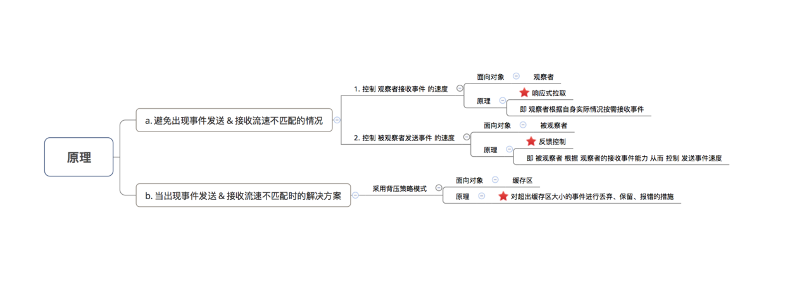
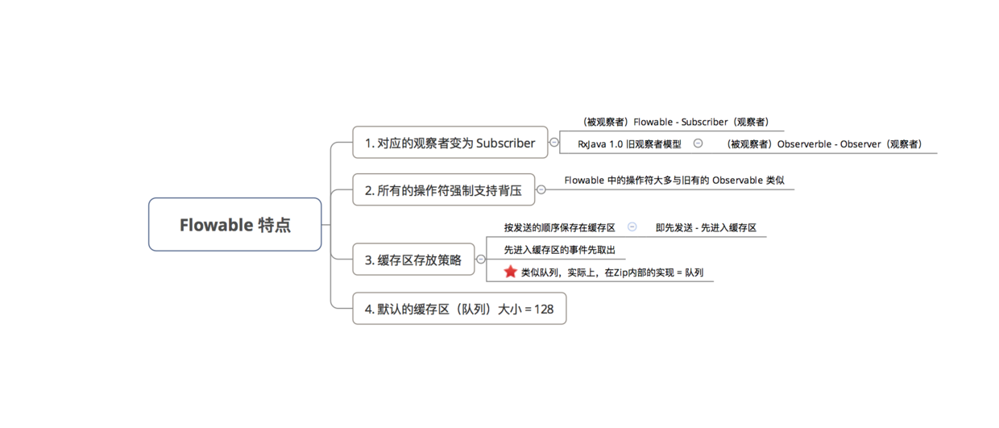
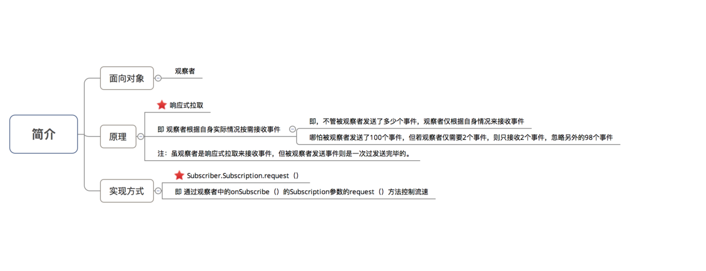
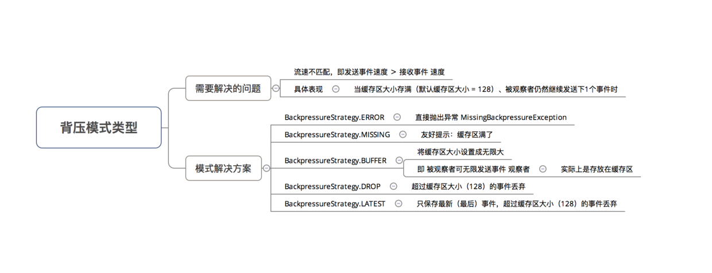

Rxjava-背压

<!-- TOC -->

- [1 什么是背压](#1-什么是背压)
- [1.2 Flowable](#12-flowable)
    - [a.响应式拉取](#a响应式拉取)
    - [b.背压策略BackpressureStrategy](#b背压策略backpressurestrategy)
- [2 自动创建FLowable](#2-自动创建flowable)

<!-- /TOC -->

# 1 什么是背压
控制事件流速 的策略  
解决：被观察者 发送事件速度太快，从而导致观察者无法及时处理事件的问题，而导致缓存区溢出、事件丢失或者OOM。  
触发的条件： 因为只有上下游运行在各自的线程中，且上游发射数据速度大于下游接收处理数据的速度时，才会产生背压问题。
* 注：背压的作用域 = 异步订阅关系，即 被观察者 & 观察者处在不同线程中
* 场景：网络请求


响应式拉取/反馈控制/背压策略

# 1.2 Flowable
## a.响应式拉取



数据全部会放入到缓存中，

两种情况下缓存溢出
* 1.Subscription.request()设置太小，即使观察者空闲，数据也会放入缓存中
* 2.观察者处理不过来，数据一直堆在缓存中

```java  
// 1. 创建被观察者Flowable
Flowable.create(new FlowableOnSubscribe<Integer>() {
    @Override
    public void subscribe(FlowableEmitter<Integer> emitter) throws Exception {
        emitter.onNext(4);
        emitter.onComplete();
    }
}, //设置缓存满了了就报错
    BackpressureStrategy.ERROR)
		.subscribeOn(Schedulers.io())
        .observeOn(AndroidSchedulers.mainThread())
        .subscribe(new Subscriber<Integer>() {
            @Override
            public void onSubscribe(Subscription s) {
                //Subscription类似Disposable，既Disposable.dispose()/cancel()切断连接
                
                s.request(3);
                //观察能够接收3个事件，多出的事件存放在缓存区，不会处理，直到重新设置request()
                // 官方默认推荐使用Long.MAX_VALUE
                mSubscription = s
            }

            @Override
            public void onNext(Integer integer) {
            }

            @Override
            public void onError(Throwable t) {
            }

            @Override
            public void onComplete() {
            }
        });

//按需从缓存中拿
mSubscription.request(48);
```

## b.背压策略BackpressureStrategy
当缓存区大小存满时(默认缓存区大小 = 128)，再接收到数据，如何处理的策略方式


* BackpressureStrategy.ERROR
    * 超过缓存区大小（128）的事件丢弃,走onError  
    * 抛出MissingBackpressureException。

* BackpressureStrategy.MISSING
  * 超过缓存区大小（128）的事件丢弃,走onError.  
  * 出现当缓存区大小存满（默认缓存区大小 = 128）、被观察者仍然继续发送下1个事件时，提示内存满了
  * 不丢弃，不缓存

* BackpressureStrategy.BUFFER  
  * 将缓存区大小设置成无限大.  
  * 注意：但要注意内存情况，防止出现OOM

* BackpressureStrategy.DROP  
发送了150个事件，仅保存第1 - 第128个事件，第129 -第150事件将被丢弃

* BackpressureStrategy.LATEST
即如果发送了150个事件，缓存区里会保存129个事件（第1-第128 + 第150事件）

# 2 自动创建FLowable
RxJava 2.0内部提供 封装了背压策略模式的方法  
* 默认采用BackpressureStrategy.ERROR模式
* onBackpressureBuffer()
* onBackpressureDrop()
* onBackpressureLatest()

```java
Flowable.interval(1, TimeUnit.MILLISECONDS)
        // 添加背压策略
       .onBackpressureBuffer() 
       .observeOn(Schedulers.newThread()) 
       .subscribe(new Subscriber<Long>() {
           @Override
           public void onSubscribe(Subscription s) {
               Log.d(TAG, "onSubscribe");
               mSubscription = s;
               s.request(Long.MAX_VALUE); 
           }

           @Override
           public void onNext(Long aLong) {
           }
           @Override
           public void onError(Throwable t) {
           }
           @Override
           public void onComplete() {
           }
       });
```