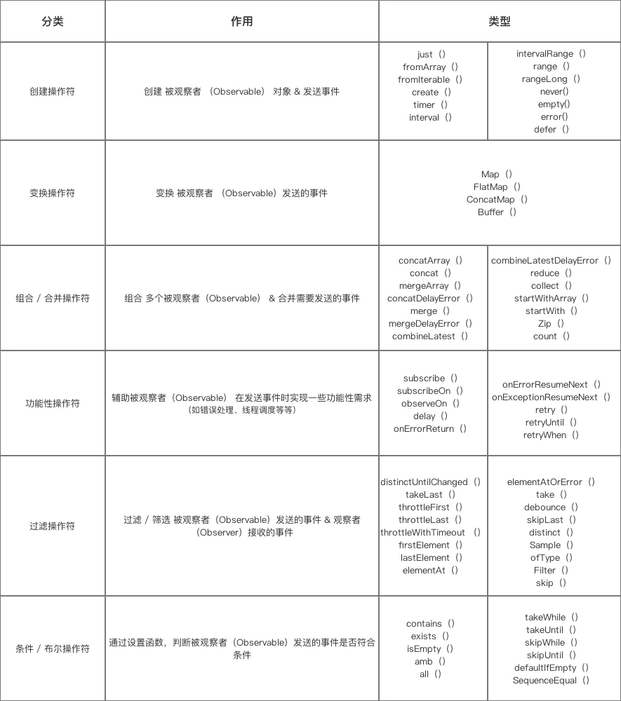

Rxjava-基础内容

consumer [kənˈsjuːmə]
scheduler [ˈskɛdʒʊələ] 调度器
subscriber  [səb'skraibə] 观察者
Flow [fləʊ] 
observable [əb'zə:vəbl]
BackpressureStrategy [bæk][ˈprɛʃə][ˈstrætɪdʒɪ]
<!-- TOC -->

- [1.什么是Rxjava](#1什么是rxjava)
- [2.Rxjava说明](#2rxjava说明)
  - [2.1 常见类/操作符/方法](#21-常见类操作符方法)
  - [2.被观察者/观察者](#2被观察者观察者)
    - [a.Single/SingleObserver](#asinglesingleobserver)
    - [b.Completable/CompletableObserver](#bcompletablecompletableobserver)
    - [c.Maybe/MaybeObserver](#cmaybemaybeobserver)
    - [d.Flowable/Subscriber](#dflowablesubscriber)
- [3.android中应用](#3android中应用)
  - [3.1 处理重复的操作](#31-处理重复的操作)
  - [3.2 autoDispose防止内存泄漏](#32-autodispose防止内存泄漏)

<!-- /TOC -->

# 1.什么是Rxjava
基于事件流的链式调用、逻辑简洁 & 使用简单的特点。
提供了丰富 & 功能强大的操作符，可以完成很多复杂的数据处理，以及线程调度。

观察者创建了一个处于待命状态的观察者哨兵，在未来某个时刻响应Observable的通知，不需要阻塞等待Observable发射数据。



```gradle
compile 'io.reactivex.rxjava2:rxjava:2.1.5'
compile 'io.reactivex.rxjava2:rxandroid:2.0.1'
```

# 2.Rxjava说明
## 2.1 常见类/操作符/方法
类 | 说明
---|---
Observable/Observer | 发射数据流/接收数据流
Single/SingleObserver | 只发射单个数据
Flowable/Subscriber | 支持背压
Completable/CompletableObserver | 只有完成的通知，不处理数据
Maybe/MaybeObserver | 必须异常/完成前发送数据，不然无效
Publisher | Flowable 的父类

支持的回调
类 | 说明
---|---
subscribe() | 忽略 onNext 以及 onComplete 等事件。
subscribe(Observer<? super T> observer) | 以 Observer 为参数。
subscribe(Consumer<? super T> onNext) | 只接受 onNext
subscribe(Consumer<? super T> onNext, Consumer<? super Throwable> onError) | 接受 onNext 和 onError
subscribe(Consumer<? super T> onNext, Consumer<? super Throwable> onError, Action onComplete) | 接受 onNext onError 和 onComplete
subscribe(Consumer<? super T> onNext, Consumer<? super Throwable> onError, Action onComplete, Consumer<? super Disposable> onSubscribe) |接受 onNext onError 和 onComplete，接受参数为 Disposable 的一个回调，用于解除订阅，这中实现就和 Observer 类似了，四个回调。

其他
类 | 说明
---|---
Consumer | 观察者，只有一个 accept() 回调
subscribe (订阅) | 建立 Observable 和 Observer 的联系
subscribeOn | 为 Observable 对数据的处理指定一个调度器，直到遇到observeOn改变线程。可以多次调用，但只有第一次的调用会起作用。<font color="#dd0000">多次调用，每调用一次切换一次线程。</font>
observeOn | 为下游对数据的操作指定一个调度器。<font color="#dd0000">多次调用，每调用一次切换一次线程。</font>
doOnSubscribe() | 在订阅后事件发送前执行。多个 subscribeOn() 却可以影响 doOnSubscribe() 的执行线程
Disposable | 用于解除订阅以及查询订阅关系是否解除
Operators操作符 | 可以理解为对数据流的操作，包括创建、过滤、变换、组合、聚合等。
Subscription | 可以通过request发起请求数据，通过cancel取消订阅关系。

类 | 说明
---|---
Disposable | 用于解除订阅以及查询订阅关系是否解除
CompositeDisposable | Disposable 的容器，可以容纳多个，add(mObservable)，并同时取消，mDisposable.clear();

* dispose():主动解除订阅
* isDisposed():查询是否解除订阅 true 代表 已经解除订阅 

在特定的调度器(Scheduler)上执行，实现多线程。

调度器类型 | 效果
---|---
Schedulers.io( ) | 用于IO密集型任务，线程缓存机制，它会根据需要，增减少线程池中的线程数量
Schedulers.computation( ) | 用于计算任务，默认线程数等于处理器的数量
Schedulers.newThread( ) | 为每个任务创建一个新线程
Schedulers.from(executor) | 使用指定的Executor作为调度器
Schedulers.single() | 拥有一个线程单例，所有的任务都在这一个线程中执行。
Schedulers.trampoline() | 在当前线程执行一个任务，但不是立即执行，用trampoline()将它加入队列。这个调度器将会处理它的队列并且按程序运行队列中每一个任务。
AndroidSchedulers.mainThread() | Android中的主线程执行任务，为Android开发定制。   

  
* 3.操作符

操作符 | 返回值 | 说明
---|---|---
compose(ObservableTransformer) | 消除重复代码

* lift
  lift是map,flatMap等操作符的根本，ObservableSource发送的数据进行操作的
* compose
  对ObservableSource本身进行操作

```java
ObservableTransformer schedulersTransformer = new ObservableTransformer() {
    @Override
    public ObservableSource apply(Observable upstream) {
        return upstream
                .subscribeOn(Schedulers.io())
                .observeOn(AndroidSchedulers.mainThread());
    }
```


## 2.被观察者/观察者

### a.Single/SingleObserver
只能发射单个数据或者一条异常通知，不能发射完成通知。
场景：发起一次网络请求，只是一条单一的数据，可以将onComplete() 和onNext()合成onSuccess()

SingleOnSubscribe的SingleEmitter，和SingleObserver只有  
* onSuccess() 
* onError()

转化为其他观察者模式
操作符 | 返回值
---|---
toCompletable() | Completable
toMaybe() | Maybe
toFlowable() | Flowable
toFuture() | Future

### b.Completable/CompletableObserver 
不对数据进行处理，只有个通知的结果。 
场景：向服务器发起一个更新数据的请求，服务器更新数据以后是返回的是更新的结果

CompletableOnSubscribe的CompletableEmitter只有
* onComplete()
* onError()

CompletableObserver的方法
* onSubscribe(Disposable d)
* onComplete()
* onError()

### c.Maybe/MaybeObserver
Maybe可发射一条单一的数据，以及发射一条完成通知，或者一条异常通知.发射数据只能在发射完成通知或者异常通知之前，否则发射数据无效

MaybeOnSubscribe的MaybeEmitter
* onSuccess("");
* onError(new Throwable("Error"));
* onComplete();

MaybeObserver的方法
* onSubscribe(disposable)
* onSuccess()
* onError()
* onComplete()

### d.Flowable/Subscriber
FlowableEmitter
* setDisposable：设置Disposable
* setCancellable：设置Cancellable
* requested：当前未完成的请求数量
* isCancelled：订阅关系是否取消
* serialize：
* tryOnError：


# 3.android中应用

## 3.1 处理重复的操作
compose/Transformers
```java
Observable.just(1)
    .compose(Observable.Transformer<T, T> {
        @Override
        public Observable<T> call(Observable<T> observable) {
            return observable
                //
                .lift()
                //线程的调度
                .subscribeOn(Schedulers.io())
                .observeOn(AndroidSchedulers.mainThread());
        }
    }

```

## 3.2 autoDispose防止内存泄漏
* a.直接使用
```java
myObservable
    .as(AutoDispose.autoDisposable(AndroidLifecycleScopeProvider.from(lifecycleOwner))  
    .subscribe(s -> ...);
```
* b.封装
```java
public class RxLifecycleUtils {
    private RxLifecycleUtils() {
        throw new IllegalStateException("Can't instance the RxLifecycleUtils");
    }
    public static <T> AutoDisposeConverter<T> bindLifecycle(LifecycleOwner lifecycleOwner) {
        return AutoDispose.autoDisposable(
                AndroidLifecycleScopeProvider.from(lifecycleOwner)
        );
    }
}

```

或者
```java
public abstract class BaseActivity extends AppCompatActivity implements IActivity {
    protected <T> AutoDisposeConverter<T> bindLifecycle() {
        return RxLifecycleUtils.bindLifecycle(this);
    }
}
```
