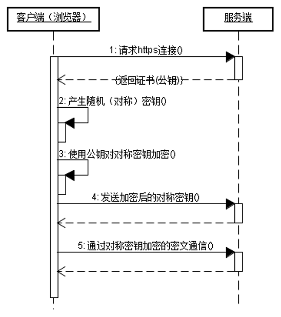
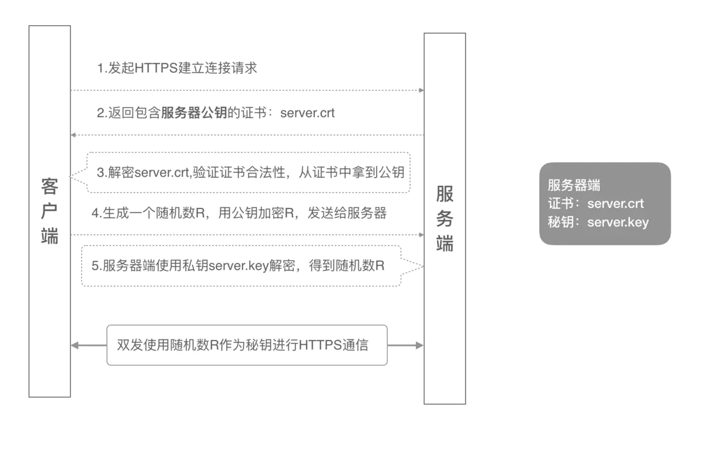
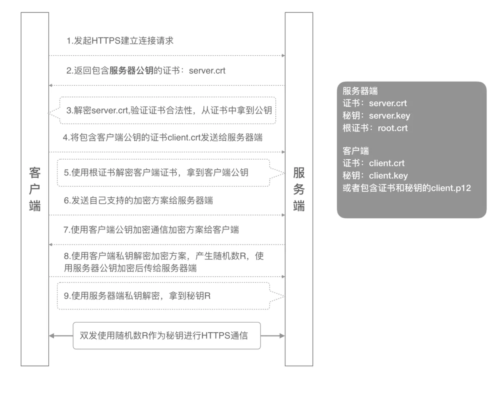
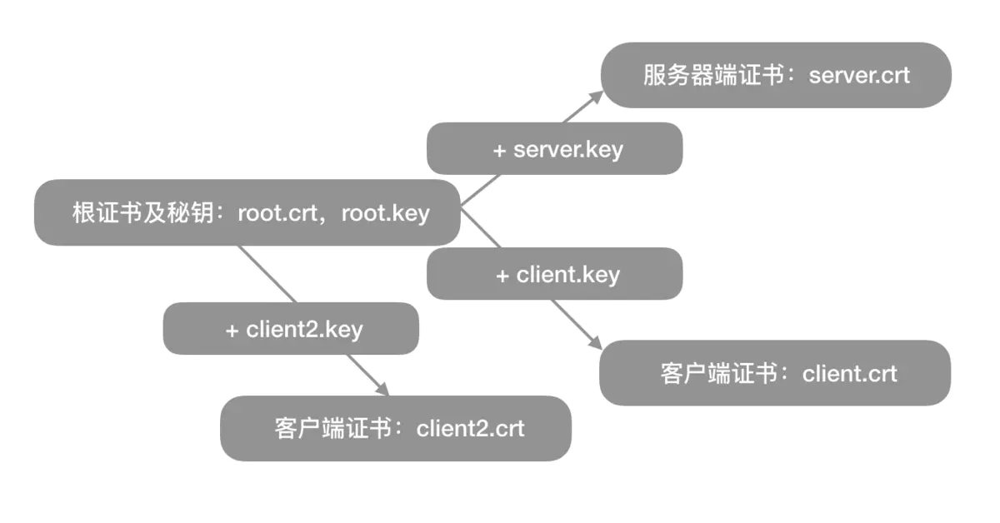

Https

trust Manager [trʌst] [ˈmænɪdʒə] 证书管理器

# 1.简介
## 1.2 是什么
HTTPS全称是HTTP over SSL/TLS，安全套接字层超文本传输协议。  
HTTP是应用层协议，TCP是传输层协议，在应用层和传输层之间，增加了一个安全套接层SSL/TLS。    
SSL(Secure Sokcet Layer，安全套接字层)  
TLS(Transport Layer Security,传输层安全协议)

## 1.1 为什么有http
* HTTP协议的问题  
    1.冒充：不验证通信方身份  
    2.窃听：通信使用明文
    3.篡改：不验证内容(报文)的完整性
* HTTP解决方案
  1.冒充：请求参数增加token，确定双方身份
  2.窃听：对通信内容加密，一般使用对称加密
  3.篡改：MD5/SH1进行完整性验证，用数据生成散列值，对方验证散列值


* 解决的问题
1.冒充：身份认证，确认网站的真实性。认证失败中止连接
2.窃听：加密传输，来保证数据传输的安全
3.篡改：同上
对Https进行抓包，需要PC端和手机端同时安装证书

## 1.2https缺点
* (1)延迟性：HTTPS协议握手阶段比较费时
* (2)消耗CPU资源：HTTPS通信主要包括对称加解密、RSA非对称加解密，消耗cpu

## 1.3 https优化
* 1.接入CDN  
  用户访问该网站，不是直接访问原服务器，而是一个服务器分发的离你最近的一个服务器节点，由于服务器离你近了，所以访问速度或者下载速度会更快。
* 2.服务器远程解密  
  增加远程解密服务器，专门用来加解密，减少主服务器的负担
* SPDY/HTTP2    
  SPDY/HTTP2 利用 TLS/SSL 带来的优势，通过修改协议的方法来提升 HTTPS 的性能，提高下载速度等

# 2.连接的过程

## 2.1单向认证
   
  

## 2.2 双向认证  
      
   
# 3.使用

## 3.1 okhttp中的使用
```java
OkHttpClient okHttpClient = new OkHttpClient.Builder()
    //为OkHttp对象设置SocketFactory用于双向认证
    //已经废弃.sslSocketFactory(SSLHelper.getSSLCertifcation(context))
    sslSocketFactory(sslParams.sSLSocketFactory, sslParams.trustManager)
    .hostnameVerifier(new UnSafeHostnameVerifier())
    .build();
```
## 3.2 单向认证
```java
//android
InputStream is = context.getAssets().open("server-cert.cer");
keyStore.setCertificateEntry("0", certificateFactory.generateCertificate(is));
if(is != null) {
    is.close();
}
SSLContext sslContext = SSLContext.getInstance("TLS");
TrustManagerFactory trustManagerFactory = TrustManagerFactory.getInstance(TrustManagerFactory.getDefaultAlgorithm());
trustManagerFactory.init(keyStore);
sslContext.init(null, trustManagerFactory.getTrustManagers(), new SecureRandom());
```

# 3.3 双向认证
双向认证要求是客户端也持有一份私钥key、服务端要有一份客户端的公钥证书。但是由于Android系统限制，我们需要把client.p12转成client.bks格式，才能被访问到。转化工具，叫做“Portecle”。
```java
// 初始化双向客户端keyStore
KeyStore clientKeyStore = KeyStore.getInstance("BKS");
clientKeyStore.load(context.getAssets().open("client.bks"), "123456".toCharArray());
KeyManagerFactory keyManagerFactory = KeyManagerFactory.getInstance(KeyManagerFactory.getDefaultAlgorithm());
keyManagerFactory.init(clientKeyStore, "123456".toCharArray());
sslContext.init(keyManagerFactory.getKeyManagers(), trustManagerFactory.getTrustManagers(), new SecureRandom());
```


## 3.1 参数说明
KeyManager 负责提供证书和私钥，证书发给对方peer。  
TrustManager 负责验证peer 发来的证书。
* 单行https TrustManager
* 双向https TrustManager KeyManager  

# 4.生成证书
## 1.需要的6个证书
根证书：root.crt
服务器端公钥证书：server.crt
服务器端私钥文件：server.key
客户端公钥证书：client.crt
客户端私钥文件：client.key
客户端集成证书（包括公钥和私钥，用于浏览器访问场景）：client.p12

## 2.生成的过程
全程使用openssl来生成一些列的自签名证书，自签名证书没有听过证书机构的认证，很多浏览器会认为不安全。
 

* 生成根公钥证书和私钥文件（root.crt/root.key）；
* 使用根证书和根证书私钥(root.crt/root.key)配合服务器端私钥颁发服务器端证书(server.crt)；
* 使用根证书和根证书私钥(root.crt/root.key)配合客户端私钥颁发客户端证书(server.crt)；
* 将根证书(root.crt)、服务器端证书(server.crt)、服务器端秘钥（server.key）配置到Nginx的Server配置中；
* 客户端使用客户端私钥和客户端证书（client.crt）正常访问业务  
  
仅验证单双向认证来说，没必要生成根CA证书

# 6.补充
## 1.加解密
公钥和私钥是成对的，它们互相解密。  
私钥数字签名，公钥验证。  
非对称加密:相对复杂度更高,适合身份验证  
会话(对称)密钥：简单，节省计算资源  

## 2.TLS
* TLS：基于 X.509 认证，他假定所有的数字证书都是由一个数字证书认证机构发出，即 CA。
* 另外值得一提的是 TLS 是独立于 HTTP 的，任何应用层的协议都可以基于 TLS 建立安全的传输通道，如 SSH 协议。  
* X509TrustManager: 客户端认证
* SSLSocketFactory: 可用于双向认证

## 3.证书：
  * HTTPS网站所用的证书可向可信CA机构申请，基本都是商业机构，申请证书需要缴费，一般是按年缴费。
  * 如果只是APP与后台服务器进行HTTPS通信，可以使用openssl工具生成自签发的数字证书，可以节约费用，不过得妥善保护好证书私钥，不能泄露或者丢失。
  * 双向认证要求是客户端也持有一份私钥key、服务端要有一份客户端的公钥证书。但是由于Android系统限制，我们需要把client.p12转成client.bks格式，才能被访问到。转化工具，叫做“Portecle”。
  * HTTPS通信所用的数字证书格式为X.509。

 详细文档  
https://juejin.cn/post/6844903953407148045