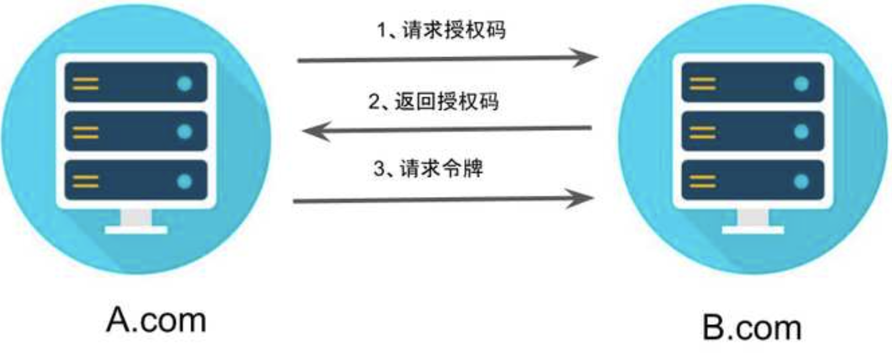

OAuth 2.0
authorization grant  [ˌɔːθəraɪˈzeɪʃən] [ɡrɑːnt] 授权 同意
颁发令牌

<!-- TOC -->

- [1. 简介](#1-简介)
  - [1.1. 令牌Token](#11-令牌token)
    - [1.1.1. token 和 password](#111-token-和-password)
    - [1.1.2. 优点](#112-优点)
  - [1.2. OAuth是什么](#12-oauth是什么)
- [2. 4种授权方式](#2-4种授权方式)
  - [2.1. 授权码](#21-授权码)
  - [2.隐藏式](#2隐藏式)
  - [3.密码式](#3密码式)
  - [4.凭证式](#4凭证式)
- [3.令牌的使用](#3令牌的使用)
  - [一.第三方登录](#一第三方登录)
  - [二、应用登记](#二应用登记)
- [4.更新令牌](#4更新令牌)

<!-- /TOC -->

# 1. 简介

## 1.1. 令牌Token
### 1.1.1. token 和 password
令牌（token）与密码（password）的作用是一样的，都可以进入系统  
差异
* 令牌是短期的，到期会自动失效，用户自己无法修改。密码一般长期有效，用户不修改，就不会发生变化。
* 令牌可以被数据所有者撤销，会立即失效。以上例而言，屋主可以随时取消快递员的令牌。密码一般不允许被他人撤销。
* 令牌有权限范围（scope），比如只能进小区的二号门。对于网络服务来说，只读令牌就比读写令牌更安全。密码一般是完整权限。
### 1.1.2. 优点
令牌既可以让第三方应用获得权限，同时又随时可控，不会危及系统安全


## 1.2. OAuth是什么
OAuth 2.0 是一种授权机制，主要用来颁发令牌（token）

# 2. 4种授权方式 
## 2.1. 授权码
授权码（authorization code）方式，指的是第三方应用先申请一个授权码，然后再用该码获取令牌。
这种方式是最常用的流程，安全性也最高。  
它适用于那些有后端的 Web 应用。授权码通过前端传送，令牌则是储存在后端，而且所有与资源服务器的通信都在后端完成。这样的前后端分离，可以避免令牌泄漏。


第一步，A网站提供一个链接，用户点击后就会跳转到 B网站，授权用户数据给 A 网站使用。下面就是 A 网站跳转 B 网站的一个示意链接。
```java
https://b.com/oauth/authorize?
  //要求返回授权码
  response_type=code&
  //客户端id
  client_id=CLIENT_ID&
  // 接受或拒绝请求后的跳转网址
  redirect_uri=CALLBACK_URL&
  参数表示要求的授权范围（这里是只读）
  scope=read
```

第二步，用户跳转后，B 网站会要求用户登录，然后询问是否同意给予 A 网站授权。用户表示同意，这时 B 网站就会跳回redirect_uri参数指定的网址。
```
https://a.com/callback?code=AUTHORIZATION_CODE
```

第三步 A 网站拿到授权码以后，就可以在后端，向 B 网站请求令牌。

```java
https://b.com/oauth/token?
  //用于确认身份
 client_id=CLIENT_ID&
 client_secret=CLIENT_SECRET&
 //表示采用的授权方式是授权码
 grant_type=authorization_code&
 //上一步的授权码
 code=AUTHORIZATION_CODE&
 redirect_uri=CALLBACK_URL
 ```

第四步 B 网站收到请求以后，就会颁发令牌
```java
{    
  "access_token":"ACCESS_TOKEN",
  "token_type":"bearer",
  "expires_in":2592000,
  "refresh_token":"REFRESH_TOKEN",
  "scope":"read",
  "uid":100101,
  "info":{...}
}
```

## 2.隐藏式
有些 Web 应用是纯前端应用，没有后端。必须将令牌储存在前端。
第一步，A 网站提供一个链接，要求用户跳转到 B 网站，授权用户数据给 A 网站使用。
```java
https://b.com/oauth/authorize?
  //表示要求直接返回令牌。
  response_type=token&
  client_id=CLIENT_ID&
  redirect_uri=CALLBACK_URL&
  scope=read
```

第二步，用户跳转到 B 网站，登录后同意给予 A 网站授权。这时，B 网站就会跳回redirect_uri参数指定的跳转网址，并且把令牌作为 URL 参数，传给 A 网站。

```java
//token参数就是令牌，
https://a.com/callback#token=ACCESS_TOKEN
```


这种方式把令牌直接传给前端，是很不安全的。因此，只能用于一些安全要求不高的场景，并且令牌的有效期必须非常短，通常就是会话期间（session）有效，浏览器关掉，令牌就失效了。

## 3.密码式
如果你高度信任某个应用，RFC 6749 也允许用户把用户名和密码，直接告诉该应用。该应用就使用你的密码，申请令牌，这种方式称为"密码式"（password）。

第一步，A 网站要求用户提供 B 网站的用户名和密码。拿到以后，A 就直接向 B 请求令牌。
```java
https://oauth.b.com/token?
    //表示授权方式是"密码式"
  grant_type=password&
  username=USERNAME&
  password=PASSWORD&
  client_id=CLIENT_ID
```
第二步，B 网站验证身份通过后，直接给出令牌。注意，这时不需要跳转，而是把令牌放在 JSON 数据里面，作为 HTTP 回应，A 因此拿到令牌。  
这种方式需要用户给出自己的用户名/密码，显然风险很大，因此只适用于其他授权方式都无法采用的情况，而且必须是用户高度信任的应用。

## 4.凭证式
适用于没有前端的命令行应用，即在命令行下请求令牌。  
这种方式给出的令牌，是针对第三方应用的，而不是针对用户的，即有可能多个用户共享同一个令牌。  

第一步，A 应用在命令行向 B 发出请求。
```java
https://oauth.b.com/token?
   //表示授权方式是“凭证式”
  grant_type=client_credentials&
  //以下两个用来确认身份
  client_id=CLIENT_ID&
  client_secret=CLIENT_SECRET
```
第二步，B 网站验证通过以后，直接返回令牌。


# 3.令牌的使用  
A 网站拿到令牌以后，就可以向 B 网站的 API 请求数据了。  
此时，每个发到 API 的请求，都必须带有令牌。具体做法是在请求的头信息，加上一个Authorization字段，令牌就放在这个字段里面。
```
//ACCESS_TOKEN 就是拿到的令牌
"Authorization: Bearer ACCESS_TOKEN"
"https://api.b.com"
```

## 一.第三方登录
## 二、应用登记
提交表单以后，GitHub 应该会返回客户端 ID（client ID）和客户端密钥（client secret），这就是应用的身份识别码。

# 4.更新令牌

令牌的有效期到了，如果让用户重新走一遍上面的流程，再申请一个新的令牌，很可能体验不好，而且也没有必要。OAuth 2.0 允许用户自动更新令牌。

具体方法是，B 网站颁发令牌的时候，一次性颁发两个令牌，一个用于获取数据，另一个用于获取新的令牌（refresh token 字段）。令牌到期前，用户使用 refresh token 发一个请求，去更新令牌。
```java
https://b.com/oauth/token?
    //表示要求更新令牌
  grant_type=refresh_token&
  //以下两个用来确认身份
  client_id=CLIENT_ID&
  client_secret=CLIENT_SECRET&
  //用于更新令牌的令牌
  refresh_token=REFRESH_TOKEN
```
B 网站验证通过以后，就会颁发新的令牌。


原网站地址  
http://www.ruanyifeng.com/blog/2019/04/oauth-grant-types.html


