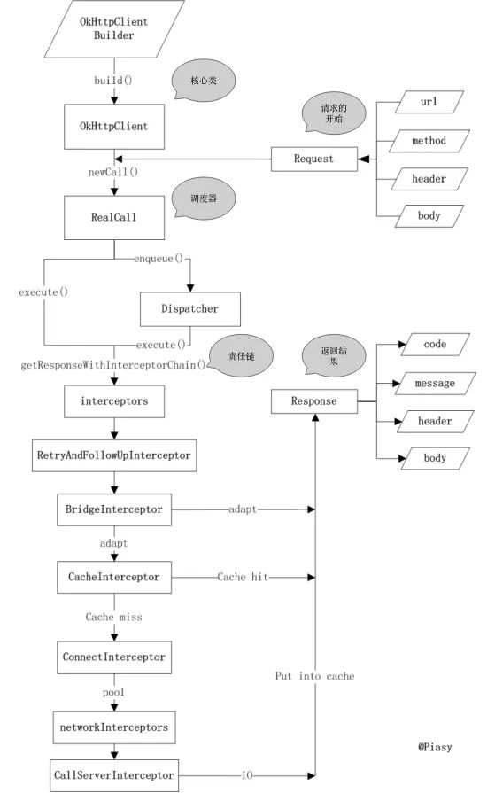
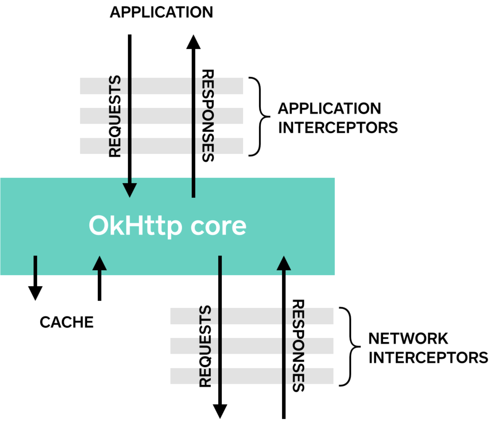
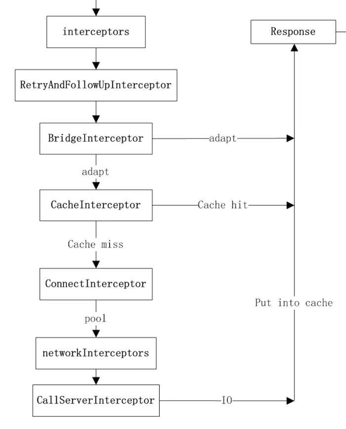
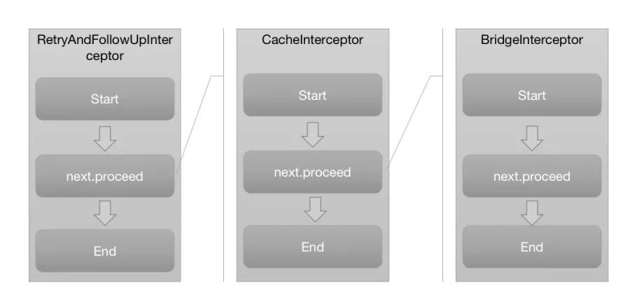
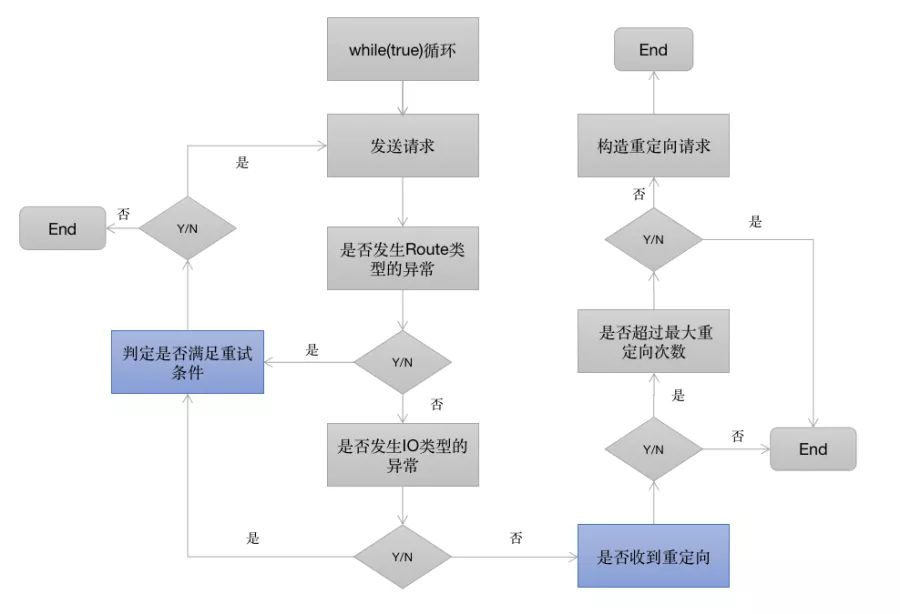

Okhttp  
execute [ˈɛksɪˌkjut]：实施  
enqueue  [kjuː] 入队  
process [ˈprəʊsɛs] 进行  
Chain [tʃeɪn]   

<!-- TOC -->

- [1.Okhttp简介](#1okhttp简介)
- [2.使用](#2使用)
  - [a.提交流](#a提交流)
  - [b.提交文件](#b提交文件)
  - [c.提交表单](#c提交表单)
  - [d.Post方式提交分块请求](#dpost方式提交分块请求)
  - [e.Call常用方法](#ecall常用方法)
- [3.重要类](#3重要类)
  - [## 1.Response属性](#-1response属性)
  - [boolean isSuccessful() | 请求是否成功](#boolean-issuccessful--请求是否成功)
  - [OkhttpClient常用方法](#okhttpclient常用方法)
  - [2.Request 常用方法](#2request-常用方法)
  - [2.Dispatcher](#2dispatcher)
- [4.Okhttp处理](#4okhttp处理)
  - [1.响应缓存](#1响应缓存)
    - [I 缓存相关的参数](#i-缓存相关的参数)
  - [max-stale | 在请求头设置有效，在响应头设置无效。](#max-stale--在请求头设置有效在响应头设置无效)
  - [2.失败重试](#2失败重试)
  - [3.OkHttp认证](#3okhttp认证)
- [5.核心类](#5核心类)
  - [](#)
  - [RealCall | 负责请求的调度（同步：当前线程发送请求，异步的话则使用OkHttp内部的线程池进行）；同时负责构造内部逻辑责任链，并执行责任链相关的逻辑，直到获取结果。](#realcall--负责请求的调度同步当前线程发送请求异步的话则使用okhttp内部的线程池进行同时负责构造内部逻辑责任链并执行责任链相关的逻辑直到获取结果)
  - [2.Requests属性](#2requests属性)
  - [1.RealCall](#1realcall)
  - [关键方法](#关键方法)
  - [enqueue() | 处理异步请求](#enqueue--处理异步请求)
  - [CallServerInterceptor | 执行流操作(写出请求体、获得响应数据) 负责向服务器发送请求数据、从服务器读取响应数据 进行http请求报文的封装与请求报文的解析](#callserverinterceptor--执行流操作写出请求体获得响应数据-负责向服务器发送请求数据从服务器读取响应数据-进行http请求报文的封装与请求报文的解析)
  - [1.2拦截器](#12拦截器)
  - [1.3 RetryAndFollowUpInterceptor](#13-retryandfollowupinterceptor)
  - [1.4 Interceptors和NetworkInterceptors的区别](#14-interceptors和networkinterceptors的区别)
  - [1.5 BridgeInterceptor](#15-bridgeinterceptor)
  - [1.6 CacheInterceptor](#16-cacheinterceptor)
  - [1.7 ConnectInterceptor](#17-connectinterceptor)
  - [1.8 CallServerInterceptor](#18-callserverinterceptor)
- [参考文档](#参考文档)

<!-- /TOC -->

# 1.Okhttp简介



# 2.使用

```java
//请求内容
Request request = new Request.Builder()
            //url
            .url("https://github.com/")
            //Post请求
            .post(RequestBody.create(MEDIA_TYPE_MARKDOWN, postBody))
            .build();
//发送请求（同步）
String postBody = "1234124"

/************** 同步请求 *******************/
Response response = client.newCall(request).execute();

/************** 异步请求 *******************/
mOkHttpClidnet.newCall(request).enqueue(new Callback() {
  @Override 
  public void onFailure(Request request, Throwable throwable) {
    throwable.printStackTrace();
  }

  @Override 
  public void onResponse(Response response) throws IOException {
  if (!response.isSuccessful()) throw new IOException("Unexpected code " + response);
    System.out.println(response.body().string());
  }
});

//请求头
Headers responseHeaders = response.headers();
 responseHeaders.name(i) + ": " + responseHeaders.value(i));
//Gson解析
Gist gist = gson.fromJson(response.body().charStream(), Gist.class);
```

## a.提交流
```java
RequestBody requestBody = new RequestBody() {
  @Override 
  public MediaType contentType() {
    return MEDIA_TYPE_MARKDOWN;
  }

  @Override 
  public void writeTo(BufferedSink sink) throws IOException {
    sink.writeUtf8("Numbers\n");
    sink.writeUtf8("-------\n");
    for (int i = 2; i <= 997; i++) {
      sink.writeUtf8(String.format(" * %s = %s\n", i, factor(i)));
    }
  }

  private String factor(int n) {
    for (int i = 2; i < n; i++) {
      int x = n / i;
      if (x * i == n) return factor(x) + " × " + i;
    }
    return Integer.toString(n);
  }
};
Request request = new Request.Builder()
        .url("https://api.github.com/markdown/raw")
        .post(requestBody)
        .build();

```

## b.提交文件
```java
Request request = new Request.Builder()
        .url("https://api.github.com/markdown/raw")
        .post(RequestBody.create(MEDIA_TYPE_MARKDOWN, file))
        .build();
Response response = client.newCall(request).execute();
```

## c.提交表单
使用FormEncodingBuilder来构建和HTML<form>标签相同效果的请求体. 键值对将使用一种HTML兼容形式的URL编码来进行编码.
```java
RequestBody formBody = new FormBody.Builder()
        .add("search", "Jurassic Park")
        .build();
Request request = new Request.Builder()
    .url("https://en.wikipedia.org/w/index.php")
    .post(formBody)
    .build();
```

## d.Post方式提交分块请求
例如它的Content-Disposition. 如果Content-Length和Content-Type可用的话, 他们会被自动添加到请求头中.
```java
RequestBody requestBody = new MultipartBody.Builder()
    .setType(MultipartBody.FORM)
    .addFormDataPart("title", "Square Logo")
    .addFormDataPart("image", "logo-square.png",
        RequestBody.create(MEDIA_TYPE_PNG, new File("website/static/logo-square.png")))
    .build();

Request request = new Request.Builder()
    .header("Authorization", "Client-ID " + IMGUR_CLIENT_ID)
    .url("https://api.imgur.com/3/image")
    .post(requestBody)
    .build();
```

## e.Call常用方法
方法 | 作用
---|---
enqueue() | 异步调用
newCall(request) | 同步调用
cancel() | okhttp取消


# 3.重要类
## 1.Response属性
-----
类 | 作用
---|---
Protocol | 代表请求协议
int code | 代表响应码
String message | 代表描述信息
Headers | 响应头,
ResponseBody body() | 代表响应体
Handshake | 代表SSL/TLS握手协议验证时的信息
boolean isSuccessful() | 请求是否成功
----
    
responseBody常用方法

类 | 作用
---|---
responseBody.string() | 获得字符串  
responseBody.bytes() | 获得字节数组
charStream() | 流来处理
byteStream() | 流来处理

string()/bytes()，这两种形式都会把文档加入到内存，如果内容过多，会内存溢出。
超过1M的要以流的形式处理

## OkhttpClient常用方法
//设置超时时间
```java
mOkHttpClient = new OkHttpClient.Builder()
    //超时时间设置
    .connectTimeout(10, TimeUnit.SECONDS)
    .writeTimeout(10, TimeUnit.SECONDS)
    .readTimeout(30, TimeUnit.SECONDS)
    //异步请求时配置
    .dispatcher(new Dispatcher())
    .build

OkHttpClient.cancel(tag)
```

公用连接池
同一个OkhttpClict创建的builder和原始的client共享相同的连接池, 分发器和配置.
```java
OkHttpClient client = new OkHttpClient();

OkHttpClient copy1 = client.newBuilder().build
OkHttpClient copy2 = client.newBuilder().build

```

## 2.Request 常用方法
```java
Request request = new Request.Builder()
    .url("https://api.github.com/repos/square/okhttp/issues")
    //会移除重复的
    .header("User-Agent", "OkHttp Headers.java")
    //不会移除重复的
    .addHeader("Accept", "application/json; q=0.5")
    .addHeader("Accept", "application/vnd.github.v3+json")
    //取消请求的标示
    .tag(tag)

    .build();

//取消请求
OkHttpClient.cancel(tag)
```

```java
Request request = new Request.Builder()
    //只是用网络数据
    .cacheControl(CacheControl.FORCE_NETWORK)
    //只是用缓存数据
    .cacheControl(CacheControl.FORCE_CACHE)
    //强制使用服务器数据
    .addHeader("Cache-Control", "no-cache");
    //请求优先使用本地缓存资源
    .addHeader("Cache-Control", "only-if-cached");、
```
## 2.Dispatcher
执行异步请求时的策略

多个Okhttp公用连接池，线程池的方法
* 1.同一Okhttp实例，创建的Okhttp(Okhttp.newBuild().build)
* 2.多个Okhhtp使用同一个dispatcher

```java
Dispatcher dispatcher = new Dispatcher()
new OkHttpClient.Build()
    .dispatcher(dispatcher)
```

类 | 作用
---|---
int maxRequests = 64 | 默认同时执行的最大请求数， 可以通过setMaxRequests(int)修改.
int maxRequestsPerHost | 每个主机默认请求的最大数目， 可以通过setMaxRequestsPerHost(int)修改.
private Runnable idleCallback | 调度没有请求任务时的回调.
ExecutorService executorService; | 执行异步请求的线程池，默认是 核心线程为0，最大线程数为Integer.MAX_VALUE，空闲等待为60s.
Deque<AsyncCall> readyAsyncCalls = new ArrayDeque<>() | 异步请求的执行顺序的队列.
Deque<AsyncCall> runningAsyncCalls = new ArrayDeque<>();| 运行中的异步请求队列.
Deque<RealCall> runningSyncCalls = new ArrayDeque<>() | 运行中的同步请求队列.

# 4.Okhttp处理
缓存实现的两种方式
* 首先要为OkHttpClient设置Cache，否则缓存不会生效（retrofit并未置默认缓存目录）。
* 
## 1.响应缓存
* a.通过添加 @Headers("Cache-Control: max-age=120") 进行设置。
  * retrofit 会默认缓存该请求的返回数据，并且120s内，缓存都是生效状态，即无论有网无网都读取缓存。
  * 这种方法是针对特定的API进行设置。
```java
@Headers("Cache-Control:public,max-age=120")
@GET("mobile/active")
Call<ResponseBody> getActive(@Query("id") int activeId);
```

* b.通过Interceptors实现缓存

不论是否有网，都缓存
```java
//设置缓存的位置，以及缓存的大小
int cacheSize = 10 * 1024 * 1024; // 10 MiB
Cache cache = new Cache(cacheDirectory, cacheSize);

mOkClient
        //失败只会重试一次
        .retryOnConnectionFailure(true)
        //设置缓存的文件和大小
        .cache(cache)
        //设置缓存
        .addInterceptor(new CacheIntercept())

//缓存时间为20s，20s无论是否有网都缓存
new Interceptor() {
  @Override
  public Response intercept(Chain chain) throws IOException {
    Request request = chain.request();
    Response response = chain.proceed(request);
    //
    return response.newBuilder().header("Cache-Control","public,max-age=20").build();
  }
}
```
无网络的情况下读取缓存，有网络的时，根据缓存的过期时间绝对是否重新请求
```java
OkHttpClient client = new OkHttpClient.Builder()
        .addInterceptor(new Interceptor() {
            @Override
            public Response intercept(Chain chain) throws IOException {
                Request request = chain.request();
                if (!NetworkUtils.isConnected(MainActivity.this)) {
                  // 离线时缓存保存4周,单位:秒
                    int maxStale = 4 * 7 * 24 * 60; 
                    CacheControl tempCacheControl = new CacheControl.Builder()
                            .onlyIfCached()
                            .maxStale(maxStale, TimeUnit.SECONDS)
                            .build();
                    request = request.newBuilder()
                            .cacheControl(tempCacheControl)
                            .build();
                }
                return chain.proceed(request);
            }
        })
        .addNetworkInterceptor(new Interceptor() {
            @Override
            public Response intercept(Chain chain) throws IOException {
                Request request = chain.request();
                Response originalResponse = chain.proceed(request);
                int maxAge = 20;    // 在线缓存,单位:秒
                return originalResponse.newBuilder()
                        .removeHeader("Pragma")// 清除头信息，因为服务器如果不支持，会返回一些干扰信息，不清除下面无法生效
                        .removeHeader("Cache-Control")
                        .header("Cache-Control", "public, max-age=" + maxAge)
                        .build();
            }
        })
        .cache(cache)
        .build();
```
* 有网络的情况下，缓存时间是：20秒。也就是在20秒内的请求都是获取本地的缓存。当网络断开后，会设置一个离线的缓存，为4周。

* addNetworkInterceptor添加的是网络拦截器，在网络畅通的时候会调用
* addInterceptor则都会调用。所以我们应该是在addInterceptor去写逻辑。


### I 缓存相关的参数

-----
类 | 作用
---|---
maxAge | 设置最大失效时间，失效则不使用
maxStale | 设置最大失效时间，失效则不使用
max-stale | 在请求头设置有效，在响应头设置无效。
----

max-stale和max-age同时设置的时候，缓存失效的时间按最长的算。


https://www.jianshu.com/p/ea2055db3dd3
## 2.失败重试

OkHttpClient提供的只能重试1次
```java
OkHttpClient client = new OkHttpClient.Builder()
        //默认重试一次，若需要重试N次，则要实现拦截器。
        .retryOnConnectionFailure(true)
        .connectTimeout(10, TimeUnit.SECONDS)
        .readTimeout(20, TimeUnit.SECONDS)
        .writeTimeout(20, TimeUnit.SECONDS)
        .build();
```
* 自定义的，重试N次的拦截器，通过addInterceptor 设置
```java
public static class Retry implements Interceptor {
    public int maxRetry;//最大重试次数
    private int retryNum = 0;//假如设置为3次重试的话，则最大可能请求4次（默认1次+3次重试）
    public Retry(int maxRetry) {
        this.maxRetry = maxRetry;
    }
    @Override
    public Response intercept(@NonNull Chain chain) throws IOException {
        Request request = chain.request();
        Response response = chain.proceed(request);
        Log.i("Retry","num:"+retryNum);
        while (!response.isSuccessful() && retryNum < maxRetry) {
            retryNum++;
            Log.i("Retry","num:"+retryNum);
            response = chain.proceed(request);
        }
        return response;
    }
}
```

## 3.OkHttp认证
OkHttp会自动重试未验证的请求. 响应是401 Not Authorized时，Authenticator会被要求提供证书. Authenticator的实现中需要建立一个新的包含证书的请求. 如果没有证书可用, 返回null来跳过尝试.
使用Response.challenges()来获得任何authentication challenges的 schemes 和 realms. 当完成一个Basic challenge, 使用Credentials.basic(username, password)来解码请求头.

```java
client = new OkHttpClient.Builder()
    .authenticator(new Authenticator() {
    @Override 
    public Request authenticate(Route route, Response response) throws IOException {
        System.out.println("Authenticating for response: " + response);
        System.out.println("Challenges: " + response.challenges());
        String credential = Credentials.basic("jesse", "password1");
        return response.request().newBuilder()
            .header("Authorization", credential)
            .build();
          }
    })
    .build();
```

当认证无法工作时, 为了避免多次重试, 你可以返回空来放弃认证.
```java
if (credential.equals(response.request().header("Authorization"))) {
    return null; 
}
```

当重试次数超过定义的次数, 你若想跳过认证,
```java
if (responseCount(response) >= 3) {
    return null; // If we've failed 3 times, give up.
}
  
private int responseCount(Response response) {
    int result = 1;
    while ((response = response.priorResponse()) != null) {
      result++;
    }
    return result;
}
```
https://www.jianshu.com/p/ca8a982a116b

# 5.核心类

-----
类 | 作用
---|---
OkHttpClient | 这个是整个OkHttp的核心管理类，所有的内部逻辑和对象归OkHttpClient统一来管理，它通过Builder构造器生成，构造参数和类成员很多
Request | Request是我们发送请求封装类，内部有url, header , method，body等常见的参数 
Response | 请求结果，包含code, message, header,body
RealCall | 负责请求的调度（同步：当前线程发送请求，异步的话则使用OkHttp内部的线程池进行）；同时负责构造内部逻辑责任链，并执行责任链相关的逻辑，直到获取结果。
----
虽然OkHttpClient是整个OkHttp的核心管理类，但是真正发出请求并且组织逻辑的是RealCall类，它同时肩负了调度和责任链组织的两大重任

## 2.Requests属性


## 1.RealCall

关键方法
-----
类 | 作用
---|---
execute() | 处理同步请求
enqueue() | 处理异步请求
----
补充：enqueue()：只是通过异步线程和callback做了一个异步调用的封装，最终逻辑还是调用execute()，然后调用了getResponseWithInterceptorChain()获得请求结果。
```java
val interceptors = mutableListOf<Interceptor>()
interceptors += client.interceptors
interceptors += RetryAndFollowUpInterceptor(client)
interceptors += BridgeInterceptor(client.cookieJar)
interceptors += CacheInterceptor(client.cache)
interceptors += ConnectInterceptor
if (!forWebSocket) {
  interceptors += client.networkInterceptors
}
interceptors += CallServerInterceptor(forWebSocket)

val chain = RealInterceptorChain(interceptors, transmitter, null, 0, originalRequest, this,
    client.connectTimeoutMillis, client.readTimeoutMillis, client.writeTimeoutMillis)

var calledNoMoreExchanges = false
try {
  val response = chain.proceed(originalRequest)
 ............
```
getResponseWithInterceptorChain:生成的Interceptors拦截器列表

---
类 | 作用
---|---
client.Interceptors | 自定义拦截器
RetryAndFollowUpInterceptor | 失败和重定向拦截器
BridgeInterceptor | 封装request和response拦截器
CacheInterceptor | 缓存相关的过滤器，负责读取缓存直接返回、更新缓存
ConnectInterceptor | 连接服务，负责和服务器建立连接 这里才是真正的请求网络
client.networkInterceptors |  自定义拦截器
CallServerInterceptor | 执行流操作(写出请求体、获得响应数据) 负责向服务器发送请求数据、从服务器读取响应数据 进行http请求报文的封装与请求报文的解析
---

OkHttp将整个请求的复杂逻辑切成了一个一个的独立模块并命名为拦截器(Interceptor)，通过责任链的设计模式串联到了一起，最终完成请求获取响应结果。

## 1.2拦截器
  
  

* 拦截器按照添加顺序依次执行
* 拦截器的执行从RealInterceptorChain.proceed()开始，进入到第一个拦截器的执行逻辑
* 每个拦截器在执行之前，会将剩余尚未执行的拦截器组成新的RealInterceptorChain
* 拦截器的逻辑被新的责任链调用next.proceed()切分为start、next.proceed、end这三个部分依次执行
* next.proceed() 所代表的其实就是剩余所有拦截器的执行逻辑
* 所有拦截器最终形成一个层层内嵌的嵌套结构

## 1.3 RetryAndFollowUpInterceptor

 

重试时间
* 当请求内部抛出异常时，判定是否需要重试
* 当响应结果是3xx重定向时，构建新的请求并发送请求

重试规则：
* client的retryOnConnectionFailure参数设置为false，不进行重试
* 请求的body已经发出，不进行重试
* 特殊的异常类型不进行重试（如ProtocolException，SSLHandshakeException等）
* 没有更多的route（包含proxy和inetaddress），不进行重试

前面这四条规则都不符合的条件下，则会重试当前请求

## 1.4 Interceptors和NetworkInterceptors的区别
 Interceptors 和 networkInterceptors 刚好一个在 RetryAndFollowUpInterceptor 的前面，一个在后面。  
 假如一个请求在 RetryAndFollowUpInterceptor 这个拦截器内部重试或者重定向了 N 次，那么其内部嵌套的所有拦截器也会被调用N次，
 * 同样 networkInterceptors 自定义的拦截器也会被调用 N 次。  
 * 而相对的 Interceptors 则一个请求只会调用一次，所以在OkHttp的内部也将其称之为 Application Interceptor。

选择应用拦截器还是网络拦截器

应用拦截器
* 不需要关心像重定向和重试这样的中间响应。
* 总是调用一次，即使HTTP响应从缓存中获取服务。
* 监视应用原始意图。不关心OkHttp注入的像If-None-Match头。
* 允许短路并不调用Chain.proceed()。
* 允许重试并执行多个Chain.proceed()调用。
网络拦截器
* 可以操作像重定向和重试这样的中间响应。
* 对于短路网络的缓存响应不会调用。
* 监视即将要通过网络传输的数据。
* 访问运输请求的Connection。

网路拦截器
* 能够对重定向和重试等中间响应进行操作。
* 对于缓存网络短路的响应不被调用。
* 观察数据，就像通过网络传输一样。
* 访问携带请求的连接。

## 1.5 BridgeInterceptor
* 负责把用户构造的请求转换为发送到服务器的请求 、把服务器返回的响应转换为用户友好的响应，是从应用程序代码到网络代码的桥梁
* 设置内容长度，内容编码
* 设置gzip压缩，并在接收到内容后进行解压。省去了应用层处理数据解压的麻烦
* 添加cookie
* 设置其他报头，如User-Agent,Host,Keep-alive等。其中Keep-Alive是实现连接复用的必要步骤

<font color="#dd0000">如果在代码里没有手动设置 Accept-Encoding = gzip ，那么 OkHttp 会自动处理 gzip 的解压缩；反之，你需要手动对返回的数据流进行 gzip 解压缩。</font>


## 1.6 CacheInterceptor
* 通过Request尝试到Cache中拿缓存，当然前提是OkHttpClient中配置了缓存，默认是不支持的。
* 根据response,time,request创建一个缓存策略，用于判断怎样使用缓存。
* 如果缓存策略中设置禁止使用网络，并且缓存又为空，则构建一个Response直接返回，注意返回码=504
* 缓存策略中设置不使用网络，但是又缓存，直接返回缓存
* 接着走后续过滤器的流程，chain.proceed(networkRequest)
* 当缓存存在的时候，如果网络返回的Resposne为304，则使用缓存的Resposne。
* 构建网络请求的Resposne
* 当在OkHttpClient中配置了缓存，则将这个Resposne缓存起来。
* 缓存起来的步骤也是先缓存header，再缓存body。
* 返回Resposne

## 1.7 ConnectInterceptor
它同时负责了Dns解析和Socket连接（包括tls连接）。

## 1.8 CallServerInterceptor
最后一个拦截器,传输http的头部和body数据

执行的步骤
向服务器发送 request header
如果有 request body，就向服务器发送
读取 response header，先构造一个 Response 对象
如果有 response body，就在 3 的基础上加上 body 构造一个新的 Response 对象

# 参考文档

Okhttp 超时-重试-缓存-拦截器  
https://www.jianshu.com/p/ea2055db3dd3


缓存误区
https://www.imooc.com/article/271657
