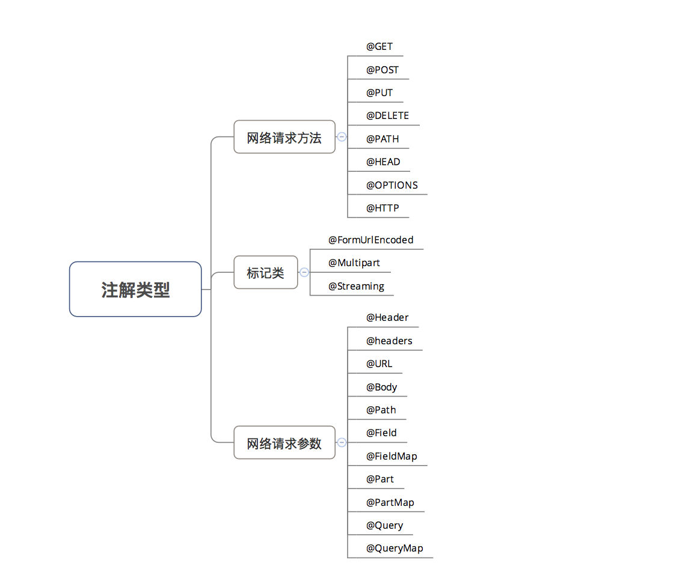
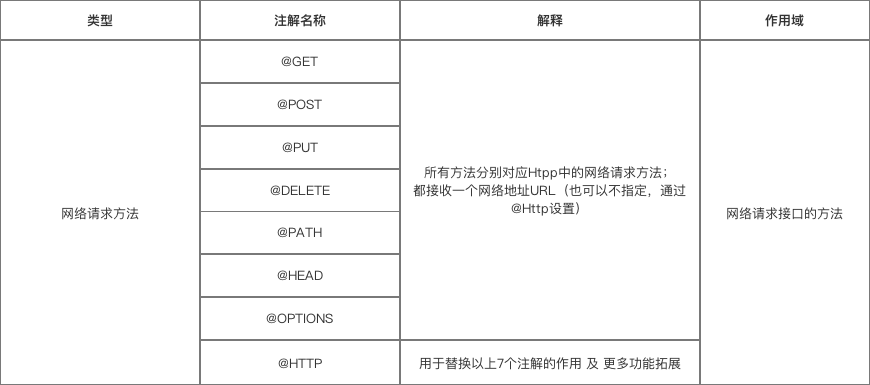
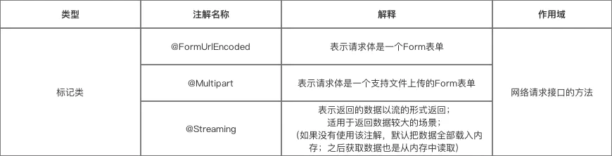
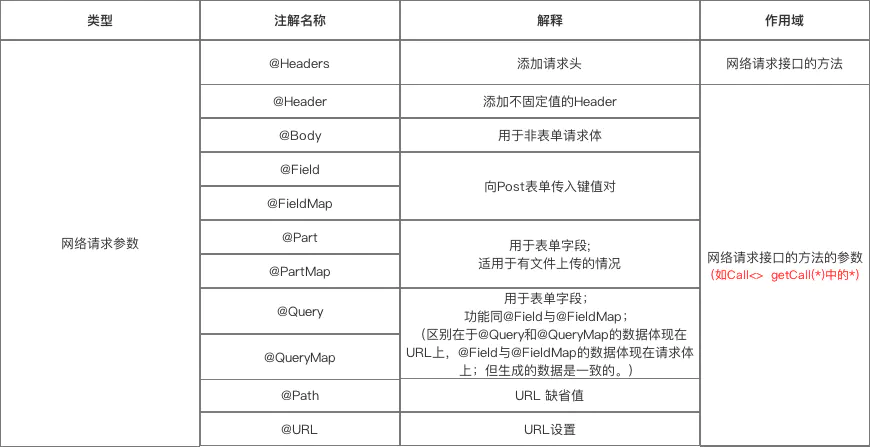

Retrofit  
Query [ˈkwirē]
<!-- TOC -->

- [1.简介](#1简介)
  - [1.1 Retrofit是什么](#11-retrofit是什么)
  - [1.2 对比其他的库](#12-对比其他的库)
  - [1.3 Retrofit](#13-retrofit)
- [2.注解以及使用](#2注解以及使用)
  - [2.1 注解类型图](#21-注解类型图)
  - [2.2 第一类 网络请求方法](#22-第一类-网络请求方法)
  - [2.3 二类标记](#23-二类标记)
    - [a. @FormUrlEncoded](#a-formurlencoded)
    - [b. @Multipart](#b-multipart)
    - [c.@Streaming](#cstreaming)
    - [例子](#例子)
  - [2.4.网络请求参数](#24网络请求参数)
    - [a.@Header & @Headers](#aheader--headers)
    - [b. @Body](#b-body)
    - [c.@Field & @FieldMap](#cfield--fieldmap)
    - [d.@Part & @PartMap](#dpart--partmap)
    - [e. @Query和@QueryMap](#e-query和querymap)
    - [f. @Path](#f-path)
    - [g.@Url](#gurl)
- [3.数据解析器](#3数据解析器)
  - [3.1 适配器类型](#31-适配器类型)
  - [3.2 CallAdapterFactory](#32-calladapterfactory)
- [参考文档](#参考文档)

<!-- /TOC -->


# 1.简介
## 1.1 Retrofit是什么
1.Retrofit 是一个 HTTP 网络请求框架的封装；网络请求是 OkHttp 完成。 基于Okhttp   
Retrofit作用  
* 1.通过配置网络请求参数  
* 2.支持同步和异步网络请求
* 3.支持多种数据解析和序列化格式(gson/json/xml/Protoful)
* 4.对Rxjava支持


## 1.2 对比其他的库
Android-Async-Http/Volley/OkHttp

## 1.3 Retrofit
```java
Retrofit retrofit = new Retrofit.Builder()
    .baseUrl("https://api.github.com/")
    .addConverterFactory(GsonConverterFactory.create())
    .build();
GitHubService service = retrofit.create(GitHubService.class);
```

# 2.注解以及使用
## 2.1 注解类型图


## 2.2 第一类 网络请求方法


```java
public interface GitHubService {
    /******************** GET **********************/
    @GET("group/{id}/users")
    Call<List<User>> groupList(@Path("id") int groupId, @Query("sort") String sort);

    @GET("group/{id}/users")
    Call<List<User>> groupList(@Path("id") int groupId, @QueryMap Map<String, String> options);

    /******************** post **********************/
    //提交对象 json {}
    @POST("users/new")
    Call<User> createUser(@Body User user);

    //表单编码和多部分 first_name=1&last_name=2
    @FormUrlEncoded
    @POST("user/edit")
    Call<User> updateUser(@Field("first_name") String first, @Field("last_name") String last);

    //多部分提交
    @Multipart
    @POST("/users")
    Call<User> addUser(
      @Part("name") RequestBody name, 
      @Part("avatar") RequestBody avatar,
      @Part MultipartBody.Part avatar);

    /******************** PUT **********************/
    //用于修改资源，请求内容写在 Body 里
    @Multipart
    @PUT("user/photo")
    Call<User> updateUser(@Part("photo") RequestBody photo, @Part("description") RequestBody description);

    @FormUrlEncoded
    @PUT("/users/{id}")
    Call<User> updateGender(@Path("id") String id, @Field("gender") String gender);

    /******************** DELETE **********************/
    //用于删除资源，不发送 Body
    @DELETE("/users/{id}")
    Call<User> getUser(@Path("id") String id, @Query("gender") String gender);

    /******************** HEAD **********************/
    //和 GET使用完全相同,和 GET 唯一区别在于，响应中没有Body

    /******************** Http **********************/
    //作用：替换@GET、@POST、@PUT、@DELETE、@HEAD注解的作用 及 更多功能拓展
    @HTTP(method = "GET", path = "blog/{id}", hasBody = false)
    Call<ResponseBody> getCall(@Path("id") int id);

```

## 2.3 二类标记
 

说明   
### a. @FormUrlEncoded  
  作用：表示发送form-encoded的数据  
  每个键值对需要用@Filed来注解键名，随后的对象需要提供值。

### b. @Multipart  
作用：表示发送form-encoded的数据（适用于 有文件 上传的场景）
每个键值对需要用@Part来注解键名，随后的对象需要提供值。


### c.@Streaming

### 例子

```java

// 多部分提交
@POST("/form")
@Multipart
Call<ResponseBody> testFileUpload1(
  //上传文本
  @Part("name") RequestBody name, 
  //上传文件
  @Part("image") RequestBody file, 
  @Part MultipartBody.Part file);

//上传文本
RequestBody namePart = RequestBody.create(MediaType.parse("text/plain"),nameStr);

//上传表单
RequestBody formBody = new FormBody.Builder()
        .add("search", "Jurassic Park")
        .build();

//上传文件
RequestBody avatarPart = RequestBody.create(MediaType.parse("image/jpeg"),avatarFile);
val multipartBody: MultipartBody = MultipartBody.Part.create(headers, requestBody)

MultipartBody.Part filePart = MultipartBody.Part.createFormData("file", "test.txt", file);
```
```http
POST /users HTTP/1.1
Host: hencoder.com
Content-Type: multipart/form-data; boundary=----
WebKitFormBoundary7MA4YWxkTrZu0gW
Content-Length: 2382

------WebKitFormBoundary7MA4YWxkTrZu0gW
Content-Disposition: form-data; name="name"
rengwuxian

------WebKitFormBoundary7MA4YWxkTrZu0gW
Content-Disposition: form-data; name="avatar"; filename="avatar.jpg"
Content-Type: image/jpeg
JFIFHHvOwX9jximQrWa......

------WebKitFormBoundary7MA4YWxkTrZu0gW--
```

## 2.4.网络请求参数

 

### a.@Header & @Headers  
注意:重名的标题不会覆盖对方。请求中将包含所有同名的标题。
```java
    /*************** @Headers ***************/
    @Headers("Cache-Control: max-age=640000")

    //多个头
    @Headers({
    "Accept: application/vnd.github.v3.full+json",
    "User-Agent: Retrofit-Sample-App"
    })

    /*************** @Header ***************/
    @GET("user")
    Call<User> getUser(@Header("Authorization") String authorization)


    @GET("user")
    Call<User> getUser(@HeaderMap Map<String, String> headers)

} 
```
### b. @Body  
作用：以 Post方式 传递 自定义数据类型 给服务器  
注意：1.如果提交的是对象，则提交json字符串  
2.如果提交的是一个Map，那么作用相当于 @Field  
不过Map要经过 FormBody.Builder 类处理成为符合 Okhttp 格式的表单
```java
FormBody.Builder builder = new FormBody.Builder();
builder.add("key","value");
```
### c.@Field & @FieldMap  
作用：发送 Post请求 时提交请求的表单字段  
具体使用：与 @FormUrlEncoded 注解配合使用

```java
@POST("/form")
@FormUrlEncoded
Call<ResponseBody> testFormUrlEncoded1(@Field("username") String name, @Field("age") int age);

/** Map的key作为表单的键 */
@POST("/form")
@FormUrlEncoded
Call<ResponseBody> testFormUrlEncoded2(@FieldMap Map<String, Object> map);
```

### d.@Part & @PartMap  
作用：发送 Post请求 时提交请求的表单字段,配合@Multipart使用  
与@Field的区别：功能相同，但携带的参数类型更加丰富，包括数据流，所以适用于 有文件上传 的场景

补充：  
PartMap 注解支持一个Map作为参数，支持RequestBody类型，如果有其它的类型，会被{@link retrofit2.Converter}转换，如后面会介绍的 使用etrofit2.converter.gson的GsonRequestBodyConverter  
所以RequestBody就不适用了,所以文件只能用<b>MultipartBody.Part </b>

```java
@POST("/form")
@Multipart
Call<ResponseBody> testFileUpload1(
  
  @Multipart
  @POST("api/uploadRecord")
  fun uploadRecord(
  /************************** 提交文字 **************************/
      @Part("name") RequestBody name, 
      @PartMap inspectionBean: Map<String, RequestBody>,

  /************************** 多文件提交 **************************/
      @Part MultipartBody.Part file,
      @Part imgs: List<MultipartBody.Part>,
  ): Call<ResponseBody>

  //提交文件的格式
  RequestBody file = RequestBody.create(MediaType.parse("multipart/form-data"), file);
  MultipartBody.Part filePart = MultipartBody.Part.createFormData("file", "test.txt", file);

  //这里并不会被当成文件，因为没有文件名(包含在Content-Disposition请求头中)，但上面的 filePart 有
  Map<String, RequestBody> fileUpload2Args = new HashMap<>();
  //fileUpload2Args.put("file", file);
```
~~RequestBody file = RequestBody.create(MediaType.parse("application/octet-stream"), file);~~
只能用于提交一个文件，很少使用

### e. @Query和@QueryMap  
作用：用于 @GET 方法的查询参数（Query = Url 中 ‘?’ 后面的 key-value）
```java
//Query = cate
url = “http://www.println.net/?cate=android”
```
```java
@GET("/")    
   Call<String> cate(@Query("cate") String cate);
}
```

### f. @Path  
作用：URL地址的缺省值

```java
@GET("users/{user}/repos")
Call<ResponseBody>  getBlog（@Path("user") String user ）;
// 访问的API是：https://api.github.com/users/{user}/repos
// 在发起请求时， {user} 会被替换为方法的第一个参数 user（被@Path注解作用）
```

### g.@Url  
作用：直接传入一个请求的 URL变量 用于URL设置
```java
@GET
Call<ResponseBody> testUrlAndQuery(@Url String url, @Query("showAll") boolean showAll);
// 当有URL注解时，@GET传入的URL就可以省略
// 当GET、POST...HTTP等方法中没有设置Url时，则必须使用 {@link Url}提供
```


# 3.数据解析器

## 3.1 适配器类型
Retrofit支持多种数据解析方式
数据解析器 | Gradle依赖
---|---
Gson | com.squareup.retrofit2:converter-gson:2.0.2
Jackson | com.squareup.retrofit2:converter-jackson:2.0.2
Simple XML | com.squareup.retrofit2:converter-simplexml:2.0.2
Protobuf | com.squareup.retrofit2:converter-protobuf:2.0.2
Moshi | com.squareup.retrofit2:converter-moshi:2.0.2
Wire | com.squareup.retrofit2:converter-wire:2.0.2
Scalars | com.squareup.retrofit2:converter-scalars:2.0.2

网络请求适配器
网络请求适配器 | Gradle依赖
---|---
guava | com.squareup.retrofit2:adapter-guava:2.0.2
Java8 | com.squareup.retrofit2:adapter-java8:2.0.2
rxjava | com.squareup.retrofit2:adapter-rxjava:2.0.2

```java
//主要在创建Retrofit对象中设置
Retrofit retrofit = new Retrofit.Builder()
  .baseUrl(""http://fanyi.youdao.com/"")
  //支持Prototocobuff解析
  .addConverterFactory(ProtoConverterFactory.create()) 
  //支持Gson解析
  .addConverterFactory(GsonConverterFactory.create()) 
  //支持RxJava
  .addCallAdapterFactory(RxJavaCallAdapterFactory.create()) 
  .build();
```

## 3.2 CallAdapterFactory
* Factory
```java
abstract class Factory {
    //返回calladapter
    public abstract CallAdapter<?, ?> get(Type returnType, Annotation[] annotations,
        Retrofit retrofit);
 
    //获取泛型的类型type,例如User<T>，User<Man>中的Man就是需要实例
    //返回的参数，例如User<T,R>, T index=1,R index=2,
    //parameterizedType,继承type接口，参数类型，例如User<Man>中的man
    protected static Type getParameterUpperBound(int index, ParameterizedType type) {
      return Utils.getParameterUpperBound(index, type);
    }
 
    //获取实例的class，例如User<T>，获得User.class
    protected static Class<?> getRawType(Type type) {
      return Utils.getRawType(type);
    }
}
```

```java
public interface CallAdapter<R, T> {
  //网络中获取数据response的类型，用于Gson/fastjson解析用到的type
  Type responseType();
  //给应用层的类型，例如observable/liveData
  T adapt(Call<R> call);
}
```


# 参考文档
Retrofit详细文档  
https://www.jianshu.com/p/a3e162261ab6/

自定义CallAdapterFactory
https://blog.csdn.net/woshuaioo/article/details/79170848


 