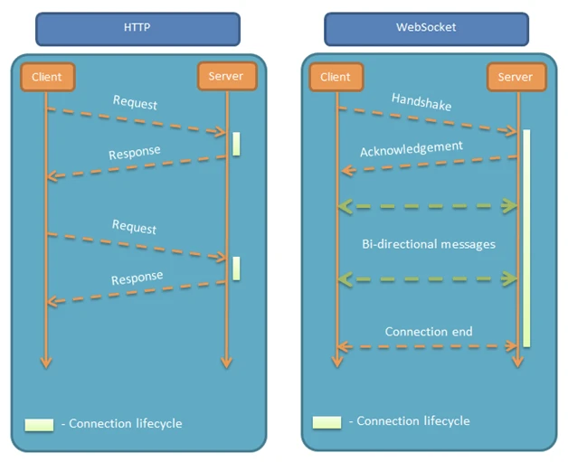

WebSocket

 Protocols [ˈprəʊtəˌkɒl] ： 协议  
 client  [ˈklaɪənt] 客户端
 interval [ˈɪntəvəl] 间隔

<!-- TOC -->

- [1.简介](#1简介)
  - [1.2 特点](#12-特点)
  - [1.2 优点](#12-优点)
  - [1.3 实现长链接的的方式](#13-实现长链接的的方式)
- [1.3 传输内容](#13-传输内容)
- [3.实现](#3实现)
  - [getPort():String | 获取端口号](#getportstring--获取端口号)
- [4.webScoket鉴权](#4webscoket鉴权)
  - [1.在请求头增加uid，token](#1在请求头增加uidtoken)
- [5.WebSocket 保活](#5websocket-保活)
  - [5.1 Ping](#51-ping)
  - [2.onFail()失败时重连](#2onfail失败时重连)
  - [3.通过sendMes()定时发送包活](#3通过sendmes定时发送包活)

<!-- /TOC -->

# 1.简介
WebSocket WebSocket 是一个全双工的长连接应用层协议，
android的OkHttp，既可以实现 HTTP 请求，又可以实现WebSocket。修复的HTTP/1.1"半双工"的模式的通信缺陷

HTTP半双工：被动的通信模式，只有客户端请求才可以返回数据，无法主动向客户端发送数据，通信的同一时刻数据只能在一个方向上传递。并且完成一次响应就要断开。  
如果希望实现长链接，只能通过轮训发送数据，问题：1.不能做到真正的实时，2.每次请求都带有完整的请求头，反复发送无效的请求

 HTTP/2、HTTP/3 中，针对半双工的缺陷新增了Stream、Server Push等，但依然是【请求-应答】的通信方式.
 Websocket是真正的长连接




 ## 1.2 特点
 * URL一般是以ws或者wss开头，ws对应Websocket协议，wss对应在TLS之上的WebSocket。类似于Http和Https的关系。
 * 有且只支持GET方法
 * WebSocket 采用二进制帧的形式传输数据，其中常用的包括用于数据传输的数据帧 MESSAGE 以及 3 个控制帧：
    * PING：主动保活的 PING 帧；
    * PONG：收到 PING 帧后回复；
    * CLOSE：主动关闭 WebSocket 连接；  
* 可以发送文本或者二进制数据
* 如果数据过大，会被分为多个(MESSAGE)帧发送；

## 1.2 优点
* WebSocket 建立在 TCP 协议之上，对服务器端友好；
* 采用的是标准的HTTP报文格式，通过协议升级实现websocket
* WebSocket 沿用 HTTP 的 URL，协议标识符是 "ws" 或 "wss"，80（HTTP） 或 443（HTTPS）端口通信，也能有效的避免一些防火墙的拦截。能够通过各种 HTTP 代理服务器；
* 传输数据相比 HTTP 更轻量，少了 HTTP Header，性能开销更小，通信更高效；

## 1.3 实现长链接的的方式
* Http 
  短连接,因此只能通过轮询来实现的
* XMPP
  长链接，基于XML
* Mqtt:
   基于TCP/IP协议上
  
# 1.3 传输内容
WebScoketUrl
```http
ws://cxmydev.com/some/path
ws://cxmydev.com:8080/some/path
wss://cxmydev.com:443?uid=xxx
```

请求
```java
GET /setting HTTP/1.1
Host: localhost:8080
//TLS之上的WebSocket
Origin: wss://127.0.0.1:3000
//表示要升级协议
Connection: Upgrade
//升级到websocket协议
Upgrade: websocket
//websocket的版本，一般就是13
//如果服务端不支持该版本，需要返回一个Sec-WebSocket-Versionheader，里面包含服务端支持的版本号。
Sec-WebSocket-Version: 13
//Sec-WebSocket-Key,服务端响应首部的Sec-WebSocket-Accept是配套的，提供基本的防护，比如恶意的连接，或者无意的连接。
//这个key是随机生成的，服务器会通过这个参数验证该请求是否有效。
Sec-WebSocket-Key: w4v7O6xFTi36lq3RNcgctw==
```

响应
```java
//响应码101,表示响应协议升级
HTTP/1.1 101 Switching Protocols
Connection:Upgrade
Upgrade: websocket
//将Sec-WebSocket-Key跟258EAFA5-E914-47DA-95CA-C5AB0DC85B11拼接。通过SHA1计算出摘要，并转成base64字符串。
Sec-WebSocket-Accept: Oy4NRAQ13jhfONC7bP8dTKb4PTU=
//客户端指定的一些扩展协议，比如这里permessage-deflate就是WebSocket的一种压缩协议。
Sec-webSocket-Extension:permessage-deflate
```


# 3.实现
库
```gradle
api 'com.squareup.okhttp3:okhttp:3.9.1'
api 'com.squareup.okhttp3:mockwebserver:3.9.1'
```

```java
mWbSocketUrl = "ws://echo.websocket.org";
Request request = new Request.Builder()
        .url(mWbSocketUrl)
        .build();

//创建Okhttp
OkHttpClient mClient = new OkHttpClient.Builder()
        //设置WebSocket连接的保活
        //没有收到pong包的话，监听事件中的onFailure方法就会被调用，此时调用代码断线重连的代码。
        .pingInterval(10, TimeUnit.SECONDS)
        .build();

//WebSocket的初始化和连接
mWebSocket = mClient.newWebSocket(request, new WsListener());
```
* 监听事件，用于收消息，监听连接的状态
  注意：回调方法都是在子线程中完成的
```java

class WsListener extends WebSocketListener {
    //连接成功
    public void onOpen(WebSocket webSocket, Response response) {}
    // WebSocket 连接关闭
    public void onClosed(WebSocket webSocket, int code, String reason) {}

    // 出错了
    public void onFailure(WebSocket webSocket, Throwable t, @Nullable Response response) {}

    // 收到服务端发来的 CLOSE 帧消息，准备关闭连接
    public void onClosing(WebSocket webSocket, int code, String reason) {}

    // 收到服务端发送来的 String 类型消息
    public void onMessage(WebSocket webSocket, String text) {}

    // WebSocket 连接关闭
    public void onMessage(WebSocket webSocket, ByteString bytes) {}

}
```

WebSocket的实现类RealWebSocket，方法

----
方法 | 说明
---|---
send(text) | 发送 String 类型的消息；
send(bytes) | 发送二进制类型的消息；
close(code, reason) | 主动关闭 WebSocket 连接；
getHostName():String | 获取主机名
getPort():String | 获取端口号
---

注意  
<font color="#dd0000">这两个方法需要在子线程中调用，否者会收到一个异常。<font>
```kt
val hostName = mMockWebSocket?.getHostName()
val port = mMockWebSocket?.getPort()
//组合成url
val url = "ws:${hostName}:${port}"
```

# 4.webScoket鉴权
## 1.在请求头增加uid，token
```java
Request request = new Request.Builder()
        .url(mWbSocketUrl)
        .header("uid",uid)
        .header("token",token)
        .build();
```
2.连接后发送给服务器

# 5.WebSocket 保活
## 5.1 Ping
```java
val httpClient = OkHttpClient.Builder()
      //默认值为 0，所以不设置不发送。
      .pingInterval(40, TimeUnit.SECONDS) 
      .build()
```

## 2.onFail()失败时重连

## 3.通过sendMes()定时发送包活


