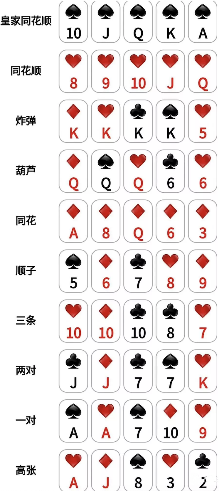
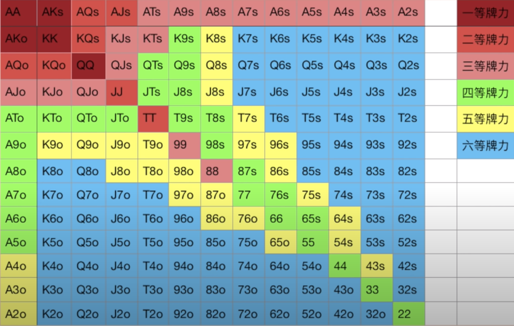

打牌
## 1.基本概念
手牌
公共牌：前三张：翻牌；转牌；和牌

# 2.起手

  

## 一等牌
对：AA/KK/QQ
同花色：AK
不同花色：AK

策略：下大注，赶走一波人

## 二等牌
AQ/KQ/AJ(同花色)
对: JJ/TT

策略：偏激

## 三等牌
同花色：AT/A9/A8/A7/A6/A5/A4/A3/A2; KJ/KT
不同花色:AJ/KJ/QJ
对:99/88

策略：保守

## 四等牌
不同色：AT-2; KT-8
剩余同色
对：77/66/55/44/33/22/11

随时跑

## 五等牌
赶紧跑

## 注意
当拿着一等牌力的时候，尽量加加注赶人。赢小比输要好得多。

1等2等牌主动触及。
中等牌力，主要靠位置。
低等牌力，只有在位置好的时候才玩。

A小等同花，第一目标中顺子，第二是中同花。

拿着对，就考虑3条，不中就弃牌。

Cbet：持续下注。

位置靠前，手牌要求高。

位置靠后，手牌要求低。

间距理论
1.自己raise，如果后面有人加注，除非真的很大，不然就不要跟注。
2.如果自己牌力不好，在后手是可以3打别人的。但不可以跟注别人。

# 范围
翻牌前利有优势，抢主动权。如果是一等二等牌力，翻牌前加注。
前面的人，利用范围去投机。

# 玩家类型

类型 | 说明 | 优点 | 缺点
---|---|---|---
凶 | 经常加注，并且在别人加注后再加注的。下注+再加注/跟入=2 | 
被动 | 总是跟注别人，自己很少加注。下注+再加注/跟入<1 | 
松+主动 | 职业玩家，对范围，平衡手牌，诈唬，要求高  | 拿打牌时赢得更多 | 输赢波动大
跟注战 | 入池多，跟注多 | 多桌上有多个凶的玩家，慢打不容易被发现 | 无法利益最大化，容易支付对方，踢脚被压制
岩石 | 入池少，跟注少，加注更少 | 入池拿到低池成功概率高 | 无法盈利最大化，不能保护好成牌
紧凶 | 入池少，一旦入池则很凶 | 成功率高，保存实力 | 范围明显，有风险被对方中牌吃掉很多

德州扑克
位置+范围+形象

# 新手常见错误
* 1.进错多了局。因为其他投注很大，而畏畏缩缩，被别人读到了牌。
* 2.玩错了人。要有一般以上的玩家不如你的牌技。
* 3.心态失控。外界的事情不会影响自己
* 4.纪律性强。赢很多后不膨胀，结束之后想想自己的优点和缺点。
* 5.对poker的理解。当你拿到第二好的牌，能不能弃牌.如果在有好牌的时候，拿到更多价值，

