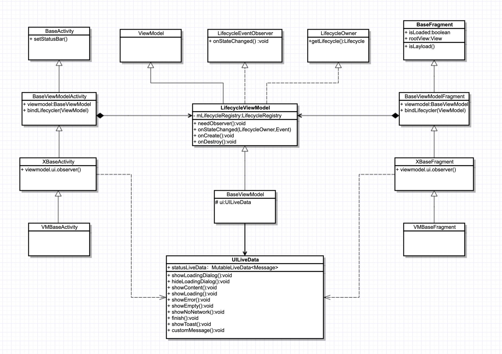
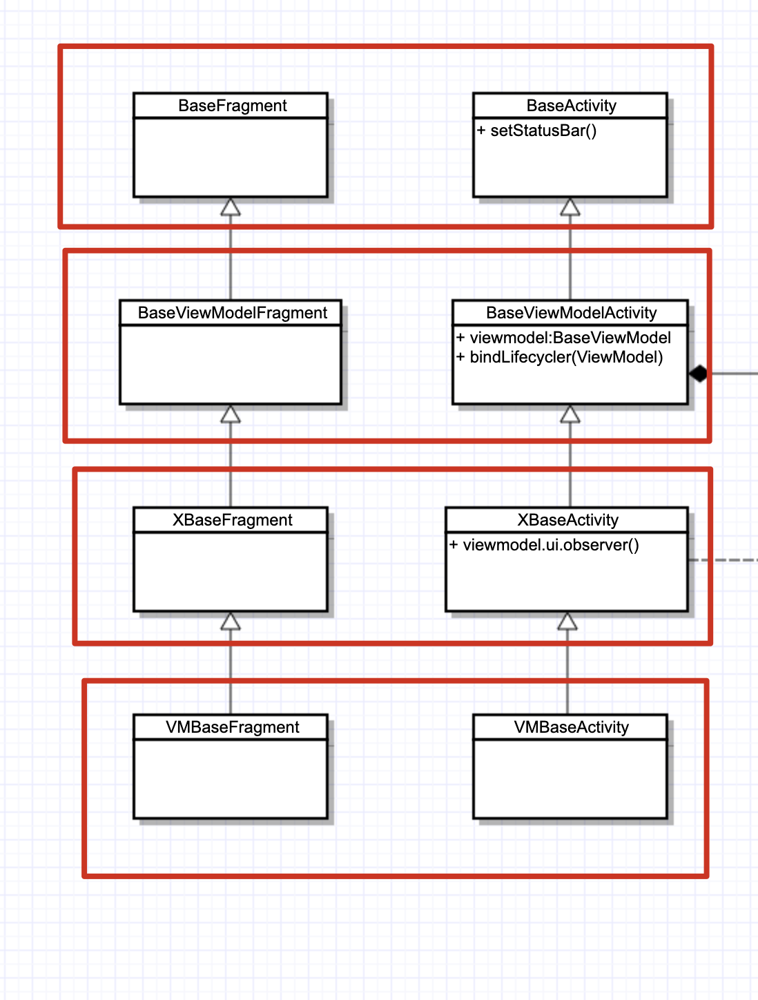

# 一、概览
1.结构图：  
整个base库大致的方向是：保留了以前的大部分功能，去除了冗余代码和部分功能，优化了实现方式，低侵入、单一职责，没有模板代码，没有添加什么大新功能。只新增了一个ViewModel的生命周期管理。api也和以前基本相同，没什么新的学习压力。
 

 

# 二、基本用法和API
1.BaseActivity和BaseFragment
这两个类在最底层，是app中所有View层的继承基类，其中封装了一些整个app要用到的一些最基础的功能。

BaseActivity  方法：
方法名 | 描述
---- | ---
setStatusBar() | 1.统一设置Activity的状态栏，默认：状态栏透明，titlebar沉浸式，至于titlebar 颜色自己进行处理，目前都是渐变背景，项目用有个统一的style来用：toolbarTitleView/CommonTitleView。 2.如果有特殊情况，自己复写覆盖就行  
startActivityForResult |	扩展了app启动转场动画
finish() | 扩展了app销毁转场动画
isTransitionsAnim() | 是否开启转场动画开关     
-----    

 
* 2.BaseActivity属性：    
  说明：如果一些简单Activity不需要ViewModel等功能，可以直接依赖BaseActivity。

* 3.BaseFragment  方法   
  
方法名 | 描述  
---- | ----  
lazyLoad() |	第一次可见调用，用于懒加载
afterLazyLoad() | 第二次及以后次数可见调用，按需使用  
---   
说明：这里只适用于新的懒加载方案，使用之前一定要去了解Androidx新的fragment生命周期管理，可以google关键字：androidx fragment 懒加载、androidx    
setMaxLifecycle。这个是使用懒加载的前提，也是使用好，Viewpager和Viewpager2的前提。

* 4.BaseFragment  属性  
 
方法名 | 说明
---- | ----
isLoaded：boolean | 是否懒加载标志位
rootView:View	| 根布局
----

说明：无需使用ViewModel的简单的fragment可以使用这个类。或者自行扩展

* 5.BaseViewModelFragment和BaseViewModelActivity  
两者都继承自上面的base类，封装了和LifecycleViewModel 的生命周期绑定逻辑，和LifecycleViewModel 配套使用，初始化过程自动化，无需用户关心，只要继承自

BaseViewModelActivity和使用LifecycleViewModel，LifecycleViewModel就会具有生命周期管理能力。如果使用了BaseViewModelActivity不使用LifecycleViewModel

不会对Activity功能产生任何影响。BaseViewModelActivity和LifecycleViewModel只是一种弱绑定关系。其他层的封装思想均是如此，低侵入和弱绑定，这样可以做到灵活的

功能组装和拆卸。你甚至可以自定义一个具有生命周期的任意个ViewModel都是可以的（继承自LifecycleObserver）

bindLifecycler(viewModel: ViewModel?)	这是唯一的一个方法，用来绑定ViewModel生命周期用，这里是自动初始化的，当然用户可以自己手动初始化自己的ViewModel生命周期也是可以的

3.XBaseActivity和XBaseFragment
这里主要封装的是ViewModel和Activity的UI控制逻辑，通过Livedata事件订阅实现，总体流程：Activity订阅事件→ ViewModel接收事件→Activity接收事件来实现一些默认的、常用的

UI逻辑，减少重复代码。主要有对LoadingDialog、StatusViewLayout的的状态控制，和一些定制的消息功能。事件订阅不需要用户关心，自动订阅。

主要方法：

initUI(viewModel: ViewModel)	初始化XBaseFragment和BaseViewModel的Livedata的事件订阅，内置了十来种默认的常用的事件，也可以根据需要自定义事件，默认事件主要控制常用的UI逻辑。
showLoadingDialog(message: Message)	显示LoadingDialog，参数为Handle的Message消息类型
hindLoadingDialog(message: Message)	隐藏LoadingDialog
showLoading(message: Message)	显示StatusViewLayout的Loading状态，如果有使用StatusViewLayout的话
showEmpty(message: Message)	显示StatusViewLayout的Empty状态
showNoNet(message: Message)	显示StatusViewLayout的无网络状态
showError(message: Message)	显示StatusViewLayout的Error状态
showContent(message: Message)	显示内容
showToast(message: Message)	显示base库中的ToastAlertUtil，message.arg1为消息类型，有错误、提示、警告、和消息四种类型，具体看ToastAlertUtil源码，message.obj为消息内容
onCustomMessage(message: Message)	自定义消息内容，空实现，用户自己实现自己的功能
getStatusViewLayout(): StatusViewLayout	获取StatusViewLayout实例对象，如果有使用的话，这里如果没有设置StatusViewLayout的id，通过使用同一的id，在ids.xml中配置的，设置默认StatusViewLayout的id，这点在StatusViewLayout初始化的时候实现，如果自己设置id，需要在Activity中重写这个方法，返回StatusViewLayout
说明：XBaseFragment/XBaseActivity命名因为不知道名啥名了，暂且叫这个吧，里面封装了和ViewModel交互逻辑，配合BaseViewModel使用才有效果，同时也支持使用普通ViewModel

或者不使用，或者自定义，非常灵活。

3.1 VMBaseFragment/VMBaseFragment
这里主要移植老的VMBaseFragment 的逻辑和api，喜欢用这个就自己用，对比XBaseFragment没节省多少代码，反而增加了模板方法和泛型，个人不太推荐，直接用XBaseFragment就行，

具体用法看示例代码，简单的很。

4.LifecycleViewModel
对ViewModel仿照Fragment源码进行了扩展，同时实现了LifecycleEventObserver、LifecycleOwner接口，使得ViewModel同时具有完整的生命周期管理能力，同时可以接收、分发生命周期事件

getLifecycle()	获取LifecycleRegistry，可以注册生命周期观察者
onCreate()

onStart()

onResume()

onPause()

onStop()

onDestroy()

和Activity/Fragment同步的生命周期
说明：扩展之后，可以在生命周期方法中进行初始化、清除数据等操作，同时支持LiveData、AutoDispose等需要LifecycleOwner的使用场景

5.BaseViewModel
主要封装了与XBaseActivity的通用的UI交互逻辑通过内部类UILiveData订阅LiveData事件实现。

所以直接看UILiveData的api就行了：

UILiveData：

属性：statusLiveData: MutableLiveData<Message> 

说明：livedata事件，在XBaseActivity中订阅，接收下面↓中的方法发射的事件，XBaseActivity中接收，两边的发射、接收方法一一对应，事件类型

是Handle的Message，为什么要用Message（官方装逼，最为致命）。一是大家都熟悉，而是Message可接受的参数很多，方便扩展。

其中每个方法的参数都是有默认参数，没特殊要求，使用默认参数就行。

showLoadingDialog(type, messageFactory)	
type：loadingdialog的点击小时模式，有点击外部消失、点击返回键不消失等，具体看代码注释，和LoadingDialog源码。

messageFactory：Message工厂方法，允许自定义消息，一般用不到吧，预留扩展，下面所有方法的这个参数都相同，不再赘述

hideLoadingDialog	隐藏LoadingDialog，和上面对应
showLoading

showContent

showError

showEmpty

showNoNetwork

控制 StatusViewLayout 的状态
finish()	销毁Activity
showToast(content,type,messageFactory)	
控制ToastAlertUtil

content：消息内容

type：现在有四种，错误、警告、成功、消息四种，具体看ToastAlertUtil源码

customMessage(messageFactory)	自定义消息在对应的Activity中回调

说明：自定义消息类型不能使用TYPE中已存在的类型